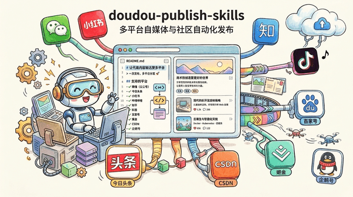

<div align="center">

# doudou-publish-skills

<p align="center">
  <a href="README.md">简体中文</a> | <b>English</b>
</p>

A collection of skills for automated publishing of articles, image-text posts, and videos across multi-platform self-media and developer communities. Powered by AI Agents using `chrome-devtools-mcp` for browser automation, it strictly follows realistic human behavior simulation and end-to-end anti-bot protocols to parse local Markdown and multimedia assets, intelligently schedule multi-modal publishing workflows, inject formatted content, and safely save drafts into target draft boxes.



</div>

---

## 📑 Table of Contents

- [📖 User Guide](#-user-guide)
  - [1. Installation](#1-installation)
  - [2. Usage](#2-usage)
- [📦 Skills List](#-skills-list)
- [💬 Community & Support](#-community--support)
- [📄 License](#-license)

---

## 📖 User Guide

This skill library serves as an **automated multi-platform publishing assistant for AI Agents** (compatible with Antigravity, Claude Code, OpenCode, and more).

---

### 1. Installation

Install effortlessly into any target project root via the command line:

```bash
npx skills add undsky/doudou-publish-skills --yes
```

---

### 2. Usage

Simply instruct the AI in natural language to publish your article or assets to the target platform draft box:

```text
Publish articles/ai-guide.md to WeChat Official Account and Toutiao draft boxes.
```

---

## 📦 Skills List

| Skill Name             | Directory                                                  | Description                                                                                              |
| :--------------------- | :--------------------------------------------------------- | :------------------------------------------------------------------------------------------------------- |
| **doudou-weixin**      | [`skills/doudou-weixin`](./skills/doudou-weixin)           | Publish articles and image-text posts to [WeChat Official Accounts](https://mp.weixin.qq.com)            |
| **doudou-toutiao**     | [`skills/doudou-toutiao`](./skills/doudou-toutiao)         | Publish articles and videos to [Toutiao](https://mp.toutiao.com)                                         |
| **doudou-baijia**      | [`skills/doudou-baijia`](./skills/doudou-baijia)           | Publish articles and videos to [Baidu Baijiahao](https://baijiahao.baidu.com)                            |
| **doudou-qiehao**      | [`skills/doudou-qiehao`](./skills/doudou-qiehao)           | Publish articles and videos to [Tencent Penguin (Qiehao)](https://om.qq.com)                             |
| **doudou-juejin**      | [`skills/doudou-juejin`](./skills/doudou-juejin)           | Publish articles to [Juejin](https://juejin.cn)                                                          |
| **doudou-csdn**        | [`skills/doudou-csdn`](./skills/doudou-csdn)               | Publish articles to [CSDN Blog](https://mp.csdn.net/)                                                    |
| **doudou-tencent**     | [`skills/doudou-tencent`](./skills/doudou-tencent)         | Publish articles to [Tencent Cloud Developer Community](https://cloud.tencent.com/developer)             |
| **doudou-aliyun**      | [`skills/doudou-aliyun`](./skills/doudou-aliyun)           | Publish articles to [Alibaba Cloud Developer Community](https://developer.aliyun.com/creatorcenter/home) |
| **doudou-bilibili**    | [`skills/doudou-bilibili`](./skills/doudou-bilibili)       | Publish articles and videos to [Bilibili](https://member.bilibili.com)                                  |
| **doudou-xiaohongshu** | [`skills/doudou-xiaohongshu`](./skills/doudou-xiaohongshu) | Publish image-text posts and videos to [Xiaohongshu (RED)](https://creator.xiaohongshu.com)              |
| **doudou-douyin**      | [`skills/doudou-douyin`](./skills/doudou-douyin)           | Publish image-text posts and videos to [Douyin](https://creator.douyin.com)                              |
| **doudou-zhihu**       | [`skills/doudou-zhihu`](./skills/doudou-zhihu)             | Publish articles to [Zhihu Columns](https://zhuanlan.zhihu.com)                                         |
| **doudou-shipinhao**   | [`skills/doudou-shipinhao`](./skills/doudou-shipinhao)     | Publish videos to [WeChat Channels](https://channels.weixin.qq.com)                                      |
| **doudou-linuxsb**     | [`skills/doudou-linuxsb`](./skills/doudou-linuxsb)         | Publish articles to [LinuxSB Community](https://linux.sb)                                                |

---

## 💬 Community & Support

| WeChat Official Account                                | QQ Group (1095058701)                             |
| ------------------------------------------------------ | ------------------------------------------------- |
|  |  |

---

## 📄 License

This project is licensed under the [CC BY-NC 4.0](LICENSE) License.

- Free for personal use, learning, research, and non-commercial projects.
- When publicly publishing derivative works, please credit the source.
- Commercial use requires separate authorization, please contact the author.
