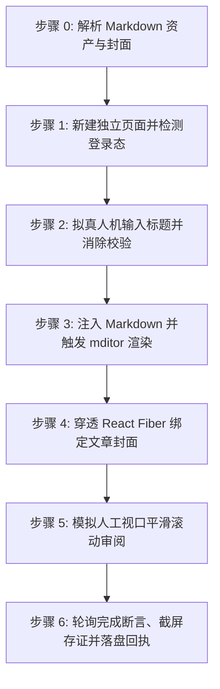

# 阿里云开发者社区文章自动发布技能 (doudou-aliyun)

本技能通过 `chrome-devtools-mcp` 控制浏览器，将用户指定的 Markdown 文件发布至**阿里云开发者社区（https://developer.aliyun.com/article/new ）**。

技能严格遵循**真实人工行为模拟与防风控规约**，通过自然的事件派发、微小随机时延、视口平滑滚动及悬停交互，避免被平台风控拦截。自动提取文章标题、摘要、CDN 版 Markdown 正文以及宽屏封面图。

---

## 核心契约与执行红线

1. **红线禁令（绝不越权）**：
   - **绝对严禁触碰任何形式的公开发布按钮**：所有操作停留在当前编辑页就绪态，由人工做最终确认与手动发布。
   - **绝对严禁关闭页面（严禁调用 `close_page`）**：执行完毕、异常或等待登录时，必须原样保留页面现场供人工核查接管。
2. **客观断言与父级回执协议（父级串行调度的生命线）**：
   - **客观内容态断言**：严禁以「已等待 N 秒」代替「已完成」，必须调用 `node scripts/completion_assert.mjs script doudou-aliyun article` 进行页内可求值断言（需正文 ≥ 200 字且封面图已绑定）。
   - **收尾必须落盘回执**：无论成败收尾必须执行 `node scripts/receipt.mjs write <Markdown路径> --payload-file <json>` 写入回执（`publishes/receipts/doudou-aliyun.json`），终态仅限 `success` / `needs_login` / `failed` / `timeout` / `skipped`，缺回执会导致父级 `doudou-UGC` 永久阻塞。
   - **统一存证与无污染规约**：存证截图固定保存为 `publishes/screenshots/aliyun_article.png`；所有临时脚本与中间文件强制放置在文章同名资产目录下，严禁污染项目工作区根目录。

---

## 自动化执行全流程

当接收到用户指定的 Markdown 文件路径时，依次执行以下阶段：



### 步骤 0：解析 Markdown 资产与封面

运行辅助解析脚本提取元数据（脚本路径相对本技能目录）：
```bash
node scripts/parser.mjs <Markdown文件绝对路径>
```
输出包含：
- `title`: 文章标题（自动清洗 Markdown 符号）
- `summary`: 100~250 字纯文本摘要
- `bodyContent`: 过滤掉首行重复 H1 后的 Markdown 正文（优先使用 `_cdn.md`），**自动移除底部"### 引用链接"区块以符合阿里云防引流风控规约**
- `cover`: 封面图信息（本地绝对路径 `localPath` 或网络 URL）

---

### 步骤 1：打开/聚焦发布页并检测登录态

1. **新建独立页面**：调用 `new_page` 打开 `https://developer.aliyun.com/article/new`（必须每次新建独立页面，严禁复用或覆盖已有页面）。
2. 等待页面加载完成。
3. 执行脚本检测登录态：
   - 检查是否存在标题输入框 `input[placeholder*="标题"]` 或头像元素；
   - 若被重定向至 `account.aliyun.com/login`，向用户发出明确提示请用户在浏览器中扫码登录，并在登录完成后继续。

---

### 步骤 2：拟真人机输入标题

1. 聚焦标题输入框 `document.querySelector('input[placeholder*="标题"]')`。
2. 模拟微小随机延迟（300ms~600ms）。
3. **采用原生 Setter 与 React Field 双向同步**，彻底消除“请填写标题”红字校验错误：
```javascript
const titleInput = document.querySelector('input[placeholder*="标题"]');
if (titleInput) {
  titleInput.focus();
  const nativeSetter = Object.getOwnPropertyDescriptor(window.HTMLInputElement.prototype, 'value').set;
  if (nativeSetter) {
    nativeSetter.call(titleInput, articleTitle);
  } else {
    titleInput.value = articleTitle;
  }
  titleInput.dispatchEvent(new Event('input', { bubbles: true }));
  titleInput.dispatchEvent(new Event('change', { bubbles: true }));
  titleInput.dispatchEvent(new KeyboardEvent('keyup', { bubbles: true, key: ' ' }));
  titleInput.dispatchEvent(new Event('blur', { bubbles: true }));
}
// 同步 React Field 并触发校验消除提示
if (formInstance && formInstance.field) {
  formInstance.field.setValue('title', articleTitle);
  if (typeof formInstance.field.validate === 'function') {
    formInstance.field.validate(['title']);
  }
}
```
4. 随机停顿 400ms~800ms。

---

### 步骤 3：注入 Markdown 并触发 mditor 渲染

阿里云开发者社区采用 `mditor` Markdown 编辑器：
1. 聚焦编辑器原生的 `textarea.textarea`：
```javascript
const textarea = document.querySelector('.left-content textarea.textarea');
if (textarea) {
  textarea.focus();
  textarea.value = bodyContent;
  textarea.dispatchEvent(new Event('input', { bubbles: true }));
  textarea.dispatchEvent(new Event('change', { bubbles: true }));
  textarea.dispatchEvent(new KeyboardEvent('keyup', { bubbles: true, key: ' ' }));
}
```
2. 调用 `instance.editor` 同步更新并触发右侧实时预览渲染：
```javascript
if (formInstance && formInstance.editor) {
  formInstance.editor.value = bodyContent;
  if (formInstance.editor.$emit) {
    formInstance.editor.$emit('change', bodyContent);
    formInstance.editor.$emit('input', bodyContent);
  }
  if (formInstance.editor.viewer && formInstance.editor.viewer.render) {
    formInstance.editor.viewer.render();
  }
}
```
3. 随机停顿 800ms~1500ms，让编辑器完成 Markdown 解析和代码高亮。

---

### 步骤 4：穿透 React Fiber 绑定文章封面（固化方案，零弹窗）

若存在封面图资产（优先使用 `cdn_manifest.json` 中的 CDN 链接）：

#### 固化推荐方案：穿透 React Fiber 直接注入封面状态（100% 成功且杜绝弹窗）
1. 从 `form.public-article-form` 向上遍历定位表单组件的 React 实例 `instance`；
2. 执行状态注入与自动存草稿：
```javascript
const targetCoverUrl = data.cover?.cdnUrl || data.cover?.url;
if (targetCoverUrl && instance) {
  instance.setState({
    fileList: [{ imgURL: targetCoverUrl }]
  });
  if (typeof instance.aiDraftHandle === 'function') {
    instance.aiDraftHandle();
  }
}
```
3. 校验客观状态：检查 `instance.state.fileList` 包含封面 URL，页面渲染 `.upload-item img`，按钮状态自动变为「重新上传」。

---

### 步骤 5：模拟人工视口平滑滚动审阅

1. 模拟人工自上而下审阅已排版的正文与封面：
   - 滚动到底部：`window.scrollTo({ top: document.body.scrollHeight, behavior: 'smooth' });`
   - 停顿 500~800ms；
   - 滚动回顶部：`window.scrollTo({ top: 0, behavior: 'smooth' });`
   - 停顿 400~700ms。
2. **严格安全隔离（绝不主动点击草稿或发布按钮）**：
   - 阿里云编辑器具备输入实时自动保存机制，**严禁主动寻找并点击「存为草稿」按钮**，**绝对严禁点击「发布」按钮**。

---

### 步骤 6：轮询完成断言、截屏存证并落盘回执

1. 按「完成断言与回执协议」以 1.5s 间隔轮询完成断言，最长 45s（**严禁以固定等待代替断言**）；
2. 捕获页面状态（如检查 `instance?.state?.draftTime` 或检测页面是否出现 `保存了草稿`）；
3. 视口滚动到封面与标题状态区域，调用 `take_screenshot` 保存当前页面截图作为存证（如 `aliyun_article.png`）；
4. **保留页面现场**：存证完成后，**严禁调用 `close_page` 或关闭标签页**，保持当前页面打开供人工复核；
5. 输出结构化结果报告（文章标题、就绪状态、草稿时间戳、封面图绑定状态等）。

---

## 异常与风控处理

| 异常场景 | 表现特征 | 应对与恢复策略 |
| :--- | :--- | :--- |
| **未登录 / 登录态过期** | 页面跳转至 `account.aliyun.com/login` | 立即停止自动化输入，向用户发送提示，等待用户在浏览器中完成扫码登录后再继续。 |
| **标题红字“请填写标题”** | 原生输入框事件未穿透 React 受控组件 | 使用 `HTMLInputElement.prototype` 的原生 Setter 并调用 `field.validate(['title'])` 消除提示。 |
| **封面上传失败** | 封面无法正常展示或被弹窗阻断 | 穿透 React Fiber 表单实例，直接通过 `instance.setState({ fileList: [{ imgURL: coverUrl }] })` 注入 CDN 链接，杜绝触发系统弹窗。 |
| **Markdown 编辑器未就绪** | 页面 DOM 未完成渲染 | 增加轮询等待（最高 10s），确认 `.left-content textarea.textarea` 挂载后再注入。 |
| **页面防重复提交拦截** | 保存按钮处于 loading 禁用态 | 确保每次点击间隔大于 3 秒，不连续狂点。 |

---

## 脚本工具与使用方法

以下路径均相对本技能目录（`SKILL.md` 所在目录），执行前先切换到该目录，或将其拼接为绝对路径使用。

- `scripts/parser.mjs`：解析 Markdown，提取标题、摘要、正文与封面资产。
- `scripts/aliyun_publisher.mjs`：浏览器注入脚本生成器（编辑器状态同步与防风控人机模拟）。

1. **运行 Node.js 脚本测试解析**：
```bash
node scripts/parser.mjs <Markdown文件路径>
```

2. **在 Agent 中配合 `chrome-devtools-mcp` 调用**：
```javascript
import { buildBrowserPublishScript, buildSaveDraftScript } from './scripts/aliyun_publisher.mjs';

// 1. 生成并执行表单填充代码（自动注入标题、Markdown正文及封面图）
const fillCode = buildBrowserPublishScript(markdownFilePath);
const fillResult = await evaluate_script({ pageId, function: fillCode });

// 2. 主动触发并等待平台原生自动保存就绪
const saveCode = buildSaveDraftScript();
const saveResult = await evaluate_script({ pageId, function: saveCode });

// 3. 截屏存证并执行内容态完成断言
await take_screenshot({ pageId, filePath: screenshotPath });
```
