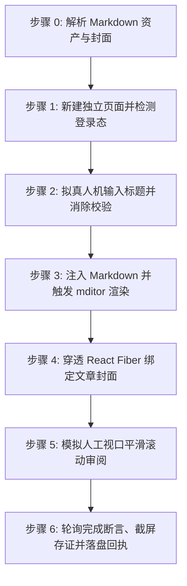

# 阿里云开发者社区文章自动发布技能 (doudou-aliyun)

本技能通过 `chrome-devtools-mcp` 控制浏览器，将用户指定的 Markdown 文件发布至**阿里云开发者社区（https://developer.aliyun.com/article/new ）**。

技能严格遵循**真实人工行为模拟与防风控规约**，通过自然的事件派发、微小随机时延、视口平滑滚动及悬停交互，避免被平台风控拦截。自动提取文章标题、摘要、CDN 版 Markdown 正文以及宽屏封面图。

---

## 核心规约与防风控原则

1. **发布入口与模态**：
   - 阿里云开发者社区文章发布入口：`https://developer.aliyun.com/article/new`
   - 支持长文技术文章（`article`）单模态发布。
2. **模态判定与资产缺失处理**：
   - 文章所需资产缺失（无可用 Markdown 正文）时，自动跳过并在最终报告与回执中明确登记原因，绝不中断父级编排。
3. **资产规范与限制**：
   - **文章标题**：`<= 100 字`（建议 30 字以内，自动清洗 Markdown 符号）；
   - **内容摘要**：`100~250 字` 纯文本摘要；
   - **Markdown 正文**：优先使用 `[article_name]_cdn.md`，自动过滤首行重复 H1，并**自动移除底部“### 引用链接”区块以符合阿里云防引流风控规约**；
   - **封面图**：优先读取同名目录下 16:9 / 2.35:1 宽屏封面图。
4. **安全隔离（绝对底线）**：
   - **绝对严禁触碰任何形式的公开发布按钮**：绝不点击「发布」按钮；所有内容保留在当前编辑页就绪态，由创作者人工最终审阅并手动提交。
   - **依托平台原生自动保存**：阿里云编辑器具备输入实时自动保存机制，**严禁主动寻找并点击「存为草稿」按钮**。
5. **完成判定必须客观可断言（严禁以「已等待」代替「已完成」）**：
   - 「静候自动保存生效」是等待动作，不是验收条件。必须以完成断言求值为 `true` 才允许判定完成。
   - 断言未通过即为未完成：登记 `timeout` 并保留页面，**严禁登记为 `success`**。
6. **收尾必须落盘回执（父级编排的唯一完成信号）**：
   - 无论成功、失败、缺登录、超时还是跳过，收尾都必须调用 `scripts/receipt.mjs write` 写入回执。
   - 父级 `doudou-UGC-skill` 不解析自然语言汇报，只读回执文件；缺回执会让父级永久阻塞后续平台。
7. **防风控与真实人机行为模拟 (Anti-Bot & Human Simulation)**：
   - **随机时延抖动**：输入前 300~600ms、步骤间 600~1500ms、点击悬停 400~700ms，严禁毫秒级并发；
   - **真实事件完整性与 React 双向同步**：通过 `HTMLInputElement.prototype` 原生 Setter 输入标题，派发完整 input/change 事件，并调用 `field.validate(['title'])` 消除红字校验；
   - **Markdown 注入与实时渲染**：注入 CodeMirror / textarea 并触发 input/keyup 事件以激活右侧实时预览；
   - **穿透 React Fiber 绑定封面**：直接操作表单 React Fiber 实例的 `state.fileList` 绑定 CDN 封面，杜绝触发系统弹窗；
   - **平滑视口滚动**：模拟人类自上而下视口滚动审阅。
8. **发布完成后保留页面（严禁自动关闭）**：
   - 每次执行必须调用 `new_page` 新建独立标签页（严禁复用已有页面）；全流程完成后**严禁调用 `close_page` 或关闭标签页**，原样保留页面现场供人工最终核验。
   - 未登录、扫码验证、网络超时等异常中断场景同样原样保留页面。

---

## 完成断言与回执协议 (Completion Assertion & Receipt)

> 本段是**父级串行编排的硬契约**。父级（`doudou-UGC-skill`）不读自然语言汇报，只读落盘回执；没有回执，父级会认为本平台仍在进行中而永久阻塞后续平台。

### 完成断言

**严禁以「已等待 N 秒」代替「已完成」。** 必须轮询下面这条可求值的客观判据：

| 项 | 值 |
| :--- | :--- |
| **断言规则** | 标题非空 + 正文字数 ≥ 200 + 封面已绑定或 Fiber 实例注入成功 |
| **超时窗口** | 45 秒，轮询间隔 1.5 秒 |
| **通过** | 登记 `success` |
| **超时** | 登记 `timeout`（`statusText` 说明未在 45s 内成立），保留页面，**严禁登记为 success** |

```javascript
// 在 evaluate_script 中求值，返回结构化断言结果
() => {
  const titleEl = document.querySelector('input[placeholder*="标题"]');
  const title = titleEl ? titleEl.value.trim() : '';
  const bodyText = document.querySelector('.left-content textarea.textarea')?.value || document.body.innerText;
  const bodyChars = bodyText.length;

  let coverBound = Boolean(document.querySelector('.upload-item img, [class*=upload-item] img'));
  if (!coverBound) {
    const form = document.querySelector('form.public-article-form');
    if (form) {
      const k = Object.keys(form).find(x => x.startsWith('__reactFiber') || x.startsWith('__reactInternalInstance'));
      let fiber = form[k];
      while (fiber) {
        if (fiber.stateNode?.state?.fileList?.[0]?.imgURL) {
          coverBound = true;
          break;
        }
        fiber = fiber.return;
      }
    }
  }
  const passed = Boolean(title.length > 0 && bodyChars >= 200 && coverBound);
  return { passed, title, bodyChars, coverBound };
};
```

### 状态枚举（六个终态，仅此六种可写入回执）

| 状态 | 含义 |
| :--- | :--- |
| `success` | 草稿已保存且完成断言通过 |
| `ready_for_review` | 内容已填入就绪待人工发布 |
| `needs_login` | 登录态缺失/过期，已保留页面待补登 |
| `failed` | 明确失败（选择器失效、注入异常） |
| `timeout` | 完成断言在 45s 窗口内未成立 |
| `skipped` | 资产缺失或用户主动跳过 |

### 存证截图统一命名

统一存至同名文章目录下的 `publishes/screenshots/` 目录：
- 长文文章：`publishes/screenshots/aliyun_article.png`（格式 `<platformSlug>_<mode>.png`）

### 临时脚本与中间文件存放规约（严禁污染工作区根目录）

- **统一落盘位置**：自动化发文执行过程中，凡需生成的任何临时注入脚本、临时数据载荷（`--payload-file <json>`）、调试脚本或中间辅助文件，**严禁放置在当前工作区根目录、项目根目录或技能目录中**！
- **强制同名资产目录**：所有临时文件**必须统一放置在目标 Markdown 文章对应的同名资产目录下**，文件名建议统一以 `scratch_` 为前缀。
- **可追溯与可清理**：执行完毕且回执落盘后，临时中间文件安全留存于同名资产目录供事后复核排查。

### 回执落盘（收尾必调，异常也要写）

```bash
node scripts/receipt.mjs write <Markdown文件绝对路径> --payload-file <json文件路径>
```

> 载荷含正则/反斜杠时**务必用 `--payload-file`**，直接内联 `--payload` 会被 shell 转义破坏。

`--payload` 结构示例：

```json
{
  "skill": "doudou-aliyun",
  "platform": "阿里云开发者社区",
  "platformSlug": "aliyun",
  "startedAt": "<技能启动时即记录，不要收尾时倒填>",
  "results": [
    {
      "mode": "article",
      "modeDesc": "长文文章",
      "status": "success",
      "statusText": "草稿已就绪",
      "title": "……",
      "screenshot": "screenshots/aliyun_article.png",
      "assertion": { "rule": "标题非空 + 正文字数 ≥ 200 + 封面已绑定", "passed": true }
    }
  ]
}
```

脚本会强校验并拒绝不合规回执：非终态 `status`、缺 `statusText`、非 `skipped` 却缺 `screenshot` 一律报错退出。

---

## 自动化执行全流程

当接收到用户指定的 Markdown 文件路径时，依次执行以下阶段：



### 步骤 0：解析 Markdown 资产与封面

运行辅助解析脚本提取元数据（脚本路径相对本技能目录）：
```bash
node scripts/parser.mjs <Markdown文件绝对路径>
```
输出包含：
- `title`: 文章标题（自动清洗 Markdown 符号）
- `summary`: 100~250 字纯文本摘要
- `bodyContent`: 过滤掉首行重复 H1 后的 Markdown 正文（优先使用 `_cdn.md`），**自动移除底部"### 引用链接"区块以符合阿里云防引流风控规约**
- `cover`: 封面图信息（本地绝对路径 `localPath` 或网络 URL）

---

### 步骤 1：打开/聚焦发布页并检测登录态

1. **新建独立页面**：调用 `new_page` 打开 `https://developer.aliyun.com/article/new`（必须每次新建独立页面，严禁复用或覆盖已有页面）。
2. 等待页面加载完成。
3. 执行脚本检测登录态：
   - 检查是否存在标题输入框 `input[placeholder*="标题"]` 或头像元素；
   - 若被重定向至 `account.aliyun.com/login`，向用户发出明确提示请用户在浏览器中扫码登录，并在登录完成后继续。

---

### 步骤 2：拟真人机输入标题

1. 聚焦标题输入框 `document.querySelector('input[placeholder*="标题"]')`。
2. 模拟微小随机延迟（300ms~600ms）。
3. **采用原生 Setter 与 React Field 双向同步**，彻底消除“请填写标题”红字校验错误：
```javascript
const titleInput = document.querySelector('input[placeholder*="标题"]');
if (titleInput) {
  titleInput.focus();
  const nativeSetter = Object.getOwnPropertyDescriptor(window.HTMLInputElement.prototype, 'value').set;
  if (nativeSetter) {
    nativeSetter.call(titleInput, articleTitle);
  } else {
    titleInput.value = articleTitle;
  }
  titleInput.dispatchEvent(new Event('input', { bubbles: true }));
  titleInput.dispatchEvent(new Event('change', { bubbles: true }));
  titleInput.dispatchEvent(new KeyboardEvent('keyup', { bubbles: true, key: ' ' }));
  titleInput.dispatchEvent(new Event('blur', { bubbles: true }));
}
// 同步 React Field 并触发校验消除提示
if (formInstance && formInstance.field) {
  formInstance.field.setValue('title', articleTitle);
  if (typeof formInstance.field.validate === 'function') {
    formInstance.field.validate(['title']);
  }
}
```
4. 随机停顿 400ms~800ms。

---

### 步骤 3：注入 Markdown 并触发 mditor 渲染

阿里云开发者社区采用 `mditor` Markdown 编辑器：
1. 聚焦编辑器原生的 `textarea.textarea`：
```javascript
const textarea = document.querySelector('.left-content textarea.textarea');
if (textarea) {
  textarea.focus();
  textarea.value = bodyContent;
  textarea.dispatchEvent(new Event('input', { bubbles: true }));
  textarea.dispatchEvent(new Event('change', { bubbles: true }));
  textarea.dispatchEvent(new KeyboardEvent('keyup', { bubbles: true, key: ' ' }));
}
```
2. 调用 `instance.editor` 同步更新并触发右侧实时预览渲染：
```javascript
if (formInstance && formInstance.editor) {
  formInstance.editor.value = bodyContent;
  if (formInstance.editor.$emit) {
    formInstance.editor.$emit('change', bodyContent);
    formInstance.editor.$emit('input', bodyContent);
  }
  if (formInstance.editor.viewer && formInstance.editor.viewer.render) {
    formInstance.editor.viewer.render();
  }
}
```
3. 随机停顿 800ms~1500ms，让编辑器完成 Markdown 解析和代码高亮。

---

### 步骤 4：穿透 React Fiber 绑定文章封面（固化方案，零弹窗）

若存在封面图资产（优先使用 `cdn_manifest.json` 中的 CDN 链接）：

#### 固化推荐方案：穿透 React Fiber 直接注入封面状态（100% 成功且杜绝弹窗）
1. 从 `form.public-article-form` 向上遍历定位表单组件的 React 实例 `instance`；
2. 执行状态注入与自动存草稿：
```javascript
const targetCoverUrl = data.cover?.cdnUrl || data.cover?.url;
if (targetCoverUrl && instance) {
  instance.setState({
    fileList: [{ imgURL: targetCoverUrl }]
  });
  if (typeof instance.aiDraftHandle === 'function') {
    instance.aiDraftHandle();
  }
}
```
3. 校验客观状态：检查 `instance.state.fileList` 包含封面 URL，页面渲染 `.upload-item img`，按钮状态自动变为「重新上传」。

---

### 步骤 5：模拟人工视口平滑滚动审阅

1. 模拟人工自上而下审阅已排版的正文与封面：
   - 滚动到底部：`window.scrollTo({ top: document.body.scrollHeight, behavior: 'smooth' });`
   - 停顿 500~800ms；
   - 滚动回顶部：`window.scrollTo({ top: 0, behavior: 'smooth' });`
   - 停顿 400~700ms。
2. **严格安全隔离（绝不主动点击草稿或发布按钮）**：
   - 阿里云编辑器具备输入实时自动保存机制，**严禁主动寻找并点击「存为草稿」按钮**，**绝对严禁点击「发布」按钮**。

---

### 步骤 6：轮询完成断言、截屏存证并落盘回执

1. 按「完成断言与回执协议」以 1.5s 间隔轮询完成断言，最长 45s（**严禁以固定等待代替断言**）；
2. 捕获页面状态（如检查 `instance?.state?.draftTime` 或检测页面是否出现 `保存了草稿`）；
3. 视口滚动到封面与标题状态区域，调用 `take_screenshot` 保存当前页面截图作为存证（如 `aliyun_article.png`）；
4. **保留页面现场**：存证完成后，**严禁调用 `close_page` 或关闭标签页**，保持当前页面打开供人工复核；
5. 输出结构化结果报告（文章标题、就绪状态、草稿时间戳、封面图绑定状态等）。

---

## 异常与风控处理

| 异常场景 | 表现特征 | 应对与恢复策略 |
| :--- | :--- | :--- |
| **未登录 / 登录态过期** | 页面跳转至 `account.aliyun.com/login` | 立即停止自动化输入，向用户发送提示，等待用户在浏览器中完成扫码登录后再继续。 |
| **标题红字“请填写标题”** | 原生输入框事件未穿透 React 受控组件 | 使用 `HTMLInputElement.prototype` 的原生 Setter 并调用 `field.validate(['title'])` 消除提示。 |
| **封面上传失败** | 封面无法正常展示或被弹窗阻断 | 穿透 React Fiber 表单实例，直接通过 `instance.setState({ fileList: [{ imgURL: coverUrl }] })` 注入 CDN 链接，杜绝触发系统弹窗。 |
| **Markdown 编辑器未就绪** | 页面 DOM 未完成渲染 | 增加轮询等待（最高 10s），确认 `.left-content textarea.textarea` 挂载后再注入。 |
| **页面防重复提交拦截** | 保存按钮处于 loading 禁用态 | 确保每次点击间隔大于 3 秒，不连续狂点。 |

---

## 脚本工具与使用方法

以下路径均相对本技能目录（`SKILL.md` 所在目录），执行前先切换到该目录，或将其拼接为绝对路径使用。

- `scripts/parser.mjs`：解析 Markdown，提取标题、摘要、正文与封面资产。
- `scripts/aliyun_publisher.mjs`：浏览器注入脚本生成器（编辑器状态同步与防风控人机模拟）。

1. **运行 Node.js 脚本测试解析**：
```bash
node scripts/parser.mjs <Markdown文件路径>
```

2. **在 Agent 中配合 `chrome-devtools-mcp` 调用**：
```javascript
import { buildBrowserPublishScript, buildSaveDraftScript } from './scripts/aliyun_publisher.mjs';

// 1. 生成并执行表单填充代码（自动注入标题、Markdown正文及封面图）
const fillCode = buildBrowserPublishScript(markdownFilePath);
const fillResult = await evaluate_script({ pageId, function: fillCode });

// 2. 主动触发并等待平台原生自动保存就绪
const saveCode = buildSaveDraftScript();
const saveResult = await evaluate_script({ pageId, function: saveCode });

// 3. 截屏存证并执行内容态完成断言
await take_screenshot({ pageId, filePath: screenshotPath });
```
