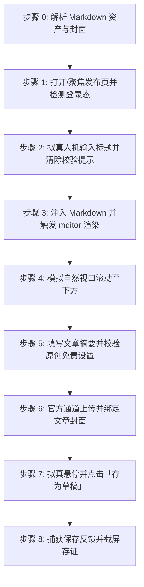

# 阿里云开发者社区文章自动发布到草稿技能 (doudou-aliyun)

本技能通过 `chrome-devtools-mcp` 控制浏览器，将用户指定的 Markdown 文件发布至**阿里云开发者社区（https://developer.aliyun.com/article/new ）的草稿箱**。

技能严格遵循**真实人工行为模拟与防风控规约**，通过自然的事件派发、微小随机时延、视口平滑滚动及悬停交互，避免被平台风控拦截。同时与 `doudou-markdown-skill` 资产体系无缝集成，自动提取文章标题、摘要、CDN 版 Markdown 正文以及宽屏封面图。

---

## 核心规约与防风控原则

1. **草稿安全隔离**：
   - **严格限定仅点击「存为草稿」按钮**，绝对不触发公开发布，确保所有内容必须经人工最终确认后再公开发布。
2. **防风控与真实人机行为模拟 (Anti-Bot & Human Simulation)**：
   - **随机时延抖动**：所有操作之间增加正态分布随机等待（输入前 400~800ms、步骤间 500~1500ms、点击前 300~600ms），严禁毫秒级并发。
   - **真实事件完整性与 React Controlled 状态同步**：对于表单输入，使用原生属性描述符 Setter 赋值，依次派发 `focus`、`keydown`、`input`、`keyup`、`change`、`blur`，并同步触发 React Field 与 Component State 校验，杜绝表单空值红字拦截。
   - **平滑视口滚动**：模拟人类自上而下的视觉审查，分步平滑滚动页面触发浏览器的视口可见性检测。
   - **拟真悬停与点击**：点击按钮前先将视口滚动到按钮可见区域，派发 `mouseover`/`mouseenter` 悬停 300~500ms 后再触发 `click`。
3. **资产自动解析优先级**（参考 `doudou-markdown-skill` 规约）：
   - **正文**：优先使用同名目录下已将本地图片替换为图床 URL 的 `[article_name]_cdn.md`；若无则使用原 Markdown 文件。
   - **封面图**：
     1. 优先读取同名目录下 `cdn_manifest.json` 中 `type: "cover"` 的 CDN 链接与本地原图（优先 2.35:1 / 16:9 宽屏封面）；
     2. 其次读取同名目录下 `cover/images/` 的本地图片文件（如 `cover-main-2.35x1.png`、`cover-16x9.png`、`cover.png`）；
     3. 再次从 Markdown 正文中提取第一张图片本地路径或网络链接；
     4. 若均无则跳过封面设置。

---

## 自动化执行全流程

当接收到用户指定的 Markdown 文件路径（例如 `mds/AICoding/ddagent.md`）时，依次执行以下 8 个阶段：



### 步骤 0：解析 Markdown 资产与封面

运行辅助解析脚本提取元数据（脚本路径相对本技能目录）：
```bash
node scripts/parser.mjs <Markdown文件绝对路径>
```
输出包含：
- `title`: 文章标题（自动清洗 Markdown 符号）
- `summary`: 100~250 字纯文本摘要
- `bodyContent`: 过滤掉首行重复 H1 后的 Markdown 正文（优先使用 `_cdn.md`）
- `cover`: 封面图信息（本地绝对路径 `localPath` 或网络 URL）

---

### 步骤 1：打开/聚焦发布页并检测登录态

1. 调用 `list_pages` 检查是否已有阿里云发布页（URL 包含 `developer.aliyun.com/article/new`）。
   - 若已有，直接调用 `select_page` 切换到该页面；
   - 若无，调用 `new_page` 打开 `https://developer.aliyun.com/article/new`。
2. 等待页面加载完成。
3. 执行脚本检测登录态：
   - 检查是否存在标题输入框 `input[placeholder*="标题"]` 或头像元素；
   - 若被重定向至 `account.aliyun.com/login`，向用户发出明确提示请用户在浏览器中扫码登录，并在登录完成后继续。

---

### 步骤 2：拟真人机输入标题

1. 聚焦标题输入框 `document.querySelector('input[placeholder*="标题"]')`。
2. 模拟微小随机延迟（300ms~600ms）。
3. **采用原生 Setter 与 React Field 双向同步**，彻底消除“请填写标题”红字校验错误：
```javascript
const titleInput = document.querySelector('input[placeholder*="标题"]');
if (titleInput) {
  titleInput.focus();
  const nativeSetter = Object.getOwnPropertyDescriptor(window.HTMLInputElement.prototype, 'value').set;
  if (nativeSetter) {
    nativeSetter.call(titleInput, articleTitle);
  } else {
    titleInput.value = articleTitle;
  }
  titleInput.dispatchEvent(new Event('input', { bubbles: true }));
  titleInput.dispatchEvent(new Event('change', { bubbles: true }));
  titleInput.dispatchEvent(new KeyboardEvent('keyup', { bubbles: true, key: ' ' }));
  titleInput.dispatchEvent(new Event('blur', { bubbles: true }));
}
// 同步 React Field 并触发校验消除提示
if (formInstance && formInstance.field) {
  formInstance.field.setValue('title', articleTitle);
  if (typeof formInstance.field.validate === 'function') {
    formInstance.field.validate(['title']);
  }
}
```
4. 随机停顿 400ms~800ms。

---

### 步骤 3：注入 Markdown 并触发 mditor 渲染

阿里云开发者社区采用 `mditor` Markdown 编辑器：
1. 聚焦编辑器原生的 `textarea.textarea`：
```javascript
const textarea = document.querySelector('.left-content textarea.textarea');
if (textarea) {
  textarea.focus();
  textarea.value = bodyContent;
  textarea.dispatchEvent(new Event('input', { bubbles: true }));
  textarea.dispatchEvent(new Event('change', { bubbles: true }));
  textarea.dispatchEvent(new KeyboardEvent('keyup', { bubbles: true, key: ' ' }));
}
```
2. 调用 `instance.editor` 同步更新并触发右侧实时预览渲染：
```javascript
if (formInstance && formInstance.editor) {
  formInstance.editor.value = bodyContent;
  if (formInstance.editor.$emit) {
    formInstance.editor.$emit('change', bodyContent);
    formInstance.editor.$emit('input', bodyContent);
  }
  if (formInstance.editor.viewer && formInstance.editor.viewer.render) {
    formInstance.editor.viewer.render();
  }
}
```
3. 随机停顿 800ms~1500ms，让编辑器完成 Markdown 解析和代码高亮。

---

### 步骤 4：模拟自然视口滚动至下方

模拟人类作者自上而下检查排版效果：
1. 平滑滚动到页面 600px 处，等待 500ms；
2. 平滑滚动到页面 900px 处（表单底部区域），等待 600ms：
```javascript
window.scrollTo({ top: 900, behavior: 'smooth' });
```

---

### 步骤 5：填写文章摘要并校验原创设置

1. 聚焦摘要输入框 `textarea[placeholder*="摘要"]` 并填入摘要：
```javascript
const summaryEl = document.querySelector('textarea[placeholder*="摘要"]');
if (summaryEl) {
  summaryEl.focus();
  const nativeTextareaSetter = Object.getOwnPropertyDescriptor(window.HTMLTextAreaElement.prototype, 'value').set;
  if (nativeTextareaSetter) {
    nativeTextareaSetter.call(summaryEl, articleSummary);
  } else {
    summaryEl.value = articleSummary;
  }
  summaryEl.dispatchEvent(new Event('input', { bubbles: true }));
  summaryEl.dispatchEvent(new Event('change', { bubbles: true }));
  summaryEl.blur();
}
if (formInstance && formInstance.field) {
  formInstance.field.setValue('abstractContent', articleSummary);
}
```
2. 检查原创设置（默认值通常为 `type: 1` 即原创），确保 `agreeDisclaimer: true`（免责声明勾选）。
3. 随机停顿 500ms~800ms。

---

### 步骤 6：官方通道上传并绑定文章封面

若存在封面图资产：

#### 推荐方案：通过 `chrome-devtools-mcp` 的 `upload_file` 官方通道直传（100% 成功）
1. 调用 `take_snapshot` 获取当前页面快照，定位 `button "上传图片"` 对应的 `uid`（例如 `uid=3_230`）；
2. 调用 `upload_file` 传入本地图片文件路径：
```json
{
  "pageId": 16,
  "uid": "3_230",
  "filePaths": ["path/to/article_name/cover/images/cover.png"]
}
```
3. 等待 2~3 秒，浏览器将自动完成官方 OSS 签名上传与封面缩略图绑定（状态更新为 `重新上传`）。

---

### 步骤 7：拟真悬停并点击「存为草稿」

1. 寻找「存为草稿」按钮元素：
   `const draftBtn = Array.from(document.querySelectorAll('button')).find(b => b.innerText.trim() === '存为草稿');`
2. 将视口滚动至按钮完全可见：
   `draftBtn.scrollIntoView({ behavior: 'smooth', block: 'center' });`
3. 模拟鼠标悬停（Hover）派发事件：
   `draftBtn.dispatchEvent(new MouseEvent('mouseover', { bubbles: true }));`
   `draftBtn.dispatchEvent(new MouseEvent('mouseenter', { bubbles: true }));`
4. 拟真停顿 400ms~800ms。
5. 触发点击：
   `draftBtn.click();`

---

### 步骤 8：捕获保存反馈并截屏存证

1. 等待 2~3 秒，检测页面 Toast 提示（`.next-message`, `.next-toast`, `.next-feedback`）或检查页面上是否出现 `已于XX:XX保存了草稿`。
2. 视口滚动到封面与草稿状态区域，调用 `take_screenshot` 保存当前页面截图作为存证。
3. 输出结构化结果报告（文章标题、保存状态、草稿时间戳、封面图绑定状态等）。

---

## 异常与风控处理

| 异常场景 | 表现特征 | 应对与恢复策略 |
| :--- | :--- | :--- |
| **未登录 / 登录态过期** | 页面跳转至 `account.aliyun.com/login` | 立即停止自动化输入，向用户发送提示，等待用户在浏览器中完成扫码登录后再继续。 |
| **标题红字“请填写标题”** | 原生输入框事件未穿透 React 受控组件 | 使用 `HTMLInputElement.prototype` 的原生 Setter 并调用 `field.validate(['title'])` 消除提示。 |
| **封面上传失败** | OSS 签名跨域或网络中断 | 优先使用 `take_snapshot` 定位上传按钮 + `upload_file` 本地图片直传通道，确保官方管线畅通。 |
| **Markdown 编辑器未就绪** | 页面 DOM 未完成渲染 | 增加轮询等待（最高 10s），确认 `.left-content textarea.textarea` 挂载后再注入。 |
| **页面防重复提交拦截** | 保存按钮处于 loading 禁用态 | 确保每次点击间隔大于 3 秒，不连续狂点。 |

---

## 脚本工具与使用方法

以下路径均相对本技能目录（`SKILL.md` 所在目录），执行前先切换到该目录，或将其拼接为绝对路径使用。

- `scripts/parser.mjs`：解析 Markdown，提取标题、摘要、正文与封面资产。
- `scripts/aliyun_publisher.mjs`：浏览器注入脚本生成器（编辑器状态同步与防风控人机模拟）。

1. **运行 Node.js 脚本测试解析**：
```bash
node scripts/parser.mjs <Markdown文件路径>
```

2. **在 Agent 中配合 `chrome-devtools-mcp` 调用**：
```javascript
import { buildBrowserPublishScript, buildSaveDraftScript } from './scripts/aliyun_publisher.mjs';

// 1. 生成并执行表单填充代码（标题、正文、摘要）
const fillCode = buildBrowserPublishScript(markdownFilePath);
const fillResult = await evaluate_script({ pageId, function: fillCode });

// 2. 通过 upload_file 上传封面（若存在本地封面）
if (fillResult.cover?.localPath) {
  const snapshot = await take_snapshot({ pageId });
  // 查找 snapshot 中 "上传图片" 按钮对应的 uid (如 "3_230")
  await upload_file({ pageId, uid: uploadBtnUid, filePaths: [fillResult.cover.localPath] });
}

// 3. 点击存为草稿
const saveCode = buildSaveDraftScript();
const saveResult = await evaluate_script({ pageId, function: saveCode });

// 4. 截屏存证
await take_screenshot({ pageId });
```
