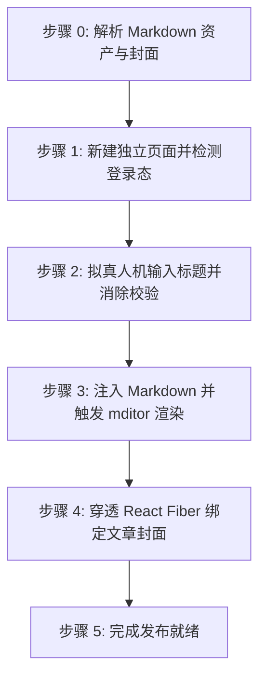

# 阿里云开发者社区文章自动发布技能 (doudou-aliyun)

## 自动化执行全流程

当接收到用户指定的 Markdown 文件路径时，依次执行以下阶段：



### 步骤 0：解析 Markdown 资产与封面

运行辅助解析脚本提取元数据（脚本路径相对本技能目录）：
```bash
node scripts/parser.mjs <Markdown文件绝对路径>
```
输出包含：
- `title`: 文章标题（自动清洗 Markdown 符号）
- `bodyContent`: 过滤掉首行重复 H1 后的 Markdown 正文（优先使用 `_cdn.md`），**自动移除底部"### 引用链接"区块以符合阿里云防引流风控规约**
- `cover`: 封面图信息（本地绝对路径 `localPath` 或网络 URL）

Agent 可在步骤 1 打开页面后，直接调用脚本一键注入文章标题、Markdown 正文与封面：
```javascript
import { parseAllAssets } from './scripts/parser.mjs';
import { buildBrowserPublishScript } from './scripts/aliyun_publisher.mjs';

const meta = parseAllAssets(markdownFilePath);
const code = buildBrowserPublishScript(meta);
await evaluate_script({ pageId, function: code });
```

---

### 步骤 1：打开/聚焦发布页并检测登录态

1. **新建独立页面**：调用 `new_page` 打开 `https://developer.aliyun.com/article/new`（必须每次新建独立页面，严禁复用或覆盖已有页面）。
2. 等待页面加载完成。
3. 执行脚本检测登录态：
   - 检查是否存在标题输入框 `input[placeholder*="标题"]` 或头像元素；
   - 若被重定向至 `account.aliyun.com/login`，向用户发出明确提示请用户在浏览器中扫码登录，并在登录完成后继续。

---

### 步骤 2：拟真人机输入标题

1. 聚焦标题输入框 `document.querySelector('input[placeholder*="标题"]')`。
2. 模拟微小随机延迟（300ms~600ms）。
3. **采用原生 Setter 与 React Field 双向同步**，彻底消除“请填写标题”红字校验错误：
```javascript
const titleInput = document.querySelector('input[placeholder*="标题"]');
if (titleInput) {
  titleInput.focus();
  const nativeSetter = Object.getOwnPropertyDescriptor(window.HTMLInputElement.prototype, 'value').set;
  if (nativeSetter) {
    nativeSetter.call(titleInput, articleTitle);
  } else {
    titleInput.value = articleTitle;
  }
  titleInput.dispatchEvent(new Event('input', { bubbles: true }));
  titleInput.dispatchEvent(new Event('change', { bubbles: true }));
  titleInput.dispatchEvent(new KeyboardEvent('keyup', { bubbles: true, key: ' ' }));
  titleInput.dispatchEvent(new Event('blur', { bubbles: true }));
}
// 同步 React Field 并触发校验消除提示
if (formInstance && formInstance.field) {
  formInstance.field.setValue('title', articleTitle);
  if (typeof formInstance.field.validate === 'function') {
    formInstance.field.validate(['title']);
  }
}
```
4. 随机停顿 400ms~800ms。

---

### 步骤 3：注入 Markdown 并触发 mditor 渲染

阿里云开发者社区采用 `mditor` Markdown 编辑器：
1. 聚焦编辑器原生的 `textarea.textarea`：
```javascript
const textarea = document.querySelector('.left-content textarea.textarea');
if (textarea) {
  textarea.focus();
  textarea.value = bodyContent;
  textarea.dispatchEvent(new Event('input', { bubbles: true }));
  textarea.dispatchEvent(new Event('change', { bubbles: true }));
  textarea.dispatchEvent(new KeyboardEvent('keyup', { bubbles: true, key: ' ' }));
}
```
2. 调用 `instance.editor` 同步更新并触发右侧实时预览渲染：
```javascript
if (formInstance && formInstance.editor) {
  formInstance.editor.value = bodyContent;
  if (formInstance.editor.$emit) {
    formInstance.editor.$emit('change', bodyContent);
    formInstance.editor.$emit('input', bodyContent);
  }
  if (formInstance.editor.viewer && formInstance.editor.viewer.render) {
    formInstance.editor.viewer.render();
  }
}
```
3. 随机停顿 800ms~1500ms，让编辑器完成 Markdown 解析和代码高亮。

---

### 步骤 4：穿透 React Fiber 绑定文章封面（固化方案，零弹窗）

若存在封面图资产（优先使用 `cdn_manifest.json` 中的 CDN 链接）：

#### 固化推荐方案：穿透 React Fiber 直接注入封面状态（100% 成功且杜绝弹窗）
1. 从 `form.public-article-form` 向上遍历定位表单组件的 React 实例 `instance`；
2. 执行状态注入与自动存草稿：
```javascript
const targetCoverUrl = data.cover?.cdnUrl || data.cover?.url;
if (targetCoverUrl && instance) {
  instance.setState({
    fileList: [{ imgURL: targetCoverUrl }]
  });
  if (typeof instance.aiDraftHandle === 'function') {
    instance.aiDraftHandle();
  }
}
```
3. 校验客观状态：检查 `instance.state.fileList` 包含封面 URL，页面渲染 `.upload-item img`，按钮状态自动变为「重新上传」。

---

### 步骤 5：完成发布就绪

1. 资产填入完成后直接判定完成；
2. **安全隔离**：原样保留当前标签页现场供人工发布，严禁调用 `close_page`。
