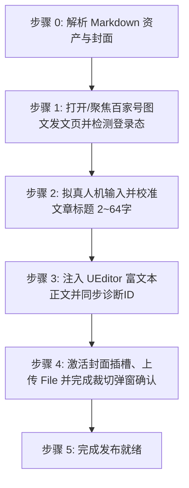

# 百家号图文文章自动发布技能 (doudou-baijia)

## 自动化执行全流程

当接收到用户指定的 Markdown 文件路径时，依次执行以下流程：



---

### 步骤 0：解析 Markdown 资产与封面

运行辅助解析脚本提取元数据（脚本路径相对本技能目录，即 `SKILL.md` 所在目录）：
```bash
node scripts/parser.mjs <Markdown文件绝对路径>
```
输出包含：
- `articleTitle`: 清洗并规范至 2~64 字以内的文章标题
- `articleHtml`: 包含 CDN 图片、标题、引用与列表的语义 HTML
- `cover`: 高清封面图（Base64 与本地路径）

Agent 可在步骤 1 打开页面后，直接调用脚本一键注入文章标题、富文本正文与封面：
```javascript
import { parseAllAssets } from './scripts/parser.mjs';
import { buildPublishBrowserScript } from './scripts/baijia_publisher.mjs';

const meta = parseAllAssets(markdownFilePath);
const code = buildPublishBrowserScript(meta);
await evaluate_script({ pageId, function: code });
```

---

### 步骤 1：打开/聚焦发文页并检测登录态

1. **新建独立页面**：调用 `new_page` 打开 `https://baijiahao.baidu.com/builder/rc/edit?type=news&is_from_cms=1`（必须每次新建独立页面，严禁复用或覆盖已有页面）。
2. 检测登录态：
   - 检查页面是否存在标题输入框 `[data-testid="news-title-input"]` 与编辑器实例 `window.editor`；
   - 若被重定向至登录页，向用户发出明确提示请用户在浏览器中扫码登录后再继续。

---

### 步骤 2：拟真人机输入文章标题

1. 定位 `[data-testid="news-title-input"] [contenteditable="true"]`；
2. 视口滚动并聚焦，派发 `focus` 事件；
3. 模拟微小随机延迟（200ms~400ms）；
4. 调用 `window.editor.__bjh_news_setTitle(meta.title)` 深度绑定百家号标题状态；
5. 依次派发 `input`、`change`、`blur` 事件。

---

### 步骤 3：注入百家号 UEditor 富文本正文

1. 调用 `window.editor.setContent(meta.htmlContent)` 注入带有 CDN 图片和代码块的标准富文本；
2. 调用 `window.editor.sync()` 同步编辑状态；
3. 随机停顿 800ms~1200ms 让 UEditor 完成节点渲染、字数统计与 `data-diagnose-id` 分配。

---

### 步骤 4：封面插槽点击、上传与裁切确认

若存在封面图资产：
1. 定位展示封面区域的插槽 `.FeEditorApp-_73a3a52aab7e3a36-content` 或 `.FeEditorApp-_93c3fe2a3121c388-item`；
2. 拟真悬停并触发 React `onClick` 弹出上传选择框；
3. 将封面 Base64 构造成标准 `File` 对象，通过 `DataTransfer` 注入上传 input（`input[name="media"][type="file"]`）；
4. 触发 input 的 React `onChange` 事件并派发 `change`；
5. 等待 1500ms~2000ms 裁切弹窗（`.cheetah-modal`）出现，拟真悬停并点击「确定 (1)」按钮；
6. 检查封面插槽确认封面图片已渲染呈现。

---

### 步骤 5：完成发布就绪

1. 资产填入完成后直接判定完成；
2. **安全隔离**：原样保留当前标签页现场供人工发布，严禁调用 `close_page`。
