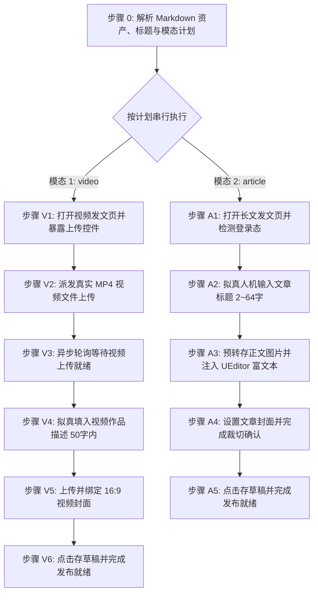

# 百家号自动化发布草稿技能 (doudou-baijia)

## 自动化执行全流程

当接收到用户指定的 Markdown 文件路径时，依次执行以下阶段（默认按 `video` → `article` 顺序串行执行）：



---

### 步骤 0：解析 Markdown 资产、标题与模态计划

运行辅助解析脚本提取元数据（脚本路径相对本技能目录）：

```bash
node scripts/parser.mjs <Markdown文件绝对路径> [模态] [--title "自定义新标题"]
```

输出包含：
- `publishPlan`: 模态执行计划（`modes`: `['video', 'article']`，`skipped` 被跳过模态及原因）
- `articleTitle`: 清洗后的文章标题（2~64 字以内）
- `cover`: 长文封面信息（Base64 / 文件名 / 本地路径）
- `videoCover`: 视频封面信息（**优先使用 16:9 高清原图**，Base64 / 文件名）
- `video`: 视频信息（成片路径 `videoPath`、标题/描述 `title` <=50字、简介 `description`）

> **视频封面图选取规约**：百家号视频平台推荐 16:9 横版高清晰度封面（建议分辨率 ≥ 1920*1080）。参考标准资产目录命名结构（如 `cover/images/` 下的原图 `cover-16x9.png` 与缩略图 `cover-16x9_thumb.png`），**视频封面图优先选用高清原图（严格排除 `_thumb` 缩略图）**。检索顺位为：
> 1. `cover/images/` 目录下 16:9 比例的高清原图：首选 `cover-16x9.png`；
> 2. `cover/images/` 目录下主封面高清原图：次选 `cover.png`；
> 3. `cover/images/` 目录下其他比例的高清原图（如 `cover-2.35x1.png`、`cover-1x1.png` 等）。

> **作品描述字数规约**：百家号视频发文页作品描述上限 **50 字**。解析脚本会自动提取并裁剪至 50 字以内。

Agent 可直接调用 `scripts/baijia_publisher.mjs` 配合 `chrome-devtools-mcp` 注入视频与长文草稿：

```javascript
import { parseAllAssets } from './scripts/parser.mjs';
import {
  buildPrepareVideoUploadBrowserScript,
  buildWaitVideoUploadReadyBrowserScript,
  buildVideoPublishBrowserScript,
  buildPublishBrowserScript
} from './scripts/baijia_publisher.mjs';

const meta = parseAllAssets(markdownFilePath, 'undsky', requestedModes ?? null);
// 视频准备上传: buildPrepareVideoUploadBrowserScript()
// 视频轮询等待: buildWaitVideoUploadReadyBrowserScript(120)
// 视频字段注入: buildVideoPublishBrowserScript(meta)
// 长文草稿发布: buildPublishBrowserScript(meta)
```

---

### 模式 A：发布视频草稿（video 模态，优先执行）

#### 步骤 V1：打开视频发布页并暴露上传控件

1. **新建独立页面**：调用 `new_page` 打开 `https://baijiahao.baidu.com/builder/rc/edit?type=videoV2&is_from_cms=1`（必须每次新建独立页面，严禁覆盖已有页面）。
2. 等待页面加载完成。
3. 执行 `buildPrepareVideoUploadBrowserScript()`，将页面隐藏的 `input[type="file"][accept*=".mp4"]` 暴露给 Accessibility Tree（赋予 id 为 `doudou-baijia-video-input`）。

#### 步骤 V2：派发真实 MP4 视频文件上传

调用 `upload_file` 将本地 `.mp4` 视频文件派发至上传控件：

```javascript
await upload_file({
  pageId: videoPageId,
  uid: videoFileInputUid, // 对应 #doudou-baijia-video-input
  filePaths: [meta.video.videoPath]
});
```

#### 步骤 V3：异步轮询等待视频上传就绪

执行 `buildWaitVideoUploadReadyBrowserScript(120)`，在浏览器端轮询等待，直到出现「更换」按钮且无上传加载蒙层。

#### 步骤 V4：拟真填入视频作品描述（<=50字）

百家号视频发文页采用 Meta Lexical 富文本框架。脚本通过：
1. 定位 `.FeEditorApp-d482ca4cbff50e1c-contentEditable`；
2. 获取其绑定的 `__lexicalEditor` 实例；
3. 调用 `editor.setEditorState(...)` 注入带有 paragraph 与 text 节点的状态，实现原生响应式更新，并降级派发 DOM 事件。

#### 步骤 V5：上传并绑定 16:9 横版视频封面

1. 定位封面组件的 `input[type="file"][accept*="image"]`；
2. 注入 16:9 封面 `File` 对象并派发 `change` 事件；
3. 弹出封面裁切弹窗（`.cheetah-modal`）后，拟真悬停并点击其中的「确定」按钮完成设置。

#### 步骤 V6：点击存草稿并完成发布就绪

1. 定位并点击「存草稿」按钮；
2. 捕获 Toast 提示（如「内容已存入草稿」）；
3. **安全隔离**：原样保留当前标签页现场供人工发布，严禁调用 `close_page`。

---

### 模式 B：发布长文图文草稿（article 模态）

#### 步骤 A1：打开长文发文页并检测登录态

1. **新建独立页面**：调用 `new_page` 打开 `https://baijiahao.baidu.com/builder/rc/edit?type=news&is_from_cms=1`。
2. 检测登录态：
   - 检查页面是否存在标题输入框 `[data-testid="news-title-input"]` 与编辑器实例 `window.editor`；
   - 若被重定向至登录页，向用户发出明确提示请用户在浏览器中扫码登录后再继续。

#### 步骤 A2：拟真人机输入文章标题（2~64字）

1. 定位 `[data-testid="news-title-input"] [contenteditable="true"]`；
2. 视口滚动并聚焦，派发 `focus` 事件；
3. 调用 `window.editor.__bjh_news_setTitle(meta.title)` 深度绑定百家号标题状态；
4. 依次派发 `input`、`change`、`blur` 事件。

#### 步骤 A3：预转存正文图片并注入 UEditor 富文本正文

1. **防跨域丢图机制**：脚本会自动扫描正文所有外链图片，通过百家号官方接口 `https://baijiahao.baidu.com/materialui/picture/uploadProxy` 预先转存至百度原生 BOS，并用 `https://baijiahao.baidu.com/bjh/picproxy` 地址替换 `src`，彻底根绝跨域爬取失败导致的丢图问题；
2. 调用 `window.editor.setContent(finalHtml)` 注入完整富文本；
3. 调用 `window.editor.sync()` 同步编辑状态；
4. 视口平滑滚动微调，触发百家号排版渲染。

#### 步骤 A4：设置封面图片并裁切确认

封面图从同名目录下的 cover/images 目录中提取，执行以下流程：

1. 定位展示封面区域的插槽 `.FeEditorApp-_73a3a52aab7e3a36-content` 或 `.FeEditorApp-_93c3fe2a3121c388-item`；
2. 拟真悬停并触发 React `onClick` 弹出上传选择框；
3. 将封面构造成标准 `File` 对象，通过 `DataTransfer` 注入上传 input（`input[name="media"][type="file"]`）；
4. 触发 input 的 React `onChange` 事件并派发 `change`；
5. 等待裁切弹窗（`.cheetah-modal`）出现，拟真悬停并点击「确定」按钮；
6. 检查封面插槽确认封面图片已渲染呈现。

#### 步骤 A5：点击存草稿并完成发布就绪

1. 定位并点击「存草稿」按钮；
2. 等待 2000ms 捕获 Toast 提示（如「内容已存入草稿」）及 URL 中的 `article_id`；
3. 资产填入完成后直接判定完成；
4. **安全隔离**：原样保留当前标签页现场供人工发布，严禁调用 `close_page`。
