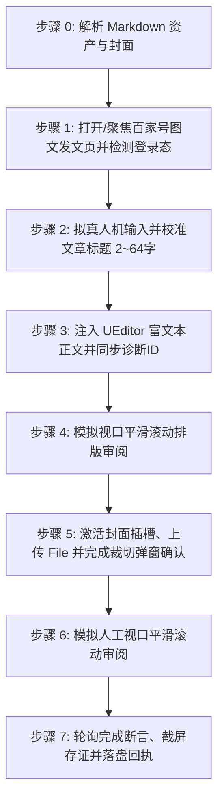

# 百家号图文文章自动发布技能 (doudou-baijia)

本技能通过 `chrome-devtools-mcp` 控制浏览器，将用户指定的本地 Markdown 文章及其衍生资产安全填入至**百家号创作者平台（https://baijiahao.baidu.com/builder/rc/edit?type=news&is_from_cms=1 ）**。

技能严格遵循**真实人工行为模拟与防风控规约**，通过自然的事件派发、微小随机时延抖动、百家号 UEditor / Lexical 富文本双向状态同步、视口平滑滚动排版审阅及弹窗式封面真实上传与裁切确认，避免被平台风控拦截。自动提取文章标题、摘要、标签、带 CDN 高清配图的排版正文以及单图/宽屏封面。

---

## 核心规约与防风控原则

1. **安全隔离与自动保存机制**：
   - **依托平台原生自动保存**：百家号编辑器在正文与标题填入后具备实时自动同步保存草稿机制。
   - **移除发布时对草稿箱的操作**：严禁主动寻找并点击「存草稿」按钮，**绝对严禁点击「发布」或「定时发布」**，确保内容停留在当前编辑页就绪态，由创作者人工进行最终核验与手动发布。
2. **完成判定必须客观可断言（严禁以「已等待」代替「已完成」）**：
   - 「静候自动保存生效」是**等待动作**，不是验收条件。必须以**完成断言**（见「完成断言与回执协议」）求值为 `true` 才允许判定完成。
   - 断言未通过即为未完成：登记 `timeout` 并保留页面，**严禁登记为 `success`**。
3. **收尾必须落盘回执（父级编排的唯一完成信号）**：
   - 无论成功、失败、缺登录、超时还是跳过，收尾都必须调用 `scripts/receipt.mjs write` 写入回执。
   - 父级 `doudou-UGC-skill` 不解析自然语言汇报，只读回执文件；**缺回执会让父级永久阻塞后续平台**。
4. **防风控与真实人机行为模拟 (Anti-Bot & Human Simulation)**：
   - **随机时延抖动**：所有操作之间增加正态分布随机等待（输入前 200~400ms、步骤间 400~1000ms、点击悬停 200~400ms），严禁毫秒级瞬时操作。
   - **真实事件完整性**：对于标题输入与表单交互，依次派发 `mouseover`、`mouseenter`、`mousedown`、`mouseup`、`click`、`focus`、`input`、`change`、`blur`，并同步底层 React / UEditor 状态。
   - **百家号 UEditor / Lexical 富文本注入**：调用 `window.editor.setContent(meta.htmlContent)` 注入标准 HTML，自动触发平台 `data-diagnose-id` 诊断与字数统计，完整保留标题、代码块、加粗、引用、列表及 CDN 配图。
   - **平滑视口滚动**：模拟人类自上而下的视觉审阅，分步平滑滚动页面触发浏览器的视口可见性检测。
   - **拟真悬停与点击**：点击元素前先将其 `scrollIntoView({ behavior: 'smooth' })`，派发 `mouseover`、`mouseenter` 悬停后再触发 `click`。
5. **正文内容忠实度保障 (Content Fidelity)**：
   - 注入正文必须直接来自 `parser.mjs` / `resolveArticleHtml` 转换的完整语义 HTML，100% 保留文章中的所有小标题、对比表格、代码块、引用块、有序/无序列表以及末尾的「引用链接」模块，**严禁模型二次脑补、扩写或擅自修改正文结构**。
6. **资产自动解析优先级**：
   - **文章标题**：限制 2～64 字以内（百家号官方限制 2~64 字），自动清洗 Markdown 符号（`#`、`**` 等）并智能截断。
   - **文章正文**：优先读取同名目录下 `[article_name]_cdn.md`（或依据 `cdn_manifest.json` 将本地图片无缝替换为 Cloudflare R2 公开 CDN 链接），转换为带有高清配图的标准语义 HTML。
   - **文章封面**（严格遵循 `baoyu-cover-image` 规约）：
     1. 优先读取同名目录下 `cover/images/` 的本地封面（优先 `cover-main-2.35x1.png` 宽屏主封面、`cover-16x9.png`、`cover-square-1x1.png`）；
     2. 其次读取同名目录下 `cdn_manifest.json` 中 `type: "cover"` 的 CDN 条目；
     3. 再次读取同名目录下 `xhs_images/images/` 下第 1 张封面卡片（如 `01-cover.png`）；
     4. 若均无则跳过封面设置。
7. **发布完成后保留页面（严禁自动关闭）**：
   - 内容填入与存证截图完成后，**严禁调用 `close_page` 或以任何方式关闭当前平台页面**，必须原样保留页面现场，供用户人工复核内容、补充登录或手动确认发布。
   - 未登录、验证码拦截、网络超时等异常中断的场景同样适用：保留页面交由用户接管，不得清理关闭。

---

## 完成断言与回执协议 (Completion Assertion & Receipt)

> 本段是**父级串行编排的硬契约**。父级（`doudou-UGC-skill`）不读自然语言汇报，只读落盘回执；没有回执，父级会认为本平台仍在进行中而永久阻塞后续平台。

### 完成断言

**严禁以「已等待 N 秒」代替「已完成」。** 必须轮询下面这条可求值的客观判据：

| 项 | 值 |
| :--- | :--- |
| **断言规则** | URL 出现 article_id= 或页面出现「已保存草稿」 |
| **超时窗口** | 45 秒，轮询间隔 1.5 秒 |
| **通过** | 登记 `success` |
| **超时** | 登记 `timeout`（`statusText` 说明未在 45s 内成立），保留页面，**严禁登记为 success** |

```javascript
// 在 evaluate_script 中求值，返回结构化断言结果
() => {
  const m = location.href.match(/article_id=([A-Za-z0-9_-]+)/);
  const saved = /已保存草稿|保存成功|已保存/.test(document.body.innerText);
  return { passed: Boolean(m) || saved, draftId: m?.[1] ?? null, draftUrl: location.href, savedTip: saved };
};
```

### 状态枚举（六个终态，仅此六种可写入回执）

| 状态 | 含义 |
| :--- | :--- |
| `success` | 草稿已保存且完成断言通过 |
| `ready_for_review` | 内容已填入就绪，平台禁止自动保存（百家号不适用） |
| `needs_login` | 登录态缺失/过期，已保留页面待补登 |
| `failed` | 明确失败（选择器失效、注入异常） |
| `timeout` | 完成断言在 45s 窗口内未成立 |
| `skipped` | 资产缺失或用户主动跳过 |

### 存证截图统一命名

必须存至 publishes/screenshots/baijia_article.png（格式 `<platformSlug>_<mode>.png`），**不得使用技能私有命名**——父级看板按统一命名反查存证。

### 临时脚本与中间文件存放规约（严禁污染工作区根目录）

- **统一落盘位置**：自动化发文执行过程中，凡需生成的任何临时注入脚本（如浏览器富文本注入 `.mjs` / `.js`）、临时数据载荷（如 `--payload-file <json>`）、调试脚本或中间辅助文件，**严禁放置在当前工作区根目录、项目根目录或技能目录中**！
- **强制同名资产目录**：所有临时文件**必须统一放置在目标 Markdown 文章对应的同名资产目录下**（即去除 `.md` 后缀的同名资产目录），文件名建议统一以 `scratch_` 为前缀。
- **可追溯与可清理**：执行完毕且回执落盘后，临时中间文件安全留存于同名资产目录供事后复核排查，或由清理指令统一清空，彻底避免根目录污染。

### 回执落盘（收尾必调，异常也要写）

```bash
node scripts/receipt.mjs write <Markdown文件绝对路径> --payload-file <json文件路径>
```

> 载荷含正则/反斜杠时**务必用 `--payload-file`**，直接内联 `--payload` 会被 shell 转义破坏。

`--payload` 结构（`results` 为逐模态数组，本技能含 `article`）：

```json
{
  "skill": "doudou-baijia",
  "platform": "百家号",
  "platformSlug": "baijia",
  "startedAt": "<技能启动时即记录，不要收尾时倒填>",
  "results": [
    {
      "mode": "article",
      "modeDesc": "图文长文",
      "status": "success",
      "statusText": "草稿已保存",
      "title": "……",
      "screenshot": "screenshots/baijia_article.png",
      "assertion": { "rule": "URL 出现 article_id= 或页面出现「已保存草稿」", "passed": true }
    }
  ]
}
```

脚本会强校验并拒绝不合规回执：非终态 `status`、缺 `statusText`、非 `skipped` 却缺 `screenshot` 一律报错退出，从源头杜绝脏数据流入看板。

---

## 自动化执行全流程

当接收到用户指定的 Markdown 文件路径时，依次执行以下流程：



---

### 步骤 0：解析 Markdown 资产与封面

运行辅助解析脚本提取元数据（脚本路径相对本技能目录，即 `SKILL.md` 所在目录）：
```bash
node scripts/parser.mjs <Markdown文件绝对路径>
```
输出包含：
- `articleTitle`: 清洗并规范至 2~64 字以内的文章标题
- `articleSummary`: 100 字以内纯文本摘要
- `tags`: 智能匹配的话题标签数组（最多 4 个）
- `articleHtml`: 包含 CDN 图片、标题、引用与列表的语义 HTML
- `cover`: 高清封面图（Base64 与本地路径）

---

### 步骤 1：打开/聚焦发文页并检测登录态

1. 调用 `list_pages` 检查是否已有百家号图文发文页面（URL 包含 `baijiahao.baidu.com/builder/rc/edit`）。
   - 若已有，调用 `select_page` 切换到该页面；
   - 若无，调用 `new_page` 打开 `https://baijiahao.baidu.com/builder/rc/edit?type=news&is_from_cms=1`。
2. 检测登录态：
   - 检查页面是否存在标题输入框 `[data-testid="news-title-input"]` 与编辑器实例 `window.editor`；
   - 若被重定向至登录页，向用户发出明确提示请用户在浏览器中扫码登录后再继续。

---

### 步骤 2：拟真人机输入文章标题

1. 定位 `[data-testid="news-title-input"] [contenteditable="true"]`；
2. 视口滚动并聚焦，派发 `focus` 事件；
3. 模拟微小随机延迟（200ms~400ms）；
4. 调用 `window.editor.__bjh_news_setTitle(meta.title)` 深度绑定百家号标题状态；
5. 依次派发 `input`、`change`、`blur` 事件。

---

### 步骤 3：注入百家号 UEditor 富文本正文

1. 调用 `window.editor.setContent(meta.htmlContent)` 注入带有 CDN 图片和代码块的标准富文本；
2. 调用 `window.editor.sync()` 同步编辑状态；
3. 随机停顿 800ms~1200ms 让 UEditor 完成节点渲染、字数统计与 `data-diagnose-id` 分配。

---

### 步骤 4：模拟人工视口平滑滚动

1. 平滑滚动到页面 400px，停顿 500ms~800ms；
2. 平滑滚动到页面 900px，停顿 500ms~800ms；
3. 平滑滚动回顶部，停顿 300ms~500ms。

---

### 步骤 5：封面插槽点击、上传与裁切确认

若存在封面图资产：
1. 定位展示封面区域的插槽 `.FeEditorApp-_73a3a52aab7e3a36-content` 或 `.FeEditorApp-_93c3fe2a3121c388-item`；
2. 拟真悬停并触发 React `onClick` 弹出上传选择框；
3. 将封面 Base64 构造成标准 `File` 对象，通过 `DataTransfer` 注入上传 input（`input[name="media"][type="file"]`）；
4. 触发 input 的 React `onChange` 事件并派发 `change`；
5. 等待 1500ms~2000ms 裁切弹窗（`.cheetah-modal`）出现，拟真悬停并点击「确定 (1)」按钮；
6. 检查封面插槽确认封面图片已渲染呈现。

---

### 步骤 6：模拟人工视口平滑滚动审阅

1. 平滑滚动至页面底部：`window.scrollTo({ top: document.body.scrollHeight, behavior: 'smooth' });`；
2. 停顿 500ms~800ms；
3. 平滑滚动回页面顶部：`window.scrollTo({ top: 0, behavior: 'smooth' });`；
4. **安全隔离核心规约**：百家号编辑器为实时自动保存草稿机制，**严禁主动寻找并点击「存草稿」按钮**，**绝对严禁触碰「发布」或「定时发布」按钮**。

---

### 步骤 7：轮询完成断言、截屏存证并落盘回执

1. 按「完成断言与回执协议」以 1.5s 间隔轮询完成断言，最长 45s（**严禁以固定等待代替断言**）；
2. 检查页面状态与 URL（如是否包含 `article_id`，字数统计与诊断状态是否就绪）；
3. 调用 `take_screenshot` 保存当前就绪状态作为执行存证（如 `baijia_article.png`）；
4. **保留页面现场**：存证完成后，**严禁调用 `close_page` 或关闭标签页**，保持当前页面打开供人工复核；
5. 向用户呈递包含文章标题、字数、封面状态、`article_id` 及存证截图的结构化报告。

---

## 异常与风控处理

| 异常场景 | 表现特征 | 应对与恢复策略 |
| :--- | :--- | :--- |
| **未登录 / 登录态失效** | 跳转至登录页或未找到标题框与 `window.editor` | 立即暂停自动化流程，向用户发出提示请在浏览器中扫码登录，登录完成后继续。 |
| **标题超长拦截** | 提示“标题限制2~64个字” | 解析器已自动对标题执行 64 字强截断，确保 100% 符合平台规则。 |
| **封面上传弹窗未展开** | 点击封面插槽无响应 | 深度遍历触发父子节点的 React `onClick` 事件，或跳过封面上传，在报告中明确提示，不阻塞草稿主体的保存。 |
| **UEditor 注入失败** | `window.editor` 未找到或未渲染 | 自动降级为操作 iframe (`#ueditor_0`) 的 `contentDocument.body`。 |
| **保存延迟** | 未及时捕获到 Toast 通知 | 额外增加 3 秒轮询等待，检查 URL 是否已带有 `article_id` 参数。 |

---

## 脚本工具与在 Agent 中的调用方法

以下路径均相对本技能目录（`SKILL.md` 所在目录），执行前先切换到该目录，或将其拼接为绝对路径使用。

- `scripts/parser.mjs`：解析 Markdown，提取标题、摘要、话题标签、语义 HTML 与封面资产。
- `scripts/baijia_publisher.mjs`：浏览器注入脚本生成器（编辑器状态同步与防风控人机模拟）。

### 1. 运行命令行测试

```bash
# 1. 测试资产解析
node scripts/parser.mjs <Markdown文件路径>

# 2. 测试浏览器代码生成
node scripts/baijia_publisher.mjs <Markdown文件路径>
```

### 2. 在 Agent 中配合 `chrome-devtools-mcp` 调用

```javascript
import { parseAllAssets } from './scripts/parser.mjs';
import { buildPublishBrowserScript } from './scripts/baijia_publisher.mjs';

// 1. 解析目标 Markdown 及其同名资产目录
const meta = parseAllAssets(markdownFilePath);

// 2. 生成自包含浏览器执行代码
const code = buildPublishBrowserScript(meta);

// 3. 在百家号发文页执行
const result = await evaluate_script({
  pageId: publishPageId,
  function: code
});

// 4. 截屏存证
await take_screenshot({ pageId: publishPageId });
```
