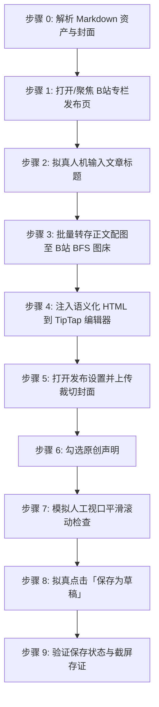

# 哔哩哔哩专栏文章自动发布到草稿技能 (doudou-bilibili)

本技能通过 `chrome-devtools-mcp` 控制浏览器，将用户指定的本地 Markdown 文件发布至**哔哩哔哩创作中心专栏编辑器（https://member.bilibili.com/platform/upload/text/new-edit ）的草稿箱**。

技能严格遵循**真实人工行为模拟与防风控规约**，通过自然的事件派发、微小随机时延抖动、视口平滑滚动及悬停交互，避免被 B 站平台风控拦截。同时与 `doudou-markdown-skill` 资产体系无缝集成，自动提取文章标题、摘要、话题、正文语义化结构、16:9/2.35:1 封面图，并自动通过 B 站官方 BFS 接口转存正文配图，彻底规避外链图片风控拦截。

---

## 核心规约与防风控原则

1. **草稿安全隔离**：
   - **严格限定仅保存到草稿箱**，绝对不点击「发布」，确保所有内容必须经人工最终确认后再公开发布。
2. **防风控与真实人机行为模拟 (Anti-Bot & Human Simulation)**：
   - **随机时延抖动**：所有操作之间增加正态分布随机等待（输入前 300~600ms、步骤间 600~1500ms、点击悬停 300~500ms），严禁毫秒级并发。
   - **真实事件完整性**：对于标题输入与表单开关，依次派发 `focus`、`keydown`、`input`、`change`、`blur`，并同步 ProseMirror / TipTap 编辑器状态。
   - **平滑视口滚动**：模拟人类自上而下的视觉审查，分步平滑滚动页面触发浏览器的视口可见性检测。
   - **拟真悬停与点击**：点击按钮前先将视口滚动到按钮可见区域，派发 `mouseover`/`mouseenter` 悬停 300~500ms 后再触发 `click`。
3. **资产自动解析优先级**（参考 `doudou-markdown-skill` 规约）：
   - **正文**：优先使用同名目录下已图床化的 `[article_name]_cdn.md`；若无则使用原 Markdown 文件。
   - **封面图**：
     1. 优先读取同名目录下 `cdn_manifest.json` 中 `type: "cover"` 的资产（优先 16:9 / 2.35:1 / 1:1 封面）；
     2. 其次读取同名目录下 `cover/images/` 的本地图片文件（如 `cover.png`、`cover-main-2.35x1.png`、`cover-square-1x1.png`）；
     3. 再次从 Markdown 正文提取第一张网络图片链接或本地路径；
     4. 若均无则跳过自定义封面，由 B 站自动抓取。
   - **正文配图官方 BFS 转存**：B 站后端在保存草稿时强制校验图片域名必须为 `*.hdslb.com`，外链图片会直接阻断草稿保存。本技能在浏览器端通过 `/x/dynamic/feed/draw/upload_bfs`（带 CSRF `bili_jct`）自动将所有本地与网络配图转存为 B 站原生图床 URL 后再注入编辑器。
   - **原创声明**：自动勾选「声明此文章为原创，未经授权禁止转载」。

---

## 自动化执行全流程

当接收到用户指定的 Markdown 文件路径（例如 `mds/RuoYi-SpringBoot3/byeidea.md`）时，依次执行以下步骤：



### 步骤 0：解析 Markdown 资产与封面

运行辅助解析脚本提取元数据（脚本路径相对本技能目录，即 `SKILL.md` 所在目录）：
```bash
node scripts/parser.mjs <Markdown文件绝对路径>
```
输出包含：
- `title`: 文章标题（自动清洗 Markdown 符号）
- `summary`: 60~120 字纯文本摘要
- `topics`: 1~3 个话题标签
- `cover`: 封面图信息（Local Base64 或 CDN URL）
- `html`: 转换为 TipTap 规范的语义化 HTML（带图片占位符）
- `images`: 正文中所有待转存的配图列表

---

### 步骤 1：打开/聚焦发布页并检测登录态

1. 调用 `list_pages` 检查是否已有 B 站专栏发布页（URL 包含 `member.bilibili.com/platform/upload/text` 或 `york/read-editor`）。
   - 若已有，调用 `select_page` 切换到该页面；
   - 若无，调用 `new_page` 打开 `https://member.bilibili.com/platform/upload/text/new-edit`。
2. 页面加载后，定位专栏编辑器 iframe (`iframe[src*="read-editor"]`)，获取 `targetWin.editor` (Sunflower TipTap 编辑器实例)。
3. 若未登录，提示用户在浏览器中扫码登录，并在登录完成后继续。

---

### 步骤 2：拟真人机输入文章标题

1. 聚焦标题输入框 `textarea.title-input__inner`。
2. 模拟微小随机延迟（300ms~600ms）。
3. 设置标题值并派发 DOM 事件：
```javascript
titleInput.focus();
titleInput.value = articleTitle;
titleInput.dispatchEvent(new Event('input', { bubbles: true }));
titleInput.dispatchEvent(new Event('change', { bubbles: true }));
titleInput.blur();
```

---

### 步骤 3：批量转存正文配图至 B站 BFS 图床

B 站编辑器严禁非 `hdslb.com` 外链图片。对于正文中的每张图片：
1. 本地图片读取为 Blob，网络图片通过 `fetch` 转为 Blob；
2. 携带 `bili_jct` CSRF Token 调用 B 站官方接口 `/x/dynamic/feed/draw/upload_bfs`；
3. 获取官方 `https://i0.hdslb.com/bfs/new_dyn/...` 链接并替换 HTML 占位符：
```javascript
const imgNodeHtml = ``;
```

---

### 步骤 4：注入语义化 HTML 到 TipTap 编辑器

调用 TipTap 编辑器官方命令注入正文：
```javascript
editor.commands.setContent(finalHtml);
```
随机等待 800ms~1400ms，让 ProseMirror 完成 DOM 树解析、高亮与块级节点渲染。

---

### 步骤 5：打开发布设置并上传裁切封面

若存在封面图资产（`cdn_manifest.json` 或 `cover/images/`）：
1. 拟真点击顶部「发布设置」按钮；
2. 检查「自定义封面」开关，若未开启则点击切换开启（等待 500ms 渲染）；
3. 点击「添加封面」/「重新上传」按钮（`.upload-button`），唤起 Vue 动态挂载原生 `input[type="file"]` 控件；
4. 将封面转为 `File` 对象，通过 `DataTransfer` 注入 `input[type="file"]` 触发原生文件选择；
5. 轮询等待 1.0~1.8 秒弹出「选择封面的截取位置」裁切弹窗（`.vui_dialog--btn-confirm` / `.image-dialog`）；
6. 点击裁切对话框的「确定」按钮，完成官方封面上传与裁切绑定。

---

### 步骤 6：勾选原创声明

在发布设置面板中定位「创作声明」选项：
- 检查并点击勾选「声明此文章为原创，未经授权禁止转载」复选框。

---

### 步骤 7：模拟人工视口平滑滚动检查

模拟人类作者自上而下检查文章排版：
1. 平滑滚动到页面 350px 处，等待 400ms~700ms；
2. 平滑滚动回顶部，等待 300ms~600ms。

---

### 步骤 8：拟真点击「保存为草稿」并验证

1. 寻找底部「保存为草稿」按钮，视口滚动居中并派发 `mouseover`；
2. 延迟 300ms~500ms 后触发 `click`；
3. 监听页面 Toast（`.vui_message` / `.vui_toast`）提示文字「保存成功」；
4. 调用 `take_screenshot` 保存当前草稿状态截图作为存证；
5. 输出结构化结果报告（文章标题、话题、封面状态、配图数、保存状态等）。

---

## 异常与风控处理

| 异常场景 | 表现特征 | 应对与恢复策略 |
| :--- | :--- | :--- |
| **未登录 / 登录态过期** | 未找到编辑器 iframe 或提示登录 | 立即停止自动化输入，向用户发送提示，等待用户在浏览器中扫码登录后再继续。 |
| **BFS 图床上传失败 / 超时** | CSRF 失效或网络超时 | 降级移除该配图占位符，保证正文主体与其他段落顺利保存，在最终报告中提示配图状态。 |
| **封面裁切弹窗未自动确认** | 弹出 `.image-dialog` 但未触发确定 | 增加 1.5s 缓冲重试点击 `.vui_dialog--btn-confirm`。 |
| **外部图片风控拦截** | 报「内容包含非法图片链接」 | 严格确保所有 `` 标签均经由 BFS 接口转存为 `hdslb.com` 链接后再注入编辑器。 |

---

## 脚本工具与使用方法

以下路径均相对本技能目录（`SKILL.md` 所在目录），执行前先切换到该目录，或将其拼接为绝对路径使用。

- `scripts/parser.mjs`：解析 Markdown，提取标题、摘要、话题、封面资产与 TipTap 语义化 HTML。
- `scripts/bilibili_publisher.mjs`：浏览器注入脚本生成器（BFS 图床转存、TipTap 状态同步、防风控人机模拟）。

1. **直接运行 Node.js 脚本测试解析**：
```bash
node scripts/parser.mjs <Markdown文件路径>
```

2. **在 Agent 中配合 `chrome-devtools-mcp` 调用**：
```javascript
import { buildBrowserPublishScript } from './scripts/bilibili_publisher.mjs';

// 1. 生成自包含执行代码
const code = buildBrowserPublishScript(markdownFilePath);

// 2. 调用 evaluate_script 在 B站专栏发布页执行
const result = await evaluate_script({
  pageId: targetPageId,
  function: code
});

// 3. 截屏存证
await take_screenshot({ pageId: targetPageId });
```
