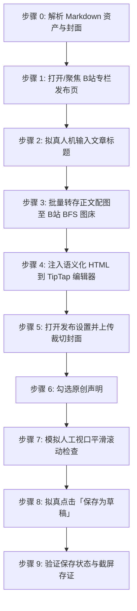
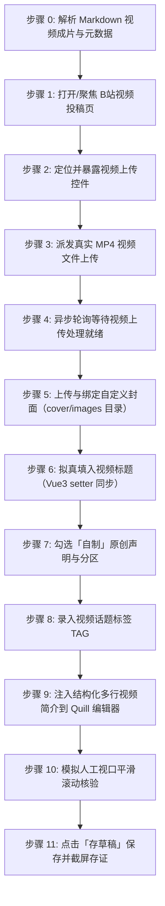

# 哔哩哔哩自动化发布草稿技能 (doudou-bilibili)

本技能通过 `chrome-devtools-mcp` 控制浏览器，实现哔哩哔哩创作中心（[https://member.bilibili.com](https://member.bilibili.com)）的**专栏长文文章**与**视频投稿**双模态自动化发布全流程。

技能严格遵循**真实人工行为模拟与防风控规约**，通过自然的事件派发、微小随机时延抖动、视口平滑滚动及悬停交互，避免被 B 站平台风控拦截。自动提取文章标题、视频短标题、多行结构化简介、话题标签、正文语义化结构、16:9/2.35:1 封面图，并自动通过 B 站官方 BFS 接口转存正文配图，彻底规避外链图片风控拦截。

---

## 📌 核心发布入口

- **专栏文章发布入口**：`https://member.bilibili.com/platform/upload/text/new-edit`
- **视频投稿发布入口**：`https://member.bilibili.com/platform/upload/video/frame`
- **稿件管理中心入口**：`https://member.bilibili.com/platform/upload-manager/article`

---

## 🎨 资产规范与路径映射

| 资产类型 | 规范路径 / 规则 | 说明 |
| :--- | :--- | :--- |
| **源 Markdown 文章** | `path/to/article_name.md` | 原始文章 |
| **视频成片文件** | `path/to/article_name/video/[video_name].mp4` 或 `[article_name].mp4` | 成品高清视频（优先识别 `video_manifest.json` 登记输出） |
| **视频作品标题** | `<= 80 字`（建议 30 字以内） | 自动清洗 Markdown 符号与非规范标点，优先适配 manifestTitle，超长自动截断为 77 字 + `...` |
| **视频作品简介** | `<= 2000 字` | 核心干货要点结构化梳理 + `#话题标签#`，保留多行清晰排版 |
| **专栏文章标题** | `<= 50 字`（建议 30 字以内） | 自动清洗 Markdown 符号 |
| **专栏内容摘要** | `60~120 字` | 纯文本精炼摘要 |
| **专栏排版 HTML** | 语义化 TipTap HTML | 正文配图自动转存至 B 站官方 BFS 图床（`*.hdslb.com`） |
| **封面图资产** | 16:9 / 2.35:1 宽屏封面 | 优先读取同名目录下 `cdn_manifest.json` 或 `cover/images/`，视频可降级平台智能抽帧 |
| **标签处理约定** | `1~5 个标签` | 视频建议匹配行业与技术话题（如 `AI编程`、`智能体`、`软件开发`） |

---

## 🛡️ 核心规约与防风控原则

1. **草稿安全隔离与终点控制**：
   - **严格限定仅保存到草稿箱**，**绝对不自动点击「发布」或「立即投稿」**，确保所有内容必须经创作者人工最终审阅确认。
   - **专栏文章**：触发底栏「保存为草稿」按钮，并监听页面 Toast 提示文字「保存成功」。
   - **视频投稿**：视频派发上传后异步轮询等待直至上传完成且表单就绪。由于 B 站视频上传会自动持久化暂存为云端视频草稿（存放在「稿件管理 -> 视频草稿」），全套表单填入并经视口平滑滚动检查后，**严格保持在就绪状态并截屏存证，绝不自动触碰提交按钮**。
2. **防风控与真实人机行为模拟 (Anti-Bot & Human Simulation)**：
   - **随机时延抖动**：所有操作之间增加正态分布随机等待（输入前 300~600ms、步骤间 600~1500ms、点击悬停 300~500ms），严禁毫秒级并发。
   - **真实事件完整性**：对于标题输入与表单开关，依次派发 `focus`、`keydown`、`input`、`change`、`blur`，并同步 ProseMirror / TipTap / Vue 组件状态。
   - **平滑视口滚动**：模拟人类自上而下的视觉审查，分步平滑滚动页面触发浏览器的视口可见性检测。
   - **拟真悬停与点击**：点击按钮前先将视口滚动到按钮可见区域，派发 `mouseover`/`mouseenter` 悬停 300~500ms 后再触发 `click`。
3. **资产自动解析优先级**：
   - **正文**：优先使用同名目录下已图床化的 `[article_name]_cdn.md`；若无则使用原 Markdown 文件。
   - **封面图**：
     1. 优先读取同名目录下 `cdn_manifest.json` 中 `type: "cover"` 的资产（优先 16:9 / 2.35:1 / 1:1 封面）；
     2. 其次读取同名目录下 `cover/images/` 的本地图片文件（如 `cover.png`、`cover-main-2.35x1.png`）；
     3. 再次从 Markdown 正文提取第一张图片链接或本地路径；
     4. 视频投稿时若无自定义封面则由 B 站自动推荐高质量抽帧。
   - **正文配图官方 BFS 转存**：B 站专栏草稿强制校验图片域名必须为 `*.hdslb.com`。本技能在浏览器端通过 `/x/dynamic/feed/draw/upload_bfs`（带 CSRF `bili_jct`）自动将所有本地与网络配图转存为 B 站原生图床 URL。
   - **原创声明**：自动选择「自制」并勾选「声明此内容为原创，未经授权禁止转载」。

---

## 🚀 双模态自动化发布执行流程

### 模式 A：发布专栏文章草稿（Article Post）



1. **打开/聚焦专栏发布页并检测登录态**：
   - 访问 `https://member.bilibili.com/platform/upload/text/new-edit`。
   - 页面加载后定位专栏编辑器 iframe (`iframe[src*="read-editor"]`)，获取 Sunflower TipTap 编辑器实例。
2. **拟真人机输入文章标题**：
   - 定位 `textarea.title-input__inner`，填入标题并派发 DOM 事件。
3. **批量转存正文配图至 B 站 BFS 图床**：
   - 携带 `bili_jct` CSRF Token 调用 `/x/dynamic/feed/draw/upload_bfs`，将正文配图转换为 `hdslb.com` 链接。
4. **注入语义化 HTML 到 TipTap 编辑器**：
   - 调用 `editor.commands.setContent(finalHtml)` 并随机等待 DOM 解析。
5. **打开发布设置并上传裁切封面**：
   - 点击「发布设置」，开启「自定义封面」，注入封面文件并确认裁切弹窗。
6. **勾选原创声明**：
   - 勾选「声明此文章为原创，未经授权禁止转载」。
7. **视口平滑滚动与保存草稿**：
   - 平滑滚动审查后，点击「保存为草稿」，验证 Toast 成功提示，截屏存证。

---

### 模式 B：发布视频投稿草稿（Video Post）



1. **解析视频资产与元数据**：
   - 运行 `node scripts/parser.mjs <Markdown文件路径>`，解析 `video/` 目录下成片（.mp4）、manifestTitle 及结构化简介，优先解析同名目录下 `cover/images/` 的自定义封面图。
2. **打开/聚焦视频投稿发布页**：
   - 访问 `https://member.bilibili.com/platform/upload/video/frame`。
3. **暴露并定位文件上传控件**：
   - 执行 `buildPrepareVideoUploadBrowserScript()`，将隐藏的 `input[type="file"]`（`buploader`）暴露给 accessibility tree，赋予 `id="doudou-bilibili-video-input"`。
4. **派发真实视频文件上传**：
   - 调用 `upload_file` 将本地 `.mp4` 文件路径派发至上传 input。
5. **异步轮询等待视频上传与表单就绪**：
   - 启动异步轮询（10~180 秒），监听页面状态直到分片上传完成、视频文件列表渲染且表单字段就绪。
6. **上传与绑定自定义封面**：
   - 优先获取同名目录 `cover/images/` 下的主封面图（`cover-main-2.35x1.png` 或 `16:9` 比例），点击「添加封面」唤起「封面制作」弹窗；
   - 注入图片文件至弹窗中的上传控件，等待多比例视口预览生成，点击「完成」确认封面绑定。
7. **拟真输入视频标题**：
   - 定位 `input[placeholder*="标题"]`，通过 `HTMLInputElement.prototype.value` 原生 setter 填入 80 字以内精炼短标题，派发 `input` 与 `change` 原生事件以同步 Vue 响应式状态。
8. **配置投稿类型与分区**：
   - 点击选择投稿类型为「自制」（原创）；
   - 自动匹配推荐分区芯片（如「科技」/「软件应用」/「人工智能」）。
9. **录入视频标签（TAG）**：
   - 定位标签输入框，依次录入 1~5 个核心话题标签并派发 Enter 回车键绑定，顺带点击高频推荐标签。
10. **注入结构化多行简介**：
    - 定位 Quill 富文本编辑器（`.ql-container`），通过 `__quill.setText(...)` 填入结构化排版的观点与核心要点（2000 字以内）。
11. **视口平滑滚动核验与保存草稿**：
    - 视口自上而下平滑滚动模拟人工核验排版；
    - 点击「存草稿」（`span.submit-draft`），严格遵循草稿安全隔离规约（**绝不点击「立即投稿」**）；
    - 页面跳转至稿件管理草稿箱，截取当前草稿列表存证截图并保存至文章同名目录：`bilibili_video_draft_proof.png`。

---

## 异常与风控处理

| 异常场景 | 表现特征 | 应对与恢复策略 |
| :--- | :--- | :--- |
| **未登录 / 登录态过期** | 未找到编辑器 iframe 或提示登录弹窗 | 立即停止自动化输入，向用户发送提示，等待用户在浏览器中扫码登录后再继续。 |
| **视频上传超时或网络波动** | 上传进度卡死或提示“网络异常” | 延长轮询上限至 180 秒，若提示失败则自动提示用户检查网络并重试。 |
| **BFS 图床上传失败 / 超时** | CSRF 失效或网络超时 | 降级移除该配图占位符，保证正文主体顺利保存，在最终报告中提示配图状态。 |
| **封面裁切弹窗未自动确认** | 弹出 `.image-dialog` 但未触发确定 | 增加 1.5s 缓冲重试点击 `.vui_dialog--btn-confirm`。 |
| **外部图片风控拦截** | 报「内容包含非法图片链接」 | 严格确保所有 `` 标签均经由 BFS 接口转存为 `hdslb.com` 链接后再注入专栏。 |

---

## 🛠️ 核心脚本与使用方法

以下路径均相对本技能目录（`SKILL.md` 所在目录），执行前先切换到该目录，或将其拼接为绝对路径使用：

- `scripts/parser.mjs`：解析 Markdown，提取专栏标题/摘要/封面资产/TipTap HTML，以及视频成片路径/精炼标题/结构化简介/标签。
- `scripts/bilibili_publisher.mjs`：浏览器注入脚本生成器（专栏 BFS 图床转存、视频上传暴露、上传就绪等待、表单拟真填充与草稿存证）。

### 1. 命令行测试解析

```bash
node scripts/parser.mjs <Markdown文件路径>
```

### 2. 命令行测试脚本生成

```bash
node scripts/bilibili_publisher.mjs <Markdown文件路径>
```

### 3. Agent 视频自动化发布调用范式

```javascript
import { 
  buildPrepareVideoUploadBrowserScript, 
  buildWaitVideoUploadReadyBrowserScript, 
  buildFillVideoFormBrowserScript 
} from './scripts/bilibili_publisher.mjs';
import { parseArticle } from './scripts/parser.mjs';

// 1. 解析目标文章与视频成片
const meta = await parseArticle(markdownFilePath);

// 2. 准备上传控件并获取 uid
const prepRes = await evaluate_script({ pageId, function: buildPrepareVideoUploadBrowserScript() });

// 3. 派发视频上传
await upload_file({ pageId, uid: inputUid, filePaths: [meta.video.videoPath] });

// 4. 等待视频上传就绪
await evaluate_script({ pageId, function: buildWaitVideoUploadReadyBrowserScript(180) });

// 5. 填充标题、简介、标签与类型
const fillRes = await evaluate_script({ pageId, function: buildFillVideoFormBrowserScript(meta) });

// 6. 截屏存证
await take_screenshot({ 
  pageId, 
  filePath: `${articleDir}/bilibili_video_draft_proof.png` 
});
```
