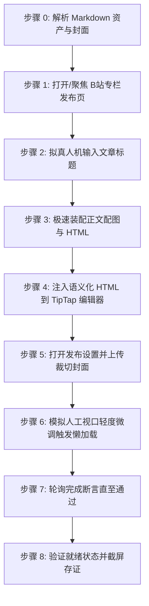
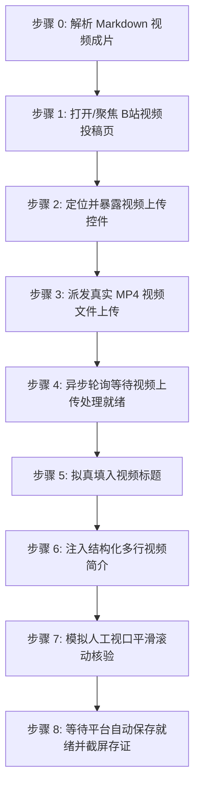

# 哔哩哔哩自动化发布技能规范 (doudou-bilibili)

本技能通过 `chrome-devtools-mcp` 控制浏览器，实现哔哩哔哩创作中心（https://member.bilibili.com ）的**专栏长文文章**与**视频投稿**双模态自动化发布全流程。

严格遵循**真实人工行为模拟与防风控规约**，视频分片上传异步就绪，专栏正文配图自动通过官方 BFS 图床转存，全流程完成后原样保留页面现场供人工最终核验，绝不自动触碰公开发布或提交投稿按钮。

---

## 核心规约与防风控原则

1. **发布入口**：
   - 专栏文章发布入口：`https://member.bilibili.com/platform/upload/text/new-edit`
   - 视频投稿发布入口：`https://member.bilibili.com/platform/upload/video/frame`
   - 稿件管理中心入口：`https://member.bilibili.com/platform/upload-manager/article`
2. **模态判定与串行执行原则**：
   - **默认全模态**：用户未明确指定模态时，默认发布全部可用模态（视频投稿 + 专栏文章）。执行顺序恒为 `video` → `article`。
   - **显式指定**：用户明确指定时，严格仅执行指定模态。
   - **资产缺失处理**：若缺少对应资产（无 `video/*.mp4` 则跳过视频投稿，无专栏正文 HTML 则跳过专栏文章），自动跳过并在回执中登记原因，继续执行其他可用模态。
3. **资产规范与限制**：
   - 视频成片：`video/*.mp4`（优先识别 `video_manifest.json` 登记的输出）；
   - 视频作品标题：`<= 80 字`（建议 30 字以内，自动清洗 Markdown 符号，超长截断）；
   - 视频作品简介：`<= 2000 字`（核心干货结构化梳理 + `#话题标签#`，保留多行分段排版）；
   - 专栏文章标题：`<= 50 字`（建议 30 字以内，自动清洗 Markdown 符号）；
   - 专栏内容摘要：`60~120 字` 纯文本摘要；
   - 封面图：优先读取同名目录下 16:9 / 2.35:1 宽屏封面，视频投稿可降级平台智能抽帧。
4. **安全隔离（绝对底线）**：
   - **依托平台原生自动保存**：B 站专栏文章具备输入实时自动保存机制；视频投稿上传后自动持久化存储在云端草稿中。
   - **移除发布时对草稿箱的操作**：严禁主动寻找并点击「保存为草稿」或「存草稿」按钮，**绝对严禁自动点击「发布」或「立即投稿」**，确保所有内容保留在当前编辑页就绪态，由创作者人工最终审阅并手动提交。
5. **完成判定必须客观可断言**：
   - 必须以客观断言求值为 `true` 判定完成，严禁以固定延时代替完成。超时标记 `timeout` 并保留页面，严禁误报 `success`。
6. **收尾必须落盘回执**：
   - 执行完毕必须调用 `scripts/receipt.mjs write` 写入回执，供上层调度读取。
7. **防风控与真实人机行为模拟**：
   - **随机时延抖动**：输入前等待 300~600ms、步骤间 600~1500ms、悬停 300~500ms；
   - **真实事件完整性**：对于标题输入与表单开关，依次派发 `focus`、`keydown`、`input`、`change`、`blur`，并同步 ProseMirror / TipTap / Vue 组件状态；
   - **平滑视口滚动**：模拟人类自上而下的视觉审查，分步平滑滚动页面触发可见性检测；
   - **正文配图官方 BFS 转存**：B 站专栏草稿强制校验图片域名必须为 `*.hdslb.com`。浏览器端通过 `/x/dynamic/feed/draw/upload_bfs`（带 CSRF `bili_jct`）自动将配图转存为 B 站原生图床 URL；
   - **原创声明**：自动选择「自制」并勾选「声明此内容为原创，未经授权禁止转载」。
8. **发布完成后保留页面（严禁自动关闭）**：
   - 每次执行必须调用 `new_page` 新建独立标签页（严禁复用已有页面）；全流程完成后严禁调用 `close_page`，原样保留页面现场供人工最终审阅。

---

## 完成断言与回执协议 (Completion Assertion & Receipt)

### 完成断言

| 项 | 值 |
| :--- | :--- |
| **断言规则** | 稿件管理中心出现该标题草稿，或上传进度 100% + 「存草稿」成功提示 |
| **超时窗口** | 45 秒，轮询间隔 1.5 秒 |
| **通过** | 登记 `success` |
| **超时** | 登记 `timeout`（保留页面，严禁登记为 success） |

```javascript
// 在 evaluate_script 中求值
() => {
  const t = document.body ? document.body.innerText : '';
  const done = /100%|上传完成|上传成功/.test(t);
  const saved = /存草稿|草稿箱|保存成功/.test(t);
  return { passed: done && saved, uploadDone: done, draftSaved: saved };
};
```

### 状态枚举（六个终态）

| 状态 | 含义 |
| :--- | :--- |
| `success` | 草稿已保存且完成断言通过 |
| `ready_for_review` | 内容已填入就绪待人工发布 |
| `needs_login` | 登录态缺失/过期，已保留页面待补登 |
| `failed` | 明确失败（选择器失效、注入异常） |
| `timeout` | 完成断言在 45s 窗口内未成立 |
| `skipped` | 资产缺失或用户主动跳过 |

### 存证截图统一命名

统一存至同名文章目录下的 `publishes/screenshots/` 目录：
- 专栏文章：`publishes/screenshots/bilibili_article.png`
- 视频投稿：`publishes/screenshots/bilibili_video.png`

### 临时脚本与中间文件存放规约

所有临时注入脚本、临时 payload 等文件必须统一放置在目标 Markdown 文章对应的同名资产目录下，严禁污染工作区或项目根目录。

### 回执落盘

```bash
node scripts/receipt.mjs write <Markdown文件绝对路径> --payload-file <json文件路径>
```

`--payload` 结构示例：

```json
{
  "skill": "doudou-bilibili",
  "platform": "哔哩哔哩",
  "platformSlug": "bilibili",
  "startedAt": "2026-09-09T08:00:00.000Z",
  "results": [
    {
      "mode": "video",
      "modeDesc": "视频投稿",
      "status": "success",
      "statusText": "草稿已保存",
      "title": "……",
      "screenshot": "screenshots/bilibili_video.png",
      "assertion": { "rule": "稿件管理中心出现该标题草稿，或上传进度 100% + 「存草稿」成功提示", "passed": true }
    },
    {
      "mode": "article",
      "modeDesc": "专栏文章",
      "status": "success",
      "statusText": "草稿已保存",
      "title": "……",
      "screenshot": "screenshots/bilibili_article.png",
      "assertion": { "rule": "稿件管理中心出现该标题草稿，或上传进度 100% + 「存草稿」成功提示", "passed": true }
    }
  ]
}
```

---

## 自动化执行全流程

当接收到用户指定的 Markdown 文件路径时，依次执行以下阶段（默认按 `video` → `article` 顺序串行执行）：

### 模式 A：发布专栏文章（Article Post）



1. **打开/聚焦专栏发布页并检测登录态**：
   - 访问 `https://member.bilibili.com/platform/upload/text/new-edit`；
   - 页面加载后定位专栏编辑器 iframe (`iframe[src*="read-editor"]`)，获取 Sunflower TipTap 编辑器实例。
2. **拟真人机输入文章标题**：
   - 定位 `textarea.title-input__inner`，填入标题并派发 DOM 事件。
3. **批量转存正文配图至 B 站 BFS 图床**：
   - 携带 `bili_jct` CSRF Token 调用 `/x/dynamic/feed/draw/upload_bfs`，将正文配图转换为 `hdslb.com` 链接。
4. **注入语义化 HTML 到 TipTap 编辑器**：
   - 调用 `editor.commands.setContent(finalHtml)` 并等待 DOM 解析。
5. **打开发布设置并上传裁切封面**：
   - 点击「发布设置」，开启「自定义封面」，注入封面文件并确认裁切弹窗。**严禁勾选原创声明，严禁设置标签**。
6. **视口平滑滚动与等待自动保存**：
   - 平滑滚动审查后，等待平台原生自动保存生效（2~3 秒），截屏存证（`bilibili_article.png`），原样保留当前编辑页面，绝不点击「保存为草稿」或「发布」按钮。

---

### 模式 B：发布视频投稿（Video Post）



1. **打开/聚焦视频投稿发布页**：
   - 访问 `https://member.bilibili.com/platform/upload/video/frame`。
2. **暴露并定位文件上传控件**：
   - 执行 `buildPrepareVideoUploadBrowserScript()`，将隐藏的 `input[type="file"]`（`buploader`）暴露给 accessibility tree，赋予 `id="doudou-bilibili-video-input"`。
3. **派发真实视频文件上传**：
   - 调用 `upload_file` 将本地 `.mp4` 文件路径派发至上传 input。
4. **异步轮询等待视频上传与表单就绪**：
   - 启动异步轮询（10~180 秒），监听页面状态直到分片上传完成、视频文件列表渲染且表单字段就绪。
5. **拟真输入视频标题**：
   - 定位 `input[placeholder*="标题"]`，通过原生 setter 填入 80 字以内精炼短标题，派发 `input` 与 `change` 事件同步 Vue 状态。
6. **注入结构化多行简介**：
   - 定位 Quill 富文本编辑器（`.ql-container`）或 textarea，填入结构化简介文案。
7. **上传自定义视频封面（若有）**：
   - 识别同名目录或解析出的视频封面图资产；
   - 点击封面设置触发器打开封面弹窗，派发 `File` 对象并自动确认完成绑定；
   - **极简原则**：严禁选择自制/原创单选框、严禁选择分区、严禁填写 TAG 标签或点击推荐标签。
8. **视口平滑滚动核验与自动保存就绪**：
   - 视口自上而下平滑滚动模拟人工核验排版；
   - 等待平台自动同步就绪，严格遵循安全隔离规约（**绝不主动点击「存草稿」，绝不点击「立即投稿」**）；
   - 在当前视频投稿页面截取就绪状态存证截图并保存至 `bilibili_video.png`，保留页面现场供人工审阅。

---

### 步骤 7：收尾落盘统一回执

多模态全部执行完毕后，构造统一回执并落盘：

```bash
node scripts/receipt.mjs write <Markdown文件绝对路径> --payload-file <json文件路径>
```

---

## 异常与风控处理

| 异常场景 | 表现特征 | 应对与恢复策略 |
| :--- | :--- | :--- |
| **未登录 / 登录态过期** | 未找到编辑器 iframe 或提示登录弹窗 | 立即停止自动化输入，向用户发送提示，等待用户在浏览器中扫码登录后再继续。 |
| **视频上传超时或网络波动** | 上传进度卡死或提示“网络异常” | 延长轮询上限至 180 秒，若提示失败则自动提示用户检查网络并重试。 |
| **BFS 图床上传失败 / 超时** | CSRF 失效或网络超时 | 降级移除该配图占位符，保证正文主体顺利保存，在最终报告中提示配图状态。 |
| **封面裁切弹窗未自动确认** | 弹出 `.image-dialog` 但未触发确定 | 增加 1.5s 缓冲重试点击 `.vui_dialog--btn-confirm`。 |
| **外部图片风控拦截** | 报「内容包含非法图片链接」 | 严格确保所有 `` 标签均经由 BFS 接口转存为 `hdslb.com` 链接后再注入专栏。 |

---

## 脚本工具与使用方法

以下路径均相对本技能目录（`SKILL.md` 所在目录）：

- `scripts/parser.mjs`：解析 Markdown，提取专栏标题/摘要/封面资产/TipTap HTML，以及视频成片路径/精炼标题/结构化简介/标签；并产出确定性模态计划 `publishPlan`。
- `scripts/bilibili_publisher.mjs`：浏览器注入脚本生成器（专栏 BFS 图床转存、视频上传暴露、上传就绪等待、表单拟真填充与草稿存证）。
- `scripts/receipt.mjs`：标准化收尾回执落盘工具。

### Agent 视频自动化发布调用范式

```javascript
import { 
  buildPrepareVideoUploadBrowserScript, 
  buildWaitVideoUploadReadyBrowserScript, 
  buildFillVideoFormBrowserScript 
} from './scripts/bilibili_publisher.mjs';
import { parseArticle } from './scripts/parser.mjs';

// 1. 解析目标文章与视频成片
const meta = await parseArticle(markdownFilePath, requestedModes ?? null);
const { modes, skipped } = meta.publishPlan;

// 2. 逐模态串行执行（video -> article）
for (const mode of modes) {
  if (mode === 'video') {
    const pageId = await new_page({ url: 'https://member.bilibili.com/platform/upload/video/frame' });
    await evaluate_script({ pageId, function: buildPrepareVideoUploadBrowserScript() });
    await upload_file({ pageId, filePaths: [meta.video.videoPath] });
    await evaluate_script({ pageId, function: buildWaitVideoUploadReadyBrowserScript(180) });
    await evaluate_script({ pageId, function: buildFillVideoFormBrowserScript(meta) });
    await take_screenshot({ pageId, filePath: 'publishes/screenshots/bilibili_video.png' });
  } else if (mode === 'article') {
    const pageId = await new_page({ url: 'https://member.bilibili.com/platform/upload/text/new-edit' });
    // 专栏注入并截屏存证
    await take_screenshot({ pageId, filePath: 'publishes/screenshots/bilibili_article.png' });
  }
}

// 3. 落盘统一回执（原样保留所有页面，严禁调用 close_page）
```
