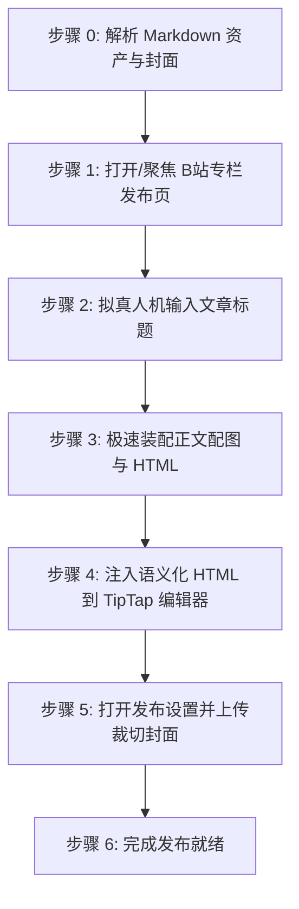
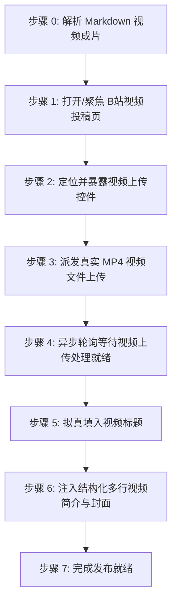

# 哔哩哔哩自动化发布技能规范 (doudou-bilibili)

## 自动化执行全流程

当接收到用户指定的 Markdown 文件路径时，依次执行以下阶段（默认按 `video` → `article` 顺序串行执行）：

### 步骤 0：解析 Markdown 资产与模态编排

运行辅助解析脚本提取元数据并生成确定性计划：
```bash
node scripts/parser.mjs <Markdown文件绝对路径> [可选模态]
```

Agent 可直接调用 `scripts/bilibili_publisher.mjs` 配合 `chrome-devtools-mcp` 注入专栏与视频：
```javascript
import { parseAllAssets } from './scripts/parser.mjs';
import {
  buildArticleBrowserScript,
  buildPrepareVideoUploadBrowserScript,
  buildFillVideoFormBrowserScript,
} from './scripts/bilibili_publisher.mjs';

const meta = await parseAllAssets(markdownFilePath, 'undsky', requestedModes ?? null);
// 专栏页: await buildArticleBrowserScript(meta)
// 视频页: buildPrepareVideoUploadBrowserScript() + buildFillVideoFormBrowserScript(meta)
```

---

### 模式 A：发布专栏文章（Article Post）



1. **打开/聚焦专栏发布页并检测登录态**：
   - 访问 `https://member.bilibili.com/platform/upload/text/new-edit`；
   - 页面加载后定位专栏编辑器 iframe (`iframe[src*="read-editor"]`)，获取 Sunflower TipTap 编辑器实例。
2. **拟真人机输入文章标题**：
   - 定位 `textarea.title-input__inner`，填入标题并派发 DOM 事件。
3. **批量转存正文配图至 B 站 BFS 图床**：
   - 携带 `bili_jct` CSRF Token 调用 `/x/dynamic/feed/draw/upload_bfs`，将正文配图转换为 `hdslb.com` 链接。
4. **注入语义化 HTML 到 TipTap 编辑器**：
   - 调用 `editor.commands.setContent(finalHtml)` 并等待 DOM 解析。
5. **打开发布设置并上传裁切封面**：
   - 点击「发布设置」，开启「自定义封面」，注入封面文件并确认裁切弹窗。**严禁勾选原创声明，严禁设置标签**。
6. **完成发布就绪**：
   - 资产填入完成后直接判定完成；
   - **安全隔离**：原样保留当前标签页现场供人工发布，严禁调用 `close_page`。

---

### 模式 B：发布视频投稿（Video Post）



1. **打开/聚焦视频投稿发布页**：
   - 访问 `https://member.bilibili.com/platform/upload/video/frame`。
2. **暴露并定位文件上传控件**：
   - 执行 `buildPrepareVideoUploadBrowserScript()`，将隐藏的 `input[type="file"]`（`buploader`）暴露给 accessibility tree，赋予 `id="doudou-bilibili-video-input"`。
3. **派发真实视频文件上传**：
   - 调用 `upload_file` 将本地 `.mp4` 文件路径派发至上传 input。
4. **异步轮询等待视频上传与表单就绪**：
   - 启动异步轮询（10~180 秒），监听页面状态直到分片上传完成、视频文件列表渲染且表单字段就绪。
5. **拟真输入视频标题**：
   - 定位 `input[placeholder*="标题"]`，通过原生 setter 填入 80 字以内精炼短标题，派发 `input` 与 `change` 事件同步 Vue 状态。
6. **注入结构化多行简介与封面**：
   - 定位 Quill 富文本编辑器（`.ql-container`）或 textarea，填入结构化简介文案。
   - 封面图从同名目录下的 cover/images 目录中提取，点击封面设置触发器打开封面弹窗，派发 `File` 对象并自动确认完成绑定。
   - **极简原则**：严禁选择自制/原创单选框、严禁选择分区、严禁填写 TAG 标签或点击推荐标签。
7. **完成发布就绪**：
   - 资产填入完成后直接判定完成；
   - **安全隔离**：原样保留当前标签页现场供人工发布，严禁调用 `close_page`。
