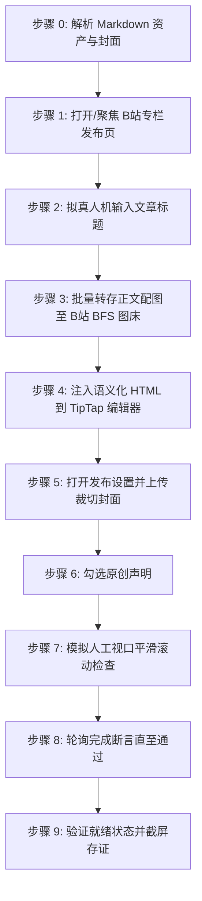
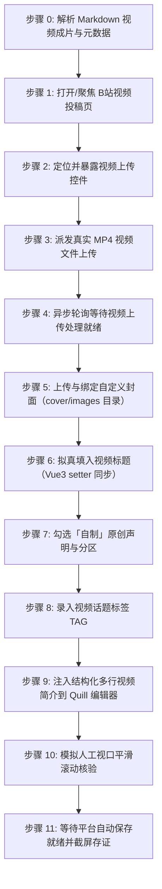

# 哔哩哔哩自动化发布技能 (doudou-bilibili)

本技能通过 `chrome-devtools-mcp` 控制浏览器，实现哔哩哔哩创作中心（[https://member.bilibili.com](https://member.bilibili.com)）的**专栏长文文章**与**视频投稿**双模态自动化发布全流程。

技能严格遵循**真实人工行为模拟与防风控规约**，通过自然的事件派发、微小随机时延抖动、视口平滑滚动及悬停交互，避免被 B 站平台风控拦截。自动提取文章标题、视频短标题、多行结构化简介、话题标签、正文语义化结构、16:9/2.35:1 封面图，并自动通过 B 站官方 BFS 接口转存正文配图，彻底规避外链图片风控拦截。

---

## 📌 核心发布入口

- **专栏文章发布入口**：`https://member.bilibili.com/platform/upload/text/new-edit`
- **视频投稿发布入口**：`https://member.bilibili.com/platform/upload/video/frame`
- **稿件管理中心入口**：`https://member.bilibili.com/platform/upload-manager/article`

---

## 🎯 模态选择规约（默认全模态发布）

B 站同时支持**视频投稿 / 专栏文章**两种模态。模态的取舍**不允许由 Agent 自行揣测或随意挑一个执行**，必须严格遵循以下判定链：

1. **用户未明确指定模态 => 默认发布全部可用模态**。
   - 「把这篇发 B 站」「发布到 B 站草稿箱」「发一下 xxx.md」等未点名模态的指令，一律理解为**视频投稿 + 专栏文章全发**，而非只发专栏。
   - **严禁**以「资产多、耗时长、担心风控」等理由自行缩减模态；也**严禁**中途反问用户「要发专栏还是视频」——默认答案就是两种都发。
2. **用户明确指定模态 => 严格只发指定的那些**。
   - 如「只发专栏」「仅发视频投稿」，则严格按指定集合执行，不得擅自追加其他模态。
3. **模态所需资产缺失 => 自动跳过该模态，其余照常发布**。
   - 缺失不是失败：跳过并在最终报告里明确登记原因，**绝不因为某一模态缺资产而中断整个任务**。
   - 若用户显式点名的模态恰好缺资产，同样跳过，并在报告中提示需要补齐的资产路径。

### 模态可用性判定表

| 模态 | 必需资产 | 缺失时的处置 |
| :--- | :--- | :--- |
| **视频投稿（video）** | `video/*.mp4` 成片（`meta.video.hasVideo === true`） | 跳过视频模态，登记「未找到 video/*.mp4 视频成片」 |
| **专栏文章（article）** | 专栏正文 HTML（`meta.html` 非空） | 跳过专栏模态，登记「未解析出可用专栏正文 HTML」 |

> 封面缺失**不构成**跳过任一模态的理由：专栏按资产优先级降级取图，视频则交由 B 站智能抽帧推荐（详见资产解析优先级第 2 条）。

### 确定性模态计划（由解析器给出，禁止手工推断）

`parseArticle()` / `parseAllAssets()` 已内置模态编排，直接读取 `meta.publishPlan`，**不要自行拼凑模态列表**：

```javascript
import { parseArticle } from "./scripts/parser.mjs";

// requestedModes 留空 / null => 默认全模态；传入 "视频" 或 ["article"] => 只发指定模态
const meta = await parseArticle(markdownFilePath, requestedModes ?? null);

meta.publishPlan;
// {
//   requested: [],                      // 归一化后的用户指定模态（空数组 = 用户未指定）
//   userSpecified: false,               // false => 走默认全发
//   modes: ["video", "article"],        // 本次实际要执行的模态（已按推荐顺序排序）
//   skipped: [{ mode, label, reason }], // 被跳过的模态及原因
//   summary: "用户未指定模态 => 默认发布全部可用模态｜将发布：视频投稿 + 专栏文章"
// }
```

命令行同样可校验计划（第二个参数留空即默认全模态）：

```bash
node scripts/parser.mjs <Markdown文件绝对路径>          # 默认全模态
node scripts/parser.mjs <Markdown文件绝对路径> "视频"    # 仅指定模态
```

### 多模态串行执行规约

- **执行顺序**：`video` → `article`（视频分片上传与转码最慢，优先启动；专栏随后执行）。
- **状态隔离**：每个模态**必须重新导航到自己的发布入口**，严禁复用上一模态的编辑器页面或残留内容。
- **失败隔离**：单个模态失败（上传超时、BFS 转存失败、验证码拦截等）**只标记该模态失败并继续下一个模态**，不得终止剩余模态。
- **页面保留**：所有模态执行完毕后，**全部页面一律原样保留**（详见核心规约第 4 条）——视频投稿模态尤其关键，页面即创作者人工确认提交的唯一入口。
- **统一汇总报告**：任务结束时输出逐模态结果表，含状态、标题、存证截图路径与跳过原因：

  | 模态 | 状态 | 标题 | 存证截图 / 原因 |
  | :--- | :--- | :--- | :--- |
  | 视频投稿 | ✅ 已存草稿 | ... | `bilibili_video.png` |
  | 专栏文章 | ✅ 已保存为草稿 | ... | `bilibili_article.png` |

---

## 完成断言与回执协议 (Completion Assertion & Receipt)

> 本段是**父级串行编排的硬契约**。父级（`doudou-UGC-skill`）不读自然语言汇报，只读落盘回执；没有回执，父级会认为本平台仍在进行中而永久阻塞后续平台。

### 完成断言

**严禁以「已等待 N 秒」代替「已完成」。** 必须轮询下面这条可求值的客观判据：

| 项 | 值 |
| :--- | :--- |
| **断言规则** | 稿件管理中心出现该标题草稿，或上传进度 100% + 「存草稿」成功提示 |
| **超时窗口** | 45 秒，轮询间隔 1.5 秒 |
| **通过** | 登记 `success` |
| **超时** | 登记 `timeout`（`statusText` 说明未在 45s 内成立），保留页面，**严禁登记为 success** |

```javascript
// 在 evaluate_script 中求值，返回结构化断言结果
() => {
  const t = document.body.innerText;
  const done = /100%|上传完成|上传成功/.test(t);
  const saved = /存草稿|草稿箱|保存成功/.test(t);
  return { passed: done && saved, uploadDone: done, draftSaved: saved };
};
```

### 状态枚举（六个终态，仅此六种可写入回执）

| 状态 | 含义 |
| :--- | :--- |
| `success` | 草稿已保存且完成断言通过 |
| `ready_for_review` | 内容已填入就绪，平台禁止自动保存（哔哩哔哩不适用） |
| `needs_login` | 登录态缺失/过期，已保留页面待补登 |
| `failed` | 明确失败（选择器失效、注入异常） |
| `timeout` | 完成断言在 45s 窗口内未成立 |
| `skipped` | 资产缺失或用户主动跳过 |

### 存证截图统一命名

必须存至 publishes/screenshots/bilibili_article.png、publishes/screenshots/bilibili_video.png（格式 `<platformSlug>_<mode>.png`），**不得使用技能私有命名**——父级看板按统一命名反查存证。

### 临时脚本与中间文件存放规约（严禁污染工作区根目录）

- **统一落盘位置**：自动化发文执行过程中，凡需生成的任何临时注入脚本（如浏览器富文本注入 `.mjs` / `.js`）、临时数据载荷（如 `--payload-file <json>`）、调试脚本或中间辅助文件，**严禁放置在当前工作区根目录、项目根目录或技能目录中**！
- **强制同名资产目录**：所有临时文件**必须统一放置在目标 Markdown 文章对应的同名资产目录下**（即去除 `.md` 后缀的同名资产目录），文件名建议统一以 `scratch_` 为前缀。
- **可追溯与可清理**：执行完毕且回执落盘后，临时中间文件安全留存于同名资产目录供事后复核排查，或由清理指令统一清空，彻底避免根目录污染。

### 回执落盘（收尾必调，异常也要写）

```bash
node scripts/receipt.mjs write <Markdown文件绝对路径> --payload-file <json文件路径>
```

> 载荷含正则/反斜杠时**务必用 `--payload-file`**，直接内联 `--payload` 会被 shell 转义破坏。

`--payload` 结构（`results` 为逐模态数组，本技能含 `article` / `video`）：

```json
{
  "skill": "doudou-bilibili",
  "platform": "哔哩哔哩",
  "platformSlug": "bilibili",
  "startedAt": "<技能启动时即记录，不要收尾时倒填>",
  "results": [
    {
      "mode": "article",
      "modeDesc": "专栏文章",
      "status": "success",
      "statusText": "草稿已保存",
      "title": "……",
      "screenshot": "screenshots/bilibili_article.png",
      "assertion": { "rule": "稿件管理中心出现该标题草稿，或上传进度 100% + 「存草稿」成功提示", "passed": true }
    },
    {
      "mode": "video",
      "modeDesc": "视频投稿",
      "status": "success",
      "statusText": "草稿已保存",
      "title": "……",
      "screenshot": "screenshots/bilibili_video.png",
      "assertion": { "rule": "稿件管理中心出现该标题草稿，或上传进度 100% + 「存草稿」成功提示", "passed": true }
    }
  ]
}
```

脚本会强校验并拒绝不合规回执：非终态 `status`、缺 `statusText`、非 `skipped` 却缺 `screenshot` 一律报错退出，从源头杜绝脏数据流入看板。

---

## 🎨 资产规范与路径映射

| 资产类型 | 规范路径 / 规则 | 说明 |
| :--- | :--- | :--- |
| **源 Markdown 文章** | `path/to/article_name.md` | 原始文章 |
| **视频成片文件** | `path/to/article_name/video/[video_name].mp4` 或 `[article_name].mp4` | 成品高清视频（优先识别 `video_manifest.json` 登记输出） |
| **视频作品标题** | `<= 80 字`（建议 30 字以内） | 自动清洗 Markdown 符号与非规范标点，优先适配 manifestTitle，超长自动截断为 77 字 + `...` |
| **视频作品简介** | `<= 2000 字` | 核心干货要点结构化梳理 + `#话题标签#`，保留多行清晰排版 |
| **专栏文章标题** | `<= 50 字`（建议 30 字以内） | 自动清洗 Markdown 符号 |
| **专栏内容摘要** | `60~120 字` | 纯文本精炼摘要 |
| **专栏排版 HTML** | 语义化 TipTap HTML | 正文配图自动转存至 B 站官方 BFS 图床（`*.hdslb.com`） |
| **封面图资产** | 16:9 / 2.35:1 宽屏封面 | 优先读取同名目录下 `cdn_manifest.json` 或 `cover/images/`，视频可降级平台智能抽帧 |
| **标签处理约定** | `1~5 个标签` | 视频建议匹配行业与技术话题（如 `AI编程`、`智能体`、`软件开发`） |

---

## 🛡️ 核心规约与防风控原则

1. **安全隔离与自动保存机制**：
   - **依托平台原生自动保存**：B 站专栏文章具备输入实时自动保存机制；视频投稿上传后自动持久化存储在云端草稿中。
   - **移除发布时对草稿箱的操作**：严禁主动寻找并点击「保存为草稿」或「存草稿」按钮，**绝对不自动点击「发布」或「立即投稿」**，确保所有内容保留在当前编辑页就绪态，由创作者人工最终审阅并手动提交。
2. **完成判定必须客观可断言（严禁以「已等待」代替「已完成」）**：
   - 「静候自动保存生效」是**等待动作**，不是验收条件。必须以**完成断言**（见「完成断言与回执协议」）求值为 `true` 才允许判定完成。
   - 断言未通过即为未完成：登记 `timeout` 并保留页面，**严禁登记为 `success`**。
3. **收尾必须落盘回执（父级编排的唯一完成信号）**：
   - 无论成功、失败、缺登录、超时还是跳过，收尾都必须调用 `scripts/receipt.mjs write` 写入回执。
   - 父级 `doudou-UGC-skill` 不解析自然语言汇报，只读回执文件；**缺回执会让父级永久阻塞后续平台**。
4. **防风控与真实人机行为模拟 (Anti-Bot & Human Simulation)**：
   - **随机时延抖动**：所有操作之间增加正态分布随机等待（输入前 300~600ms、步骤间 600~1500ms、点击悬停 300~500ms），严禁毫秒级并发。
   - **真实事件完整性**：对于标题输入与表单开关，依次派发 `focus`、`keydown`、`input`、`change`、`blur`，并同步 ProseMirror / TipTap / Vue 组件状态。
   - **平滑视口滚动**：模拟人类自上而下的视觉审查，分步平滑滚动页面触发浏览器的视口可见性检测。
   - **拟真悬停与点击**：点击按钮前先将视口滚动到按钮可见区域，派发 `mouseover`/`mouseenter` 悬停 300~500ms 后再触发 `click`。
5. **资产自动解析优先级**：
   - **正文**：优先使用同名目录下已图床化的 `[article_name]_cdn.md`；若无则使用原 Markdown 文件。
   - **封面图**：
     1. 优先读取同名目录下 `cdn_manifest.json` 中 `type: "cover"` 的资产（优先 16:9 / 2.35:1 / 1:1 封面）；
     2. 其次读取同名目录下 `cover/images/` 的本地图片文件（如 `cover.png`、`cover-main-2.35x1.png`）；
     3. 再次从 Markdown 正文提取第一张图片链接或本地路径；
     4. 视频投稿时若无自定义封面则由 B 站自动推荐高质量抽帧。
   - **正文配图官方 BFS 转存**：B 站专栏草稿强制校验图片域名必须为 `*.hdslb.com`。本技能在浏览器端通过 `/x/dynamic/feed/draw/upload_bfs`（带 CSRF `bili_jct`）自动将所有本地与网络配图转存为 B 站原生图床 URL。
   - **原创声明**：自动选择「自制」并勾选「声明此内容为原创，未经授权禁止转载」。
6. **发布完成后保留页面（严禁自动关闭）**：
   - 专栏文章或视频投稿表单就绪并完成截屏存证后，**严禁调用 `close_page` 或以任何方式关闭当前页面**，必须原样保留页面现场——页面即是创作者人工审阅后点击提交的唯一入口。
   - 未登录、验证码拦截、上传超时等异常中断的场景同样适用：保留页面交由用户接管，不得清理关闭。

---

## 🚀 双模态自动化发布执行流程

> 下列模式**不是「择一执行」的选项**，而是逐模态执行的操作手册：按「模态选择规约」得出的 `publishPlan.modes` 依次执行其中每一个模态（默认两种全发）。模式字母仅为编号，实际执行顺序恒为 `video`（模式 B）→ `article`（模式 A）。

### 模式 A：发布专栏文章（Article Post）



1. **打开/聚焦专栏发布页并检测登录态**：
   - 访问 `https://member.bilibili.com/platform/upload/text/new-edit`。
   - 页面加载后定位专栏编辑器 iframe (`iframe[src*="read-editor"]`)，获取 Sunflower TipTap 编辑器实例。
2. **拟真人机输入文章标题**：
   - 定位 `textarea.title-input__inner`，填入标题并派发 DOM 事件。
3. **批量转存正文配图至 B 站 BFS 图床**：
   - 携带 `bili_jct` CSRF Token 调用 `/x/dynamic/feed/draw/upload_bfs`，将正文配图转换为 `hdslb.com` 链接。
4. **注入语义化 HTML 到 TipTap 编辑器**：
   - 调用 `editor.commands.setContent(finalHtml)` 并随机等待 DOM 解析。
5. **打开发布设置并上传裁切封面**：
   - 点击「发布设置」，开启「自定义封面」，注入封面文件并确认裁切弹窗。
6. **勾选原创声明**：
   - 勾选「声明此文章为原创，未经授权禁止转载」。
7. **视口平滑滚动与等待自动保存**：
   - 平滑滚动审查后，等待平台原生自动保存生效（2~3 秒），截屏存证（`bilibili_article.png`），原样保留当前编辑页面，绝不点击「保存为草稿」或「发布」按钮。

---

### 模式 B：发布视频投稿（Video Post）



1. **解析视频资产与元数据**：
   - 运行 `node scripts/parser.mjs <Markdown文件路径>`，解析 `video/` 目录下成片（.mp4）、manifestTitle 及结构化简介，优先解析同名目录下 `cover/images/` 的自定义封面图。
2. **打开/聚焦视频投稿发布页**：
   - 访问 `https://member.bilibili.com/platform/upload/video/frame`。
3. **暴露并定位文件上传控件**：
   - 执行 `buildPrepareVideoUploadBrowserScript()`，将隐藏的 `input[type="file"]`（`buploader`）暴露给 accessibility tree，赋予 `id="doudou-bilibili-video-input"`。
4. **派发真实视频文件上传**：
   - 调用 `upload_file` 将本地 `.mp4` 文件路径派发至上传 input。
5. **异步轮询等待视频上传与表单就绪**：
   - 启动异步轮询（10~180 秒），监听页面状态直到分片上传完成、视频文件列表渲染且表单字段就绪。
6. **上传与绑定自定义封面**：
   - 优先获取同名目录 `cover/images/` 下的主封面图（`cover-main-2.35x1.png` 或 `16:9` 比例），点击「添加封面」唤起「封面制作」弹窗；
   - 注入图片文件至弹窗中的上传控件，等待多比例视口预览生成，点击「完成」确认封面绑定。
7. **拟真输入视频标题**：
   - 定位 `input[placeholder*="标题"]`，通过 `HTMLInputElement.prototype.value` 原生 setter 填入 80 字以内精炼短标题，派发 `input` 与 `change` 原生事件以同步 Vue 响应式状态。
8. **配置投稿类型与分区**：
   - 点击选择投稿类型为「自制」（原创）；
   - 自动匹配推荐分区芯片（如「科技」/「软件应用」/「人工智能」）。
9. **录入视频标签（TAG）**：
   - 定位标签输入框，依次录入 1~5 个核心话题标签并派发 Enter 回车键绑定，顺带点击高频推荐标签。
10. **注入结构化多行简介**：
    - 定位 Quill 富文本编辑器（`.ql-container`），通过 `__quill.setText(...)` 填入结构化排版的观点与核心要点（2000 字以内）。
11. **视口平滑滚动核验与自动保存就绪**：
    - 视口自上而下平滑滚动模拟人工核验排版；
    - 等待平台自动同步就绪，严格遵循安全隔离规约（**绝不主动点击「存草稿」，绝不点击「立即投稿」**）；
    - 在当前视频投稿页面截取就绪状态存证截图并保存至文章同名目录：`bilibili_video.png`；
    - **严禁调用 `close_page` 或关闭当前页面**，原样保留页面现场供创作者人工审阅后手动提交。

---

## 异常与风控处理

| 异常场景 | 表现特征 | 应对与恢复策略 |
| :--- | :--- | :--- |
| **未登录 / 登录态过期** | 未找到编辑器 iframe 或提示登录弹窗 | 立即停止自动化输入，向用户发送提示，等待用户在浏览器中扫码登录后再继续。 |
| **视频上传超时或网络波动** | 上传进度卡死或提示“网络异常” | 延长轮询上限至 180 秒，若提示失败则自动提示用户检查网络并重试。 |
| **BFS 图床上传失败 / 超时** | CSRF 失效或网络超时 | 降级移除该配图占位符，保证正文主体顺利保存，在最终报告中提示配图状态。 |
| **封面裁切弹窗未自动确认** | 弹出 `.image-dialog` 但未触发确定 | 增加 1.5s 缓冲重试点击 `.vui_dialog--btn-confirm`。 |
| **外部图片风控拦截** | 报「内容包含非法图片链接」 | 严格确保所有 `` 标签均经由 BFS 接口转存为 `hdslb.com` 链接后再注入专栏。 |

---

## 🛠️ 核心脚本与使用方法

以下路径均相对本技能目录（`SKILL.md` 所在目录），执行前先切换到该目录，或将其拼接为绝对路径使用：

- `scripts/parser.mjs`：解析 Markdown，提取专栏标题/摘要/封面资产/TipTap HTML，以及视频成片路径/精炼标题/结构化简介/标签；并产出确定性模态计划 `publishPlan`（`PUBLISH_MODES` / `normalizeRequestedModes` / `resolvePublishPlan`）。
- `scripts/bilibili_publisher.mjs`：浏览器注入脚本生成器（专栏 BFS 图床转存、视频上传暴露、上传就绪等待、表单拟真填充与草稿存证）。

### 1. 命令行测试解析

```bash
node scripts/parser.mjs <Markdown文件路径>
```

### 2. 命令行测试脚本生成

```bash
node scripts/bilibili_publisher.mjs <Markdown文件路径>
```

### 3. Agent 视频自动化发布调用范式

```javascript
import { 
  buildPrepareVideoUploadBrowserScript, 
  buildWaitVideoUploadReadyBrowserScript, 
  buildFillVideoFormBrowserScript 
} from './scripts/bilibili_publisher.mjs';
import { parseArticle } from './scripts/parser.mjs';

// 1. 解析目标文章与视频成片
//    requestedModes 留空 => 默认全模态；仅当用户明确点名模态时才传入
const meta = await parseArticle(markdownFilePath, requestedModes ?? null);

// 2. 读取确定性模态计划，逐模态串行执行（video -> article），严禁自行推断模态
//    以下为 video 模态的步骤；article 模态请重新导航至专栏发布入口后执行模式 A 流程
const { modes, skipped, summary } = meta.publishPlan;

// 3. 准备上传控件并获取 uid
const prepRes = await evaluate_script({ pageId, function: buildPrepareVideoUploadBrowserScript() });

// 4. 派发视频上传
await upload_file({ pageId, uid: inputUid, filePaths: [meta.video.videoPath] });

// 5. 等待视频上传就绪
await evaluate_script({ pageId, function: buildWaitVideoUploadReadyBrowserScript(180) });

// 6. 填充标题、简介、标签与类型
const fillRes = await evaluate_script({ pageId, function: buildFillVideoFormBrowserScript(meta) });

// 7. 截屏存证
await take_screenshot({ 
  pageId, 
  filePath: `${articleDir}/bilibili_video.png` 
});

// 8. 继续执行 publishPlan.modes 中的下一个模态（如 article），
//    单模态失败只登记该模态失败，不得终止剩余模态；全部结束后汇总 skipped 输出统一报告
```
