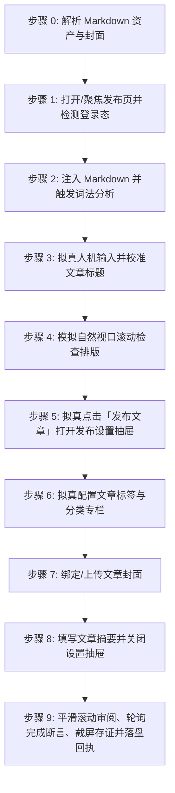

# CSDN 博客文章自动发布技能 (doudou-csdn)

本技能通过 `chrome-devtools-mcp` 控制浏览器，将用户指定的本地 Markdown 文件发布至 **CSDN 博客创作者编辑器（https://editor.csdn.net/md ）**。

**效率深度优化铁律**：流程全面固化，严格杜绝多余思考。文章模态**只需要**填写标题、正文内容、上传封面图（坚决不配标签、不选专栏、不写摘要）。严格遵循真实人机行为防风控与平台原生自动保存机制。

---

## 核心规约与防风控原则

1. **安全隔离与自动保存机制**：
   - **依托平台原生自动保存**：CSDN Markdown 编辑器在注入正文与标题后具备实时自动保存草稿机制。
   - **移除发布时对草稿箱的操作**：若存在封面图，打开发布抽屉仅完成封面绑定后立即点击「取消」关闭弹窗，**绝对不点击「发布文章」**，确保所有内容保留在当前编辑页就绪态，由人工最终确认与手动发布。
2. **完成判定必须客观可断言（严禁以「已等待」代替「已完成」）**：
   - 「静候自动保存生效」是**等待动作**，不是验收条件。必须以**完成断言**（见「完成断言与回执协议」）求值为 `true` 才允许判定完成。
   - 断言未通过即为未完成：登记 `timeout` 并保留页面，**严禁登记为 `success`**。
3. **收尾必须落盘回执（父级编排的唯一完成信号）**：
   - 无论成功、失败、缺登录、超时还是跳过，收尾都必须调用 `scripts/receipt.mjs write` 写入回执。
   - 父级 `doudou-UGC-skill` 不解析自然语言汇报，只读回执文件；**缺回执会让父级永久阻塞后续平台**。
4. **防风控与真实人机行为模拟 (Anti-Bot & Human Simulation)**：
   - **随机时延抖动**：所有操作之间增加正态分布随机等待（输入前 300~600ms、步骤间 600~1500ms、点击悬停 300~500ms），严禁毫秒级并发。
   - **真实事件完整性**：对于表单与文本输入，依次派发 `focus`、`keydown`、`input`、`keyup`、`change`、`blur`，并同步 Element-UI 与 Vue 组件实例数据。
   - **平滑视口滚动**：模拟人类自上而下的视觉审查，分步平滑滚动页面触发浏览器的视口可见性检测。
   - **拟真悬停与点击**：点击按钮前先将视口滚动到按钮可见区域，派发 `mouseover`/`mouseenter` 悬停 300~500ms 后再触发 `click`。
5. **资产极简解析（无多余思考）**：
   - **正文**：优先使用同名目录下 `[article_name]_cdn.md`；若无则使用原 Markdown 文件。
   - **封面图**：读取同名目录下封面产物（CDN URL 或本地 Base64）；若无则跳过封面设置。
   - **坚决不推断、不配置标签、分类专栏与摘要**。
6. **发布完成后保留页面（严禁自动关闭）**：
   - 表单配置与存证截图完成后，**严禁调用 `close_page` 或以任何方式关闭当前平台页面**，必须原样保留页面现场，供用户人工复核内容、补充登录或手动确认发布。
   - 未登录、验证码拦截、网络超时等异常中断的场景同样适用：保留页面交由用户接管，不得清理关闭。

---

## 完成断言与回执协议 (Completion Assertion & Receipt)

> 本段是**父级串行编排的硬契约**。父级（`doudou-UGC-skill`）不读自然语言汇报，只读落盘回执；没有回执，父级会认为本平台仍在进行中而永久阻塞后续平台。

### 完成断言

**严禁以「已等待 N 秒」代替「已完成」。** 必须轮询下面这条可求值的客观判据：

| 项 | 值 |
| :--- | :--- |
| **断言规则** | URL 出现 articleId=\d+ |
| **超时窗口** | 45 秒，轮询间隔 1.5 秒 |
| **通过** | 登记 `success` |
| **超时** | 登记 `timeout`（`statusText` 说明未在 45s 内成立），保留页面，**严禁登记为 success** |

```javascript
// 在 evaluate_script 中求值，返回结构化断言结果
() => {
  const m = location.href.match(/articleId=(\d+)/);
  const saved = /保存成功|已保存/.test(document.body.innerText);
  return { passed: Boolean(m), draftId: m?.[1] ?? null, draftUrl: m ? location.href : null, savedTip: saved };
};
```

### 状态枚举（六个终态，仅此六种可写入回执）

| 状态 | 含义 |
| :--- | :--- |
| `success` | 草稿已保存且完成断言通过 |
| `ready_for_review` | 内容已填入就绪，平台禁止自动保存（CSDN不适用） |
| `needs_login` | 登录态缺失/过期，已保留页面待补登 |
| `failed` | 明确失败（选择器失效、注入异常） |
| `timeout` | 完成断言在 45s 窗口内未成立 |
| `skipped` | 资产缺失或用户主动跳过 |

### 存证截图统一命名

必须存至 publishes/screenshots/csdn_article.png（格式 `<platformSlug>_<mode>.png`），**不得使用技能私有命名**——父级看板按统一命名反查存证。

### 临时脚本与中间文件存放规约（严禁污染工作区根目录）

- **统一落盘位置**：自动化发文执行过程中，凡需生成的任何临时注入脚本（如浏览器富文本注入 `.mjs` / `.js`）、临时数据载荷（如 `--payload-file <json>`）、调试脚本或中间辅助文件，**严禁放置在当前工作区根目录、项目根目录或技能目录中**！
- **强制同名资产目录**：所有临时文件**必须统一放置在目标 Markdown 文章对应的同名资产目录下**（即去除 `.md` 后缀的同名资产目录），文件名建议统一以 `scratch_` 为前缀。
- **可追溯与可清理**：执行完毕且回执落盘后，临时中间文件安全留存于同名资产目录供事后复核排查，或由清理指令统一清空，彻底避免根目录污染。

### 回执落盘（收尾必调，异常也要写）

```bash
node scripts/receipt.mjs write <Markdown文件绝对路径> --payload-file <json文件路径>
```

> 载荷含正则/反斜杠时**务必用 `--payload-file`**，直接内联 `--payload` 会被 shell 转义破坏。

`--payload` 结构（`results` 为逐模态数组，本技能含 `article`）：

```json
{
  "skill": "doudou-csdn",
  "platform": "CSDN",
  "platformSlug": "csdn",
  "startedAt": "<技能启动时即记录，不要收尾时倒填>",
  "results": [
    {
      "mode": "article",
      "modeDesc": "Markdown长文",
      "status": "success",
      "statusText": "草稿已保存",
      "title": "……",
      "screenshot": "screenshots/csdn_article.png",
      "assertion": { "rule": "URL 出现 articleId=\\d+", "passed": true }
    }
  ]
}
```

脚本会强校验并拒绝不合规回执：非终态 `status`、缺 `statusText`、非 `skipped` 却缺 `screenshot` 一律报错退出，从源头杜绝脏数据流入看板。

---

## 自动化执行全流程

当接收到用户指定的 Markdown 文件路径时，依次执行以下 9 个阶段：



### 步骤 0：解析 Markdown 资产与封面

运行辅助解析脚本提取元数据（脚本路径相对本技能目录，即 `SKILL.md` 所在目录）：
```bash
node scripts/parser.mjs <Markdown文件绝对路径>
```
输出包含：
- `title`: 文章标题（自动清洗 Markdown 符号）
- `summary`: 80~200 字纯文本摘要
- `categoryColumn`: 智能推断匹配的 CSDN 分类专栏（AI编程、AI工具箱、n8n教程等）
- `tags`: 1~5 个技术标签关键词
- `bodyContent`: 过滤掉首行重复 H1 后的 Markdown 正文（优先使用 `_cdn.md`）
- `cover`: 封面图信息（CDN URL 或 Local Base64）

---

### 步骤 1：打开/聚焦发布页并检测登录态

1. **新建独立页面**：调用 `new_page` 打开 `https://editor.csdn.net/md/`（必须每次新建独立页面，严禁复用或覆盖已有页面）。
2. 等待页面加载完成。
3. 执行脚本检测登录态：
   - 检查是否存在标题输入框 `input.article-bar__title` 及编辑器内容区 `.editor__inner`；
   - 若未登录，向用户发出明确提示请用户在浏览器中扫码登录，并在登录完成后继续。

---

### 步骤 2：注入 Markdown 并触发词法分析

CSDN Markdown 编辑器支持通过原生文件导入组件 `#import-markdown-file-input` 进行精准解析：
1. 构造标准 Markdown `File` 与 `DataTransfer` 对象；
2. 注入 `#import-markdown-file-input` 并派发 `change` 事件触发词法树构建；
3. 随机停顿 800ms~1500ms，让编辑器完成 Markdown 语法树分析、代码高亮与右侧实时预览。

---

### 步骤 3：拟真人机输入并校准文章标题

1. 聚焦标题输入框 `input.article-bar__title`；
2. 模拟微小随机延迟（300ms~600ms）；
3. 填入文章完整标题，派发 `input` 与 `change` 事件；
4. 随机停顿 400ms~800ms。

---

### 步骤 4：模拟自然视口滚动检查排版

模拟人类作者自上而下检查文章排版：
1. 平滑滚动到页面 500px 处，等待 600ms~900ms；
2. 平滑滚动回顶部，等待 500ms~800ms：
```javascript
window.scrollTo({ top: 500, behavior: 'smooth' });
// 延时后
window.scrollTo({ top: 0, behavior: 'smooth' });
```

---

### 步骤 5：若有封面，打开发布设置面板上传并绑定封面（无封面则跳过）

1. 若存在封面图，点击顶部「发布文章」按钮 `.btn-publish` 展开 `.modal__publish-article` 抽屉面板；
2. 在弹窗内定位 `CoverImage` Vue 组件或 `input[type="file"]`，注入并绑定封面；
3. **安全隔离与无多余操作**：**严禁配置文章标签、严禁勾选分类专栏、严禁填写摘要**！封面绑定完成后，立即点击面板右上角或底部的「取消」按钮关闭弹窗；
4. 若无封面图，本步骤完全跳过，直接在主编辑区等待自动保存。

---

### 步骤 9：平滑滚动审阅、轮询完成断言、截屏存证并落盘回执

1. 模拟人工视口平滑滚动审阅排版：
   - 向下滚动：`window.scrollTo({ top: 300, behavior: 'smooth' });` 停顿 400~700ms；
   - 滚回顶部：`window.scrollTo({ top: 0, behavior: 'smooth' });`；
2. 按「完成断言与回执协议」以 1.5s 间隔轮询完成断言，最长 45s（**严禁以固定等待代替断言**）；
3. 从当前 URL 中提取 `articleId`（`https://editor.csdn.net/md?articleId=<article_id>`）；
4. 调用 `take_screenshot` 保存当前就绪页面截图作为存证（`csdn_article.png`）；
5. **保留页面现场**：存证完成后，**严禁调用 `close_page` 或关闭标签页**，保持当前页面打开供人工复核；
6. 输出结构化结果报告（文章标题、就绪状态、articleId、专栏、标签、摘要、封面状态、操作日志）。

---

## 异常与风控处理

| 异常场景 | 表现特征 | 应对与恢复策略 |
| :--- | :--- | :--- |
| **未登录 / 登录态过期** | 未找到 `.editor__inner` 或跳转至登录页 | 立即停止自动化输入，向用户发送提示，等待用户在浏览器中完成扫码登录后再继续。 |
| **发布面板未展开** | 点击 `.btn-publish` 后未出现 `.modal__publish-article` | 自动降级为直接在主编辑区点击顶部「保存草稿」按钮，保证文章主体内容不丢失。 |
| **封面上传失败 / 超时** | 图片拉取超时或格式不兼容 | 降级通过 CDN URL 绑定或跳过封面上传，在最终报告中标记，不阻塞草稿主体的保存。 |
| **专栏无完全匹配项** | 分类专栏列表中未找到推断的专栏名 | 保持默认或跳过专栏勾选，不影响草稿保存。 |
| **防重复保存拦截** | 保存按钮处于 loading 状态 | 确保调用间隔大于 3 秒，避免高频连击。 |

---

## 脚本工具与使用方法

以下路径均相对本技能目录（`SKILL.md` 所在目录），执行前先切换到该目录，或将其拼接为绝对路径使用。

- `scripts/parser.mjs`：解析 Markdown，提取标题、摘要、分类专栏、标签、正文与封面资产。
- `scripts/csdn_publisher.mjs`：浏览器注入脚本生成器（Markdown 编辑器状态同步与防风控人机模拟）。

1. **直接运行 Node.js 脚本测试解析**：
```bash
node scripts/parser.mjs <Markdown文件路径>
```

2. **在 Agent 中配合 `chrome-devtools-mcp` 调用**：
```javascript
import { buildBrowserPublishScript } from './scripts/csdn_publisher.mjs';

// 1. 生成自包含执行代码
const code = buildBrowserPublishScript(markdownFilePath);

// 2. 调用 evaluate_script 在 CSDN 发布页执行
const result = await evaluate_script({
  pageId: targetPageId,
  function: code
});

// 3. 截屏存证
await take_screenshot({ pageId: targetPageId });
```
