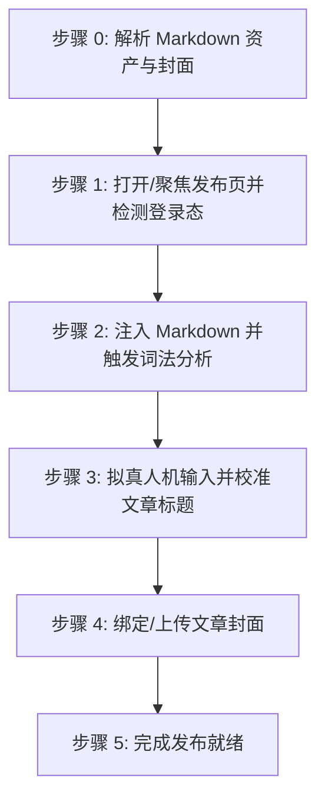

# CSDN 博客文章自动发布技能 (doudou-csdn)

## 自动化执行全流程

当接收到用户指定的 Markdown 文件路径时，依次执行以下阶段：



### 步骤 0：解析 Markdown 资产与封面

运行辅助解析脚本提取元数据（脚本路径相对本技能目录，即 `SKILL.md` 所在目录）：
```bash
node scripts/parser.mjs <Markdown文件绝对路径>
```
输出包含：
- `title`: 文章标题（自动清洗 Markdown 符号）
- `bodyContent`: 过滤掉首行重复 H1 后的 Markdown 正文（优先使用 `_cdn.md`）
- `cover`: 封面图信息（CDN URL 或 Local Base64）

Agent 可在步骤 1 打开页面后，直接调用脚本一键注入文章标题、Markdown 正文与封面：
```javascript
import { buildBrowserPublishScript } from './scripts/csdn_publisher.mjs';

const code = buildBrowserPublishScript(markdownFilePath);
await evaluate_script({ pageId, function: code });
```

---

### 步骤 1：打开/聚焦发布页并检测登录态

1. **新建独立页面**：调用 `new_page` 打开 `https://editor.csdn.net/md/`（必须每次新建独立页面，严禁复用或覆盖已有页面）。
2. 等待页面加载完成。
3. 执行脚本检测登录态：
   - 检查是否存在标题输入框 `input.article-bar__title` 及编辑器内容区 `.editor__inner`；
   - 若未登录，向用户发出明确提示请用户在浏览器中扫码登录，并在登录完成后继续。

---

### 步骤 2：注入 Markdown 并触发词法分析

CSDN Markdown 编辑器支持通过原生文件导入组件 `#import-markdown-file-input` 进行精准解析：
1. 构造标准 Markdown `File` 与 `DataTransfer` 对象；
2. 注入 `#import-markdown-file-input` 并派发 `change` 事件触发词法树构建；
3. 随机停顿 800ms~1500ms，让编辑器完成 Markdown 语法树分析、代码高亮与右侧实时预览。

---

### 步骤 3：拟真人机输入并校准文章标题

1. 聚焦标题输入框 `input.article-bar__title`；
2. 模拟微小随机延迟（300ms~600ms）；
3. 填入文章完整标题，派发 `input` 与 `change` 事件；
4. 随机停顿 400ms~800ms。

---

### 步骤 4：打开发布设置面板上传并绑定封面

1. 点击顶部「发布文章」按钮 `.btn-publish` 展开 `.modal__publish-article` 抽屉面板；
2. 在弹窗内定位 `CoverImage` Vue 组件或 `input[type="file"]`，注入并绑定封面；
3. **安全隔离与无多余操作**：**严禁配置文章标签、严禁勾选分类专栏、严禁填写摘要**！封面绑定完成后，立即点击面板右上角或底部的「取消」按钮关闭弹窗。

---

### 步骤 5：完成发布就绪

1. 资产填入完成后直接判定完成；
2. **安全隔离**：原样保留当前标签页现场供人工发布，严禁调用 `close_page`。
