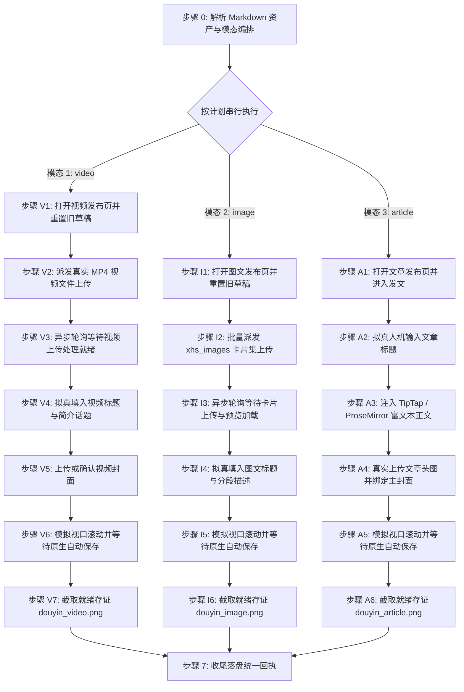

# 抖音自动化发布草稿技能规范 (doudou-douyin)

本技能通过 `chrome-devtools-mcp` 控制 Chrome 浏览器，实现抖音创作者平台（Creator Studio）的**视频**、**图文**与**文章**三模态自动化发布全流程。

严格遵循**真实人工行为模拟与防风控规约**，视频与图文异步轮询上传就绪，文章富文本双向同步，全流程完成后原样保留页面现场供人工最终核验，绝不自动触碰发布按钮。

---

## 核心规约与防风控原则

1. **发布入口**：
   - 视频发布：`https://creator.douyin.com/creator-micro/content/upload`
   - 图文发布：`https://creator.douyin.com/creator-micro/content/upload?default-tab=3`
   - 文章发布：`https://creator.douyin.com/creator-micro/content/upload?default-tab=5`
2. **模态判定与串行执行原则**：
   - **默认全模态**：用户未明确指定模态时，默认发布全部可用模态（`video` + `image` + `article`）。执行顺序恒为 `video` → `image` → `article`。
   - **显式指定**：用户明确指定时，严格仅执行指定模态。
   - **资产缺失处理**：若缺少对应资产（无 `video/*.mp4` 则跳过视频，无 `xhs_images/images/` 则跳过图文，无排版 HTML 则跳过文章），自动跳过并在回执中登记原因，继续执行其他可用模态。
3. **草稿安全隔离（绝对底线）**：
   - 依托平台原生自动保存机制，**彻底移除点击「暂存离开」按钮的操作**（防止页面跳出当前编辑器回到列表），**绝对严格禁止误触「发布」**。
4. **完成判定必须客观可断言**：
   - 必须以客观断言求值为 `true` 判定完成，严禁以固定延时代替完成。超时标记 `timeout` 并保留页面，严禁误报 `success`。
5. **收尾必须落盘回执**：
   - 执行完毕必须调用 `scripts/receipt.mjs write` 写入回执，供上层调度读取。
6. **防风控与真实人机行为模拟**：
   - **旧草稿安全重置**：进入发布入口若检测到“是否继续编辑”提示，先点击「放弃」以重置干净的上传区域；
   - **异步上传等待机制**：视频派发上传后必须异步轮询直到页面出现「上传成功」；图文上传必须轮询直到「已添加N张图片」且预览完成；
   - **微小随机延迟**：表单输入、点击之间插入 200~600ms 随机延时；
   - **原生事件与状态双向同步**：输入框使用原生 Setter 并派发 `input` 与 `change`；文章使用 TipTap `setContent` 与 `emit('update')`；
   - **平滑视口滚动**：模拟人类自上而下滚动审阅排版。
7. **发布完成后保留页面（严禁自动关闭）**：
   - 每次执行必须调用 `new_page` 新建独立标签页（严禁复用已有页面）；流程完成后严禁调用 `close_page`，原样保留页面现场。

---

## 完成断言与回执协议 (Completion Assertion & Receipt)

### 完成断言

| 项 | 值 |
| :--- | :--- |
| **断言规则** | 编辑器内状态就绪且平台自动保存生效 |
| **超时窗口** | 45 秒，轮询间隔 1.5 秒 |
| **通过** | 登记 `success` |
| **超时** | 登记 `timeout`（保留页面，严禁登记为 success） |

```javascript
// 在 evaluate_script 中求值
() => {
  const t = document.body ? document.body.innerText : '';
  const saved = /已保存|草稿已保存|保存成功/.test(t) || !!document.querySelector('.zone-container.editor-kit-container, .tiptap.ProseMirror');
  return { passed: saved, draftUrl: location.href };
};
```

### 状态枚举（六个终态）

| 状态 | 含义 |
| :--- | :--- |
| `success` | 内容填入就绪且平台自动保存通过 |
| `ready_for_review` | 内容已填入就绪待人工发布 |
| `needs_login` | 登录态缺失/过期，已保留页面待补登 |
| `failed` | 明确失败（选择器失效、注入异常） |
| `timeout` | 完成断言在 45s 窗口内未成立 |
| `skipped` | 资产缺失或用户主动跳过 |

### 存证截图统一命名

统一存至同名文章目录下的 `publishes/screenshots/` 目录：
- 视频截图：`publishes/screenshots/douyin_video.png`
- 图文截图：`publishes/screenshots/douyin_image.png`
- 文章截图：`publishes/screenshots/douyin_article.png`

### 临时脚本与中间文件存放规约

所有临时注入脚本、临时 payload 等文件必须统一放置在目标 Markdown 文章对应的同名资产目录下，严禁污染工作区或项目根目录。

### 回执落盘

```bash
node scripts/receipt.mjs write <Markdown文件绝对路径> --payload-file <json文件路径>
```

`--payload` 结构示例：

```json
{
  "skill": "doudou-douyin",
  "platform": "抖音",
  "platformSlug": "douyin",
  "startedAt": "2026-09-09T08:00:00.000Z",
  "results": [
    {
      "mode": "video",
      "modeDesc": "视频",
      "status": "success",
      "statusText": "草稿已保存",
      "title": "……",
      "screenshot": "screenshots/douyin_video.png",
      "assertion": { "rule": "视频上传完成且表单就绪", "passed": true }
    },
    {
      "mode": "image",
      "modeDesc": "图文",
      "status": "success",
      "statusText": "草稿已保存",
      "title": "……",
      "screenshot": "screenshots/douyin_image.png",
      "assertion": { "rule": "图文卡片上传完成且表单就绪", "passed": true }
    },
    {
      "mode": "article",
      "modeDesc": "文章",
      "status": "success",
      "statusText": "草稿已保存",
      "title": "……",
      "screenshot": "screenshots/douyin_article.png",
      "assertion": { "rule": "文章富文本注入完成且表单就绪", "passed": true }
    }
  ]
}
```

---

## 自动化执行全流程

当接收到用户指定的 Markdown 文件路径时，依次执行以下阶段（默认按 `video` → `image` → `article` 顺序串行执行）：



### 步骤 0：解析 Markdown 资产与模态编排

运行辅助解析脚本提取元数据：

```bash
node scripts/parser.mjs <Markdown文件绝对路径> [可选模态]
```

输出包含：
- `publishPlan`: 确定性执行计划（`modes` 包含实际要发布的模态，`skipped` 记录跳过模态及原因）
- `videoTitle` / `imagePostTitle` / `articleTitle`: 清洗后符合平台字数上限的标题
- `video`: 视频成片信息（`videoPath`、`hasVideo`）
- `cardPaths`: 全套图文卡片本地路径列表（`01-cover.png` ~ `05-summary.png`）
- `articleHtml`: 纯排版富文本 HTML
- `cover`: 封面图信息（Base64 与本地路径）

---

### 模式 A：发布视频草稿（video 模态，优先执行）

#### 步骤 V1：打开视频发布页并重置旧草稿

1. **新建独立页面**：调用 `new_page` 打开 `https://creator.douyin.com/creator-micro/content/upload`。
2. 等待页面加载完成。
3. 执行旧草稿重置脚本（若有上次未发布提示，点击「放弃」）：

```javascript
const giveUpBtn = Array.from(document.querySelectorAll('button, span, a, div')).find(el => el.innerText?.trim() === '放弃');
if (giveUpBtn) giveUpBtn.click();
```

---

#### 步骤 V2：派发真实 MP4 视频文件上传

调用 `upload_file` 将本地 `.mp4` 视频文件派发至上传控件 `input[type="file"]`：

```javascript
await upload_file({
  pageId: targetPageId,
  filePaths: [meta.video.videoPath]
});
```

---

#### 步骤 V3：异步轮询等待视频上传处理就绪

页面自动跳转至 `content/post/video` 后，启动异步轮询（最长等待 120 秒），直到出现「上传成功」或「重新上传」：

```javascript
// 在 evaluate_script 中求值
(() => {
  const successEl = Array.from(document.querySelectorAll('*')).find(el => el.innerText?.trim() === '上传成功');
  const uploadText = Array.from(document.querySelectorAll('*')).find(el => el.innerText?.includes('已上传：') || el.innerText?.includes('当前速度：'));
  const reuploadBtn = Array.from(document.querySelectorAll('*')).find(el => el.innerText?.trim() === '重新上传');
  return { ready: !!successEl || (!!reuploadBtn && !uploadText) };
})();
```

---

#### 步骤 V4：拟真填入视频标题与简介话题

1. **填写作品标题（<=30字）**：
```javascript
const titleInput = document.querySelector('input[placeholder*="填写作品标题"], input[placeholder*="标题"]');
if (titleInput && meta.videoTitle) {
  titleInput.focus();
  const setter = Object.getOwnPropertyDescriptor(window.HTMLInputElement.prototype, 'value')?.set;
  if (setter) setter.call(titleInput, meta.videoTitle);
  else titleInput.value = meta.videoTitle;
  titleInput.dispatchEvent(new Event('input', { bubbles: true }));
  titleInput.dispatchEvent(new Event('change', { bubbles: true }));
  titleInput.blur();
}
```
2. **填写作品简介与话题（<=1000字，保留分段换行）**：
```javascript
const descEl = document.querySelector('.zone-container.editor-kit-container') || document.querySelector('[contenteditable="true"]');
if (descEl && meta.videoDesc) {
  descEl.focus();
  // 逐行注入以确保分段换行
  document.execCommand('selectAll', false, null);
  document.execCommand('delete', false, null);
  const lines = meta.videoDesc.split('\n');
  for (let i = 0; i < lines.length; i++) {
    if (lines[i].length > 0) document.execCommand('insertText', false, lines[i]);
    if (i < lines.length - 1) document.execCommand('insertParagraph', false, null);
  }
  document.body.dispatchEvent(new KeyboardEvent('keydown', { key: 'Escape', code: 'Escape', keyCode: 27, bubbles: true }));
  descEl.blur();
}
```

---

#### 步骤 V5：上传或确认视频封面

若存在自定义封面图资产，唤起「选择封面」弹窗并切换至「本地上传」注入封面；若无则保留平台推荐抽帧。

---

#### 步骤 V6：模拟视口滚动并等待原生自动保存

平滑微调视口滚动，模拟人工检查排版：

```javascript
window.scrollBy({ top: 150, behavior: 'smooth' });
// 延时后
window.scrollTo({ top: 0, behavior: 'smooth' });
```

依托平台实时自动保存，轮询完成断言直至通过。**严格绝不点击「暂存离开」或「发布」按钮**。

---

#### 步骤 V7：截取就绪存证并保留页面

1. 调用 `take_screenshot` 保存当前视频编辑状态截图至 `publishes/screenshots/douyin_video.png`。
2. 原样保留当前标签页，严禁关闭。

---

### 模式 B：发布图文（image 模态）

#### 步骤 I1：打开图文发布页并重置旧草稿

1. **新建独立页面**：调用 `new_page` 打开 `https://creator.douyin.com/creator-micro/content/upload?default-tab=3`。
2. 执行放弃未发布草稿脚本，重置干净的上传区域。

---

#### 步骤 I2：批量派发 xhs_images 卡片集上传

调用 `upload_file` 将同名目录下的全部卡片文件路径批量派发至 `input[type="file"]`：

```javascript
await upload_file({
  pageId: targetPageId,
  filePaths: meta.cardPaths // 包含 01-cover.png ~ 05-summary.png
});
```

---

#### 步骤 I3：异步轮询等待卡片上传与预览加载

异步轮询（10~30秒），直到出现「已添加N张图片」且手机预览区加载完成：

```javascript
// 在 evaluate_script 中求值
(() => {
  const text = document.body ? document.body.innerText : '';
  const imgAdded = /已添加\d+张图片|重新上传/.test(text);
  return { ready: imgAdded };
})();
```

---

#### 步骤 I4：拟真填入图文标题与分段描述

1. **填写图文标题（<=20字）**：设置 `input[placeholder*="添加作品标题"]` 原生 Setter 并派发事件。
2. **填写图文描述与话题（<=1000字）**：聚焦 `.zone-container.editor-kit-container`，逐行注入文案保持换行排版。

---

#### 步骤 I5：模拟视口滚动并等待原生自动保存

平滑滚动视口，等待平台实时自动保存生效。**严格绝不点击「暂存离开」或「发布」按钮**。

---

#### 步骤 I6：截取就绪存证并保留页面

1. 调用 `take_screenshot` 保存当前图文编辑状态截图至 `publishes/screenshots/douyin_image.png`。
2. 原样保留当前标签页，严禁关闭。

---

### 模式 C：发布长文（article 模态）

#### 步骤 A1：打开文章发布页并进入发文

1. **新建独立页面**：调用 `new_page` 打开 `https://creator.douyin.com/creator-micro/content/upload?default-tab=5`。
2. 若出现未发布提示，点击「我要发文」进入 `post/article` 编辑页面。

---

#### 步骤 A2：拟真人机输入文章标题

聚焦 `input[placeholder*="请输入文章标题"]`，填入 <=30 字文章标题并派发原生事件：

```javascript
const titleInput = document.querySelector('input[placeholder*="请输入文章标题"]');
if (titleInput) {
  titleInput.focus();
  const setter = Object.getOwnPropertyDescriptor(window.HTMLInputElement.prototype, 'value')?.set;
  if (setter) setter.call(titleInput, meta.articleTitle);
  else titleInput.value = meta.articleTitle;
  titleInput.dispatchEvent(new Event('input', { bubbles: true }));
  titleInput.dispatchEvent(new Event('change', { bubbles: true }));
  titleInput.blur();
}
```

---

#### 步骤 A3：注入 TipTap / ProseMirror 富文本正文

聚焦 `.tiptap.ProseMirror`，通过编辑器实例同步正文内容与字数统计：

```javascript
const pm = document.querySelector('.tiptap.ProseMirror') || document.querySelector('[contenteditable="true"]');
if (pm && pm.editor) {
  pm.focus();
  pm.editor.commands.setContent(meta.articleHtml.htmlContent, true);
  if (typeof pm.editor.options.onUpdate === 'function') pm.editor.options.onUpdate({ editor: pm.editor });
  if (typeof pm.editor.emit === 'function') pm.editor.emit('update', { editor: pm.editor });
}
```

---

#### 步骤 A4：真实上传文章头图并绑定主封面

若存在封面图资产（`meta.cover.base64`）：

1. 点击「添加头图」按钮，展开上传弹窗；
2. 构造标准 `File` 对象并设置至上传 input；
3. 点击确定完成头图裁剪并自动同步主封面。

---

#### 步骤 A5：模拟视口滚动并等待原生自动保存

平滑滚动视口审查排版，轮询完成断言直至通过。**严格绝不点击「暂存离开」或「发布」按钮**。

---

#### 步骤 A6：截取就绪存证并保留页面

1. 调用 `take_screenshot` 保存当前文章编辑状态截图至 `publishes/screenshots/douyin_article.png`。
2. 原样保留当前标签页，严禁关闭。

---

### 步骤 7：收尾落盘统一回执

多模态全部执行完毕后，构造统一回执并落盘：

```bash
node scripts/receipt.mjs write <Markdown文件绝对路径> --payload-file <json文件路径>
```

---

## 异常与风控处理

| 异常场景 | 表现特征 | 应对与恢复策略 |
| :--- | :--- | :--- |
| **未登录 / 登录态过期** | 呈现扫码登录弹窗或跳转登录页 | 立即停止自动化输入，向用户发送提示，等待用户扫码登录完成后继续。 |
| **旧草稿未关闭拦截** | 弹出“是否继续编辑”提示 | 步骤 1 自动检测并点击「放弃」，确保干净的创作环境。 |
| **标题超长截断** | 视频/文章 > 30字，图文 > 20字 | 解析脚本自动清洗截断至合规上限，并在末尾添加省略号。 |
| **视频上传超时 / 网络波动** | 进度停滞超过 120 秒 | 标记该模态 `timeout`，保留页面现场，继续执行下一模态。 |
| **话题浮层遮挡** | 输入 `#` 后弹出候选话题遮挡界面 | 派发 `Escape` 键盘事件主动关闭浮层。 |

---

## 脚本工具与使用方法

以下路径均相对本技能目录（`SKILL.md` 所在目录）：

- `scripts/parser.mjs`：解析 Markdown 资产、提炼三模态标题与文案、生成确定性计划 `publishPlan`。
- `scripts/douyin_publisher.mjs`：浏览器端注入脚本生成器（涵盖旧草稿重置、视频/图文/文章表单填充与 TipTap 双向同步）。
- `scripts/receipt.mjs`：标准化收尾回执落盘工具。

### Agent 调用范式

```javascript
import { parseAllAssets } from "./scripts/parser.mjs";
import {
  buildDiscardDraftScript,
  buildVideoPostEditorScript,
  buildImageBrowserScript,
  buildArticleBrowserScript,
} from "./scripts/douyin_publisher.mjs";

// 1. 解析目标 Markdown（同步函数，自动编排确定性计划）
const meta = parseAllAssets(markdownFilePath, "undsky", requestedModes ?? null);
const { modes, skipped } = meta.publishPlan;

// 2. 逐模态串行执行（video -> image -> article）
for (const mode of modes) {
  if (mode === "video") {
    const pageId = await new_page({ url: "https://creator.douyin.com/creator-micro/content/upload" });
    await evaluate_script({ pageId, function: buildDiscardDraftScript() });
    await upload_file({ pageId, filePaths: [meta.video.videoPath] });
    await evaluate_script({ pageId, function: buildVideoPostEditorScript(meta) });
    await take_screenshot({ pageId, filePath: "publishes/screenshots/douyin_video.png" });
  } else if (mode === "image") {
    const pageId = await new_page({ url: "https://creator.douyin.com/creator-micro/content/upload?default-tab=3" });
    await evaluate_script({ pageId, function: buildDiscardDraftScript() });
    await upload_file({ pageId, filePaths: meta.cardPaths });
    await evaluate_script({ pageId, function: buildImageBrowserScript(meta) });
    await take_screenshot({ pageId, filePath: "publishes/screenshots/douyin_image.png" });
  } else if (mode === "article") {
    const pageId = await new_page({ url: "https://creator.douyin.com/creator-micro/content/upload?default-tab=5" });
    await evaluate_script({ pageId, function: buildArticleBrowserScript(meta) });
    await take_screenshot({ pageId, filePath: "publishes/screenshots/douyin_article.png" });
  }
}

// 3. 落盘统一回执（原样保留所有页面，严禁调用 close_page）
```
