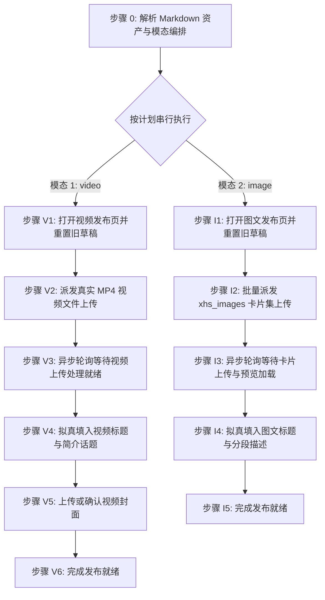

# 抖音自动化发布草稿技能规范 (doudou-douyin)

## 自动化执行全流程

当接收到用户指定的 Markdown 文件路径时，依次执行以下阶段（默认按 `video` → `image` 顺序串行执行）：



### 步骤 0：解析 Markdown 资产与模态编排

运行辅助解析脚本提取元数据：

```bash
node scripts/parser.mjs <Markdown文件绝对路径> [可选模态]
```

输出包含：
- `publishPlan`: 确定性执行计划（`modes` 包含实际要发布的模态，`skipped` 记录跳过模态及原因）
- `videoTitle` / `imagePostTitle`: 清洗后符合平台字数上限的标题
- `video`: 视频成片信息（`videoPath`、`hasVideo`）
- `cardPaths`: 全套图文卡片本地路径列表（`01-cover.png` ~ `05-summary.png`）
- `cover`: 封面图信息（Base64 与本地路径）

Agent 可直接调用 `scripts/douyin_publisher.mjs` 配合 `chrome-devtools-mcp` 注入视频与图文：
```javascript
import { parseAllAssets } from './scripts/parser.mjs';
import {
  buildVideoPostEditorScript,
  buildImagePostEditorScript,
} from './scripts/douyin_publisher.mjs';

const meta = parseAllAssets(markdownFilePath, 'undsky', requestedModes ?? null);
// 视频页注入: buildVideoPostEditorScript(meta)
// 图文页注入: buildImagePostEditorScript(meta)
```

---

### 模式 A：发布视频草稿（video 模态，优先执行）

#### 步骤 V1：打开视频发布页并重置旧草稿

1. **新建独立页面**：调用 `new_page` 打开 `https://creator.douyin.com/creator-micro/content/upload`。
2. 等待页面加载完成。
3. 执行旧草稿重置脚本（若有上次未发布提示，点击「放弃」）：

```javascript
const giveUpBtn = Array.from(document.querySelectorAll('button, span, a, div')).find(el => el.innerText?.trim() === '放弃');
if (giveUpBtn) giveUpBtn.click();
```

---

#### 步骤 V2：派发真实 MP4 视频文件上传

调用 `upload_file` 将本地 `.mp4` 视频文件派发至上传控件 `input[type="file"]`：

```javascript
await upload_file({
  pageId: targetPageId,
  filePaths: [meta.video.videoPath]
});
```

---

#### 步骤 V3：异步轮询等待视频上传处理就绪

页面自动跳转至 `content/post/video` 后，启动异步轮询（最长等待 120 秒），直到出现「上传成功」或「重新上传」：

```javascript
// 在 evaluate_script 中求值
(() => {
  const successEl = Array.from(document.querySelectorAll('*')).find(el => el.innerText?.trim() === '上传成功');
  const uploadText = Array.from(document.querySelectorAll('*')).find(el => el.innerText?.includes('已上传：') || el.innerText?.includes('当前速度：'));
  const reuploadBtn = Array.from(document.querySelectorAll('*')).find(el => el.innerText?.trim() === '重新上传');
  return { ready: !!successEl || (!!reuploadBtn && !uploadText) };
})();
```

---

#### 步骤 V4：拟真填入视频标题与简介话题

1. **填写作品标题（<=30字）**：
```javascript
const titleInput = document.querySelector('input[placeholder*="填写作品标题"], input[placeholder*="标题"]');
if (titleInput && meta.videoTitle) {
  titleInput.focus();
  const setter = Object.getOwnPropertyDescriptor(window.HTMLInputElement.prototype, 'value')?.set;
  if (setter) setter.call(titleInput, meta.videoTitle);
  else titleInput.value = meta.videoTitle;
  titleInput.dispatchEvent(new Event('input', { bubbles: true }));
  titleInput.dispatchEvent(new Event('change', { bubbles: true }));
  titleInput.blur();
}
```
2. **填写作品简介与话题（<=1000字，保留分段换行）**：
```javascript
const descEl = document.querySelector('.zone-container.editor-kit-container') || document.querySelector('[contenteditable="true"]');
if (descEl && meta.videoDesc) {
  descEl.focus();
  // 逐行注入以确保分段换行
  document.execCommand('selectAll', false, null);
  document.execCommand('delete', false, null);
  const lines = meta.videoDesc.split('\n');
  for (let i = 0; i < lines.length; i++) {
    if (lines[i].length > 0) document.execCommand('insertText', false, lines[i]);
    if (i < lines.length - 1) document.execCommand('insertParagraph', false, null);
  }
  document.body.dispatchEvent(new KeyboardEvent('keydown', { key: 'Escape', code: 'Escape', keyCode: 27, bubbles: true }));
  descEl.blur();
}
```

---

#### 步骤 V5：上传或确认视频封面

若存在自定义封面图资产，唤起「选择封面」弹窗并切换至「本地上传」注入封面；若无则保留平台推荐抽帧。

---

#### 步骤 V6：完成发布就绪

1. 资产填入完成后直接判定完成；
2. **安全隔离**：原样保留当前标签页现场供人工发布，严禁调用 `close_page`。

---

### 模式 B：发布图文（image 模态）

#### 步骤 I1：打开图文发布页并重置旧草稿

1. **新建独立页面**：调用 `new_page` 打开 `https://creator.douyin.com/creator-micro/content/upload?default-tab=3`。
2. 执行放弃未发布草稿脚本，重置干净的上传区域。

---

#### 步骤 I2：批量派发 xhs_images 卡片集上传

调用 `upload_file` 将同名目录下的全部卡片文件路径批量派发至 `input[type="file"]`：

```javascript
await upload_file({
  pageId: targetPageId,
  filePaths: meta.cardPaths // 包含 01-cover.png ~ 05-summary.png
});
```

---

#### 步骤 I3：异步轮询等待卡片上传与预览加载

异步轮询（10~30秒），直到出现「已添加N张图片」且手机预览区加载完成：

```javascript
// 在 evaluate_script 中求值
(() => {
  const text = document.body ? document.body.innerText : '';
  const imgAdded = /已添加\d+张图片|重新上传/.test(text);
  return { ready: imgAdded };
})();
```

---

#### 步骤 I4：拟真填入图文标题与分段描述

1. **填写图文标题（<=20字）**：设置 `input[placeholder*="添加作品标题"]` 原生 Setter 并派发事件。
2. **填写图文描述与话题（<=1000字）**：聚焦 `.zone-container.editor-kit-container`，逐行注入文案保持换行排版。

---

#### 步骤 I5：完成发布就绪

1. 资产填入完成后直接判定完成；
2. **安全隔离**：原样保留当前标签页现场供人工发布，严禁调用 `close_page`。

