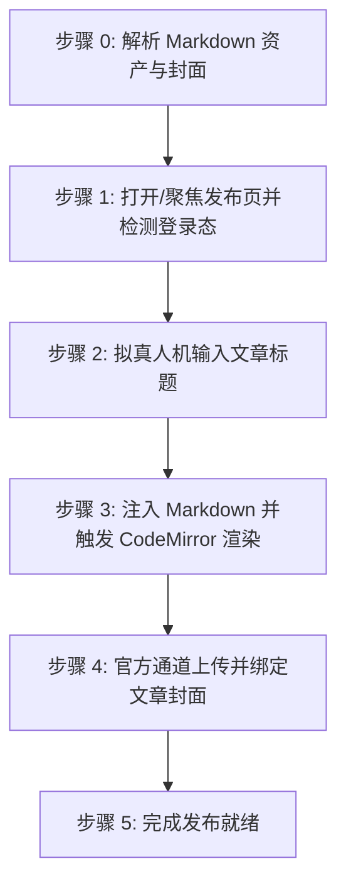

# 掘金社区文章自动发布技能 (doudou-juejin)

## 自动化执行全流程

当接收到用户指定的 Markdown 文件路径时，依次执行以下阶段：



### 步骤 0：解析 Markdown 资产与封面

运行辅助解析脚本或内置逻辑提取元数据（脚本路径相对本技能目录，即 `SKILL.md` 所在目录）：
```bash
node scripts/parser.mjs <Markdown文件绝对路径>
```
输出包含：
- `title`: 文章标题（自动清洗 Markdown 符号）
- `bodyContent`: 过滤掉首行重复 H1 后的 Markdown 正文（优先使用 `_cdn.md`）
- `cover`: 封面图信息（CDN URL 或 Local Base64）

Agent 可在步骤 1 打开页面后，直接调用脚本一键注入文章标题、Markdown 正文与封面：
```javascript
import { buildBrowserPublishScript } from './scripts/juejin_publisher.mjs';

const code = buildBrowserPublishScript(markdownFilePath);
await evaluate_script({ pageId, function: code });
```

---

### 步骤 1：打开/聚焦发布页并检测登录态

1. **新建独立页面**：调用 `new_page` 打开 `https://juejin.cn/editor/drafts/new?v=2`（必须每次新建独立页面，严禁复用或覆盖已有页面）。
2. 等待页面加载（`waitForStableDom` 或随机等待 1200ms）。
3. 执行脚本检测登录态：
   - 检查是否存在 `.markdown-editor` 或标题输入框 `input.title-input`；
   - 若未登录，向用户发出明确提示请用户在浏览器中扫码登录，并在登录完成后继续。

---

### 步骤 2：拟真人机输入文章标题

1. 聚焦标题输入框 `input.title-input`。
2. 模拟微小随机延迟（300ms~600ms）。
3. 设置标题值并派发 DOM 事件与 Vue `$emit` 同步：
```javascript
const titleInput = document.querySelector('input.title-input');
if (titleInput) {
  titleInput.focus();
  titleInput.value = articleTitle;
  titleInput.dispatchEvent(new Event('input', { bubbles: true }));
  titleInput.dispatchEvent(new Event('change', { bubbles: true }));

  const titleVue = titleInput.__vue__;
  if (titleVue) {
    titleVue.innerValue = articleTitle;
    titleVue.$emit('input', articleTitle);
    titleVue.$emit('change', articleTitle);
  }
  titleInput.blur();
}
```
4. 随机停顿 400ms~800ms。

---

### 步骤 3：注入 Markdown 并触发 CodeMirror 渲染

掘金创作者中心采用 `CodeMirror` 与 Vue 双向绑定 Markdown 编辑器：
1. 聚焦 CodeMirror 并注入 Markdown 正文；
2. 调用 Vue 编辑器组件的 `handleChange(bodyContent)` 触发实时解析与右侧预览渲染：
```javascript
const cm = document.querySelector('.CodeMirror')?.CodeMirror;
if (cm) {
  cm.focus();
  cm.setValue(bodyContent);
}
const editorVue = document.querySelector('.markdown-editor')?.__vue__;
if (editorVue && typeof editorVue.handleChange === 'function') {
  editorVue.handleChange(bodyContent);
}
```
3. 随机停顿 900ms~1600ms，让编辑器完成 Markdown 语法树分析、代码高亮与公式渲染。

---

### 步骤 4：打开发布设置面板上传并绑定封面

1. 寻找顶部「发布」按钮并点击展开 `.publish-popup` 面板；
2. 封面图从同名目录下的 cover/images 目录中提取，通过掘金官方 TOS 通道或文件选择器上传封面并绑定至草稿；
3. **安全隔离与原样保留现场**：**严禁选择分类、严禁搜索标签、严禁填写摘要**！封面绑定完成后，**不要关闭弹窗**，原样保留发布设置面板供人工选择分类、标签并最终提交发布。

---

### 步骤 5：完成发布就绪

1. 资产填入完成后直接判定完成；
2. **安全隔离**：原样保留当前标签页现场供人工发布，严禁调用 `close_page`。
