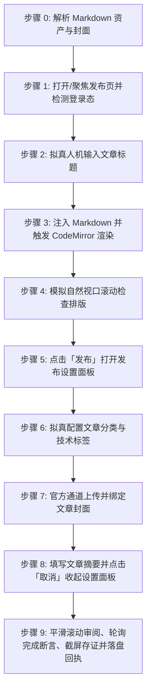

# 掘金社区文章自动发布技能 (doudou-juejin)

本技能通过 `chrome-devtools-mcp` 控制浏览器，将用户指定的本地 Markdown 文件发布至**掘金创作者中心（https://juejin.cn/editor/drafts/new?v=2 ）**。

技能严格遵循**真实人工行为模拟与防风控规约**，通过自然的事件派发、微小随机时延抖动、视口平滑滚动及悬停交互，避免被掘金平台风控拦截。自动提取文章标题、摘要、分类、技术标签、CDN 版 Markdown 正文以及宽屏封面图。

---

## 核心规约与防风控原则

1. **安全隔离与自动保存机制**：
   - **依托平台原生自动保存**：掘金编辑器在内容、标题、标签与封面填入后具备实时响应式自动保存草稿机制。
   - **移除发布时对草稿箱的操作**：发布设置面板配置完成后点击取消收起，**绝对严禁点击「确定并发布」**，确保所有内容保留在当前编辑页就绪态，由人工最终确认与手动发布。
2. **完成判定必须客观可断言（严禁以「已等待」代替「已完成」）**：
   - 「静候自动保存生效」是**等待动作**，不是验收条件。必须以**完成断言**（见下节）求值为 `true` 才允许判定完成。
   - 断言在 **45 秒超时窗口内以 1.5 秒轮询**；超时不算失败，按 `timeout` 终态登记后交还用户，**严禁谎报成功**。
3. **收尾必须落盘回执（父级编排的唯一完成信号）**：
   - 无论成功、失败、待登录、超时还是跳过，**收尾必须写 `publishes/receipts/doudou-juejin.json`**。
   - 父级 `doudou-UGC` 步骤 9 只认这份回执文件来判断本平台是否终结并推进下一个平台；**不写回执会让父级队列永久停在栅栏上等一个不会到来的信号**。
4. **防风控与真实人机行为模拟 (Anti-Bot & Human Simulation)**：
   - **随机时延抖动**：所有操作之间增加正态分布随机等待（输入前 300~600ms、步骤间 600~1500ms、点击悬停 300~600ms），严禁毫秒级并发。
   - **真实事件完整性**：对于表单输入，依次派发 `focus`、`keydown`、`input`、`keyup`、`change`、`blur`，并同步更新 Vue 组件实例与 CodeMirror 编辑器。
   - **平滑视口滚动**：模拟人类自上而下的视觉审查，分步平滑滚动页面触发浏览器的视口可见性检测。
   - **拟真悬停与点击**：点击按钮前先将视口滚动到按钮可见区域，派发 `mouseover`/`mouseenter` 悬停 300~500ms 后再触发 `click`。
5. **资产自动解析优先级**：
   - **正文**：优先使用同名目录下已将本地图片替换为图床 URL 的 `[article_name]_cdn.md`；若无则使用原 Markdown 文件。
   - **封面图**：
     1. 优先读取同名目录下 `cdn_manifest.json` 中 `type: "cover"` 的 CDN 链接（优先 2.35:1 / 16:9 / 1:1 封面）；
     2. 其次读取同名目录下 `cover/images/` 的本地图片文件（如 `cover-main-2.35x1.png`、`cover-square-1x1.png`）；
     3. 再次从 Markdown 正文中提取第一张图片链接或本地路径；
     4. 若均无则跳过封面设置。
   - **摘要**：提炼 60~95 字纯文本摘要（掘金限制 100 字以内）。
   - **分类与标签**：依据文章内容智能推断分类（如「人工智能」、「后端」、「前端」、「开发工具」等），并匹配 1~3 个官方技术标签（如「AI编程」、「人工智能」、「智能体」、「Docker」等）。
6. **发布完成后保留页面（严禁自动关闭）**：
   - 表单配置与存证截图完成后，**严禁调用 `close_page` 或以任何方式关闭当前平台页面**，必须原样保留页面现场，供用户人工复核内容、补充登录或手动确认发布。
   - 未登录、验证码拦截、网络超时等异常中断的场景同样适用：保留页面交由用户接管，不得清理关闭。

---

## 完成断言与回执协议 (Completion Assertion & Receipt)

### 完成断言

掘金草稿保存成功后会把 URL 从 `/editor/drafts/new?v=2` 改写为带草稿 ID 的形态，这是**最干净的客观判据**：

| 项 | 值 |
| :--- | :--- |
| **断言规则** | URL 匹配 `/editor/drafts/(\d+)`（即草稿 ID 为纯数字，**非 `new`**） |
| **辅助判据** | 顶部状态文字出现「保存成功」/「全部已保存」 |
| **超时窗口** | 45 秒，轮询间隔 1.5 秒 |
| **通过** | 提取 `draftId` 与 `draftUrl`，登记 `success` |
| **超时** | 登记 `timeout`（`statusText` 说明「自动保存未在 45s 内产生草稿 ID」），保留页面 |

```javascript
// 在 evaluate_script 中求值，返回结构化断言结果
() => {
  const m = location.pathname.match(/\/editor\/drafts\/(\d+)/);
  const savedTip = Array.from(document.querySelectorAll("*")).some((el) =>
    /保存成功|全部已保存/.test(el.textContent ?? "")
  );
  return {
    passed: Boolean(m),
    draftId: m?.[1] ?? null,
    draftUrl: m ? location.href : null,
    savedTip,
    rule: "URL 匹配 /editor/drafts/\\d+（非 new）",
  };
};
```

### 状态枚举（六个终态，仅此六种可写入回执）

| 状态 | 含义 |
| :--- | :--- |
| `success` | 草稿已保存且完成断言通过 |
| `ready_for_review` | 内容已填入就绪，平台禁止自动保存（掘金不适用） |
| `needs_login` | 登录态缺失/过期，已保留页面待补登 |
| `failed` | 明确失败（选择器失效、注入异常） |
| `timeout` | 完成断言在 45s 窗口内未成立 |
| `skipped` | 资产缺失或用户主动跳过 |

### 存证截图统一命名

必须存至产物目录 `publishes/screenshots/juejin_article.png`（格式 `<platformSlug>_<mode>.png`），**不再使用** `juejin_draft_proof.png` 之类的技能私有命名——父级看板按统一命名反查存证。

### 回执落盘（收尾必调，异常也要写）

```bash
node scripts/receipt.mjs write <Markdown文件绝对路径> --payload '<json>'
```

`--payload` 结构（`results` 为逐模态数组，掘金仅 `article` 一项）：

```json
{
  "skill": "doudou-juejin",
  "platform": "掘金",
  "platformSlug": "juejin",
  "startedAt": "2026-09-07T10:12:03.114Z",
  "results": [
    {
      "mode": "article",
      "modeDesc": "Markdown长文",
      "status": "success",
      "statusText": "草稿已保存",
      "title": "……",
      "draftId": "7681589410293845201",
      "draftUrl": "https://juejin.cn/editor/drafts/7681589410293845201",
      "screenshot": "screenshots/juejin_article.png",
      "assertion": { "rule": "URL 匹配 /editor/drafts/\\d+", "passed": true }
    }
  ]
}
```

脚本会强校验并拒绝不合规回执：非终态 `status`、缺 `statusText`、非 `skipped` 却缺 `screenshot` 一律报错退出，从源头杜绝脏数据流入看板。

---

## 自动化执行全流程

当接收到用户指定的 Markdown 文件路径（例如 `mds/AICoding/ddagent.md`）时，依次执行以下 9 个阶段：



### 步骤 0：解析 Markdown 资产与封面

运行辅助解析脚本或内置逻辑提取元数据（脚本路径相对本技能目录，即 `SKILL.md` 所在目录）：
```bash
node scripts/parser.mjs <Markdown文件绝对路径>
```
输出包含：
- `title`: 文章标题（自动清洗 Markdown 符号）
- `summary`: 60~95 字纯文本摘要
- `category`: 智能推断的掘金分类（人工智能、后端、前端、开发工具等）
- `tags`: 1~3 个技术标签关键词
- `bodyContent`: 过滤掉首行重复 H1 后的 Markdown 正文（优先使用 `_cdn.md`）
- `cover`: 封面图信息（CDN URL 或 Local Base64）

---

### 步骤 1：打开/聚焦发布页并检测登录态

1. 调用 `list_pages` 检查是否已有掘金发布页（URL 包含 `juejin.cn/editor/drafts`）。
   - 若已有，直接调用 `select_page` 切换到该页面；
   - 若无，调用 `new_page` 打开 `https://juejin.cn/editor/drafts/new?v=2`。
2. 等待页面加载（`waitForStableDom` 或随机等待 1200ms）。
3. 执行脚本检测登录态：
   - 检查是否存在 `.markdown-editor` 或标题输入框 `input.title-input`；
   - 若未登录，向用户发出明确提示请用户在浏览器中扫码登录，并在登录完成后继续。

---

### 步骤 2：拟真人机输入文章标题

1. 聚焦标题输入框 `input.title-input`。
2. 模拟微小随机延迟（300ms~600ms）。
3. 设置标题值并派发 DOM 事件与 Vue `$emit` 同步：
```javascript
const titleInput = document.querySelector('input.title-input');
if (titleInput) {
  titleInput.focus();
  titleInput.value = articleTitle;
  titleInput.dispatchEvent(new Event('input', { bubbles: true }));
  titleInput.dispatchEvent(new Event('change', { bubbles: true }));

  const titleVue = titleInput.__vue__;
  if (titleVue) {
    titleVue.innerValue = articleTitle;
    titleVue.$emit('input', articleTitle);
    titleVue.$emit('change', articleTitle);
  }
  titleInput.blur();
}
```
4. 随机停顿 400ms~800ms。

---

### 步骤 3：注入 Markdown 并触发 CodeMirror 渲染

掘金创作者中心采用 `CodeMirror` 与 Vue 双向绑定 Markdown 编辑器：
1. 聚焦 CodeMirror 并注入 Markdown 正文；
2. 调用 Vue 编辑器组件的 `handleChange(bodyContent)` 触发实时解析与右侧预览渲染：
```javascript
const cm = document.querySelector('.CodeMirror')?.CodeMirror;
if (cm) {
  cm.focus();
  cm.setValue(bodyContent);
}
const editorVue = document.querySelector('.markdown-editor')?.__vue__;
if (editorVue && typeof editorVue.handleChange === 'function') {
  editorVue.handleChange(bodyContent);
}
```
3. 随机停顿 900ms~1600ms，让编辑器完成 Markdown 语法树分析、代码高亮与公式渲染。

---

### 步骤 4：模拟自然视口滚动检查排版

模拟人类作者自上而下检查文章排版：
1. 平滑滚动到页面 450px 处，等待 500ms~800ms；
2. 平滑滚动回顶部，等待 400ms~700ms：
```javascript
window.scrollTo({ top: 450, behavior: 'smooth' });
// 延时后
window.scrollTo({ top: 0, behavior: 'smooth' });
```

---

### 步骤 5：点击「发布」打开发布设置面板

1. 寻找顶部「发布」按钮：
   `const publishBtn = Array.from(document.querySelectorAll('button')).find(b => b.innerText.trim() === '发布');`
2. 视口滚动至按钮可见区域，派发 `mouseover`/`mouseenter` 悬停 300~500ms 后点击：
   `publishBtn.click();`
3. 随机停顿 800ms~1300ms，等待 `.publish-popup` 弹出。

---

### 步骤 6：拟真配置文章分类与技术标签

在展开的发布面板中：
1. **文章分类**：在 `.category-list .item` 中找到匹配项并点击选中。
2. **技术标签**：
   - 调用标签输入组件的 `tagInputVue.handleSearch(tagKeyword)` 发起异步搜索；
   - 从搜索结果 `tagInputVue.dataList` 中匹配最佳官方标签；
   - 调用 `tagInputVue.handleChange([matchedTag])` 与 `panelVue.handleTagsChange([matchedTag])` 完成标签绑定。
3. 随机停顿 400ms~800ms。

---

### 步骤 7：官方通道上传并绑定文章封面

若存在封面图资产（CDN URL 或本地 Base64）：
1. 在浏览器端将图片转换为 `File` 对象（`new File([blob], 'cover.png', { type: blob.type })`）；
2. 优先调用 Markdown 编辑器实例的官方上传通道 `editorVue.uploadImages([file])` 将图片上传至字节跳动 TOS，获取官方专属图床链接（形如 `https://p0-xtjj-private.juejin.cn/tos-cn-i-73owjymdk6/...`）；
3. 将返回的官方 TOS 链接绑定至 `panelVue.post.cover_image` 与草稿数据 `parentVue.draft.cover_image`，并派发 `uploaderVue.$emit('changeCover', tosUrl)` 同步触发发布面板缩略图渲染；
4. 若 `editorVue.uploadImages` 不可用，自动降级调用 `uploaderVue.onFileSelected({ target: { files: [file] } })`；
5. 随机停顿 600ms~1000ms。

---

### 步骤 8：填写文章摘要并点击「取消」收起设置面板

1. 聚焦摘要输入框 `.publish-popup textarea` 填入精炼摘要（100 字以内），派发 `input` 与 `change` 事件；
2. **安全隔离核心规约**：寻找面板底部的「取消」按钮，悬停并点击「取消」关闭弹出面板。
   - 在掘金编辑器中，已配置的分类、标签、封面与摘要会自动同步在当前编辑状态中；
   - 点击「取消」退出弹窗回到 Markdown 编辑器，**严格禁止误触「确定并发布」**。
3. 随机停顿 500ms~900ms。

---

### 步骤 9：平滑滚动审阅、轮询完成断言、截屏存证并落盘回执

1. 模拟人工视口平滑滚动审阅排版：
   - 向下滚动：`window.scrollTo({ top: 300, behavior: 'smooth' });` 停顿 400~700ms；
   - 滚回顶部：`window.scrollTo({ top: 0, behavior: 'smooth' });` 停顿 300~500ms；
2. **轮询完成断言**（替代原先「静候 2.5 秒」的盲等）：按「完成断言与回执协议」以 1.5s 间隔求值，最长 45s；
   - 断言通过 => 提取 `draftId` / `draftUrl`，判定 `success`；
   - 45s 未通过 => 判定 `timeout`，**不得谎报成功**；
3. 调用 `take_screenshot` 保存存证至 `publishes/screenshots/juejin_article.png`；
4. **落盘回执（本步骤不可跳过）**：执行 `node scripts/receipt.mjs write <md> --payload '<json>'` 写入 `publishes/receipts/doudou-juejin.json`；
5. **保留页面现场**：存证完成后，**严禁调用 `close_page` 或关闭标签页**，保持当前页面打开供人工复核；
6. 输出结构化结果报告（文章标题、草稿 ID、分类、标签、摘要、封面状态、断言结果与回执路径）。

> **异常分支同样必须走完第 3~4 步**：未登录写 `needs_login`、注入失败写 `failed`、断言超时写 `timeout`。回执缺失会阻塞父级整条发布队列。

---

## 异常与风控处理

| 异常场景 | 表现特征 | 应对与恢复策略 |
| :--- | :--- | :--- |
| **未登录 / 登录态过期** | 未找到 `.markdown-editor` 或跳转至登录页 | 立即停止自动化输入，截图存证并写 `needs_login` 回执，保留页面交还用户补登，**不阻塞父级队列的后续平台**。 |
| **发布面板未展开** | 点击「发布」后未出现 `.publish-popup` | 自动降级为直接在主编辑区触发保存，保证文章主体内容不丢失。 |
| **封面上传失败 / 超时** | TOS 响应超时或图片拉取失败 | 降级跳过封面上传，在最终报告中标记封面待手动绑定，不阻塞草稿主体的保存。 |
| **标签搜索无精确匹配** | 搜索未返回预期的标签 | 自动选用官方模糊匹配的第一项候选标签，或降级为默认「人工智能」标签。 |
| **防重复保存拦截** | 保存按钮处于 loading 状态 | 确保调用间隔大于 3 秒，避免高频连击。 |
| **完成断言 45s 超时** | URL 始终停留在 `/editor/drafts/new` | 写 `timeout` 回执并附截图，提示用户手动触发一次保存后复核，**严禁登记为 success**。 |

---

## 脚本工具与使用方法

以下路径均相对本技能目录（`SKILL.md` 所在目录），执行前先切换到该目录，或将其拼接为绝对路径使用。

- `scripts/parser.mjs`：解析 Markdown，提取标题、摘要、掘金分类、标签、正文与封面资产。
- `scripts/juejin_publisher.mjs`：浏览器注入脚本生成器（编辑器状态同步与防风控人机模拟）。
- `scripts/receipt.mjs`：**单平台回执落盘与终态校验**（父级编排的完成信号来源，收尾必调）。

1. **直接运行 Node.js 脚本测试解析**：
```bash
node scripts/parser.mjs <Markdown文件路径>
```

2. **在 Agent 中配合 `chrome-devtools-mcp` 调用**：
```javascript
import { buildBrowserPublishScript } from './scripts/juejin_publisher.mjs';
import { writeReceipt, screenshotRelPath } from './scripts/receipt.mjs';

const startedAt = new Date().toISOString();

// 1. 生成自包含执行代码
const code = buildBrowserPublishScript(markdownFilePath);

// 2. 调用 evaluate_script 在掘金发布页执行
const result = await evaluate_script({ pageId: targetPageId, function: code });

// 3. 轮询完成断言（45s 窗口 / 1.5s 间隔），得到 success 或 timeout
const assertion = await pollAssertion(targetPageId, { timeoutMs: 45000, intervalMs: 1500 });

// 4. 截屏存证（统一命名 screenshots/juejin_article.png）
await take_screenshot({ pageId: targetPageId, filePath: absScreenshotPath });

// 5. 落盘回执 —— 无论成功与否都必须执行
writeReceipt({
  markdownFilePath,
  skill: 'doudou-juejin',
  platform: '掘金',
  platformSlug: 'juejin',
  startedAt,
  results: [{
    mode: 'article',
    modeDesc: 'Markdown长文',
    status: assertion.passed ? 'success' : 'timeout',
    statusText: assertion.passed ? '草稿已保存' : '自动保存未在 45s 内产生草稿 ID',
    title: result.title,
    draftId: assertion.draftId,
    draftUrl: assertion.draftUrl,
    screenshot: screenshotRelPath('juejin', 'article'),
    assertion,
  }],
});
```

3. **校验回执是否为终态（父级栅栏判据，也可自查）**：
```bash
node scripts/receipt.mjs check <Markdown文件路径> doudou-juejin
```
