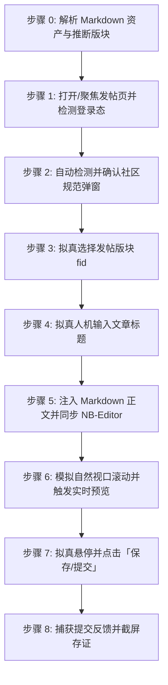

# 烧饼社区文章自动发布技能 (doudou-linuxsb)

本技能通过 `chrome-devtools-mcp` 控制浏览器，将用户指定的 Markdown 文件发布至**烧饼社区（https://linux.sb/topic_edit?fid=4 ）**。

技能严格遵循**真实人工行为模拟与防风控规约**，通过自然的事件派发、微小随机时延、社区发帖规范弹窗自动处理、视口平滑滚动及 NB-Editor Markdown 渲染，避免被平台拦截。同时与 `doudou-markdown-skill` 资产体系无缝集成，自动提取文章标题、摘要、CDN 版 Markdown 正文及智能推荐版块。

---

## 核心规约与防风控原则

1. **社区规范弹窗自动响应**：
   - 首次或每次进入发帖页面时，平台常弹出《社区发帖规范》（`.posting-notice-backdrop`）阻断视口，技能需自动识别并拟真悬停点击「我已阅读并确认」（`.posting-notice-confirm`）清除遮罩。
2. **防风控与真实人机行为模拟 (Anti-Bot & Human Simulation)**：
   - **随机时延抖动**：所有操作之间增加正态分布随机等待（输入前 300~600ms、步骤间 400~1000ms、点击前 300~700ms），严禁毫秒级机械化并发。
   - **真实事件完整性**：对于标题输入与正文填充，依次派发 `focus`、`keydown`、`input`、`keyup`、`change`、`blur`，确保表单状态与 NB-Editor 内部状态完全同步。
   - **平滑视口滚动**：模拟人类自上而下的视觉审查，分步平滑滚动页面触发浏览器的视口可见性检测。
   - **拟真悬停与点击**：点击提交按钮前先将视口平滑滚动到按钮可见区域，派发 `mouseover`/`mouseenter` 悬停 300~600ms 后再触发 `click`。
3. **版块智能推断与匹配**：
   - 默认发布至 `fid=4`（技术交流）；
   - 根据文章标题、正文关键词与路径特征智能推荐匹配版块（如资源分享 `fid=3`、福利放送 `fid=2`、求助问答 `fid=5`、深度思考 `fid=7`、我要推广 `fid=8`、社区治理 `fid=6`、大禹治水 `fid=10`）。
4. **资产自动解析优先级**（参考 `doudou-markdown-skill` 规约）：
   - **正文**：优先使用同名目录下已将本地图片替换为图床 URL 的 `[article_name]_cdn.md`；若无则使用原 Markdown 文件。
   - **图片**：优先使用 CDN 公开链接，确保图片在社区中完美显示。

---

## 社区版块映射表 (Forum Boards)

| 版块 ID (`fid`) | 版块名称 | 适用主题特征 |
| :--- | :--- | :--- |
| **`4` (默认)** | **技术交流** | AI、编程、架构、教程、Linux、Docker、前后端开发、深度实践 |
| **`3`** | **资源分享** | 实用软件、开源项目、工具合集、优质资源、素材分享 |
| **`2`** | **福利放送** | 免费福利、抽奖、礼包、社区活动 |
| **`5`** | **求助问答** | 遇到报错、技术求助、使用疑问、请教交流 |
| **`7`** | **深度思考** | 行业认知、心路历程、复盘思考、哲学感悟、长文分析 |
| **`8`** | **我要推广** | 推广链接、Affiliate、自荐产品、活动优惠 |
| **`6`** | **社区治理** | 社区规则、治理建议、公告反馈 |
| **`10`** | **大禹治水** | 闲聊摸鱼、日常灌水、社区互动 |
| **`1`** | **错误地方** | 误发版块归档 |

---

## 自动化执行全流程

当接收到用户指定的 Markdown 文件路径（例如 `mds/AICoding/txtcheck.md`）时，依次执行以下 8 个阶段：



### 步骤 0：解析 Markdown 资产与推断版块

运行辅助解析脚本提取元数据（脚本路径相对本技能目录）：
```bash
node scripts/parser.mjs <Markdown文件绝对路径> [可选指定fid]
```
输出包含：
- `title`: 文章标题（自动清洗 Markdown 符号）
- `fid` / `forumName`: 智能推荐或指定的版块 ID 与版块名称
- `summary`: 80~200 字纯文本摘要
- `bodyContent`: 过滤掉首行重复 H1 后的 Markdown 正文（优先使用 `_cdn.md`）
- `cover`: 封面图资产信息

---

### 步骤 1：打开/聚焦发帖页并检测登录态

1. 调用 `list_pages` 检查是否已有烧饼社区发帖页（URL 包含 `linux.sb/topic_edit`）。
   - 若已有，直接调用 `select_page` 切换到该页面；
   - 若无，调用 `new_page` 打开 `https://linux.sb/topic_edit?fid=4`。
2. 等待页面加载完成。
3. 执行脚本检测登录态：
   - 检查页面是否存在用户主页链接（`a[href*="/user/"]`）或表单元素 `form[action*="topic_edit"]`；
   - 若未登录，向用户发出明确提示请用户在浏览器中完成登录，并在登录完成后继续。

---

### 步骤 2：自动检测并确认社区规范弹窗

若页面弹出发帖规范提示遮罩（`.posting-notice-backdrop`）：
```javascript
const noticeConfirmBtn = document.querySelector('.posting-notice-confirm');
if (noticeConfirmBtn && noticeConfirmBtn.offsetParent !== null) {
  noticeConfirmBtn.scrollIntoView({ behavior: 'smooth', block: 'center' });
  noticeConfirmBtn.dispatchEvent(new MouseEvent('mouseover', { bubbles: true }));
  noticeConfirmBtn.dispatchEvent(new MouseEvent('mouseenter', { bubbles: true }));
  noticeConfirmBtn.click();
}
```
等待 400ms~700ms 确认遮罩消失。

---

### 步骤 3：拟真选择发帖版块

1. 聚焦版块下拉框 `select[name="forum_id"]`。
2. 设置 `fid` 对应值并派发 DOM 事件：
```javascript
const forumSelect = document.querySelector('select[name="forum_id"]');
if (forumSelect) {
  forumSelect.focus();
  forumSelect.value = targetFid;
  forumSelect.dispatchEvent(new Event('input', { bubbles: true }));
  forumSelect.dispatchEvent(new Event('change', { bubbles: true }));
  forumSelect.blur();
}
```
3. 随机停顿 300ms~600ms。

---

### 步骤 4：拟真人机输入文章标题

1. 聚焦标题输入框 `input[name="title"]`。
2. 模拟微小随机延迟（300ms~600ms）。
3. 采用原生 Setter 设值并派发事件：
```javascript
const titleInput = document.querySelector('input[name="title"]');
if (titleInput) {
  titleInput.focus();
  const nativeSetter = Object.getOwnPropertyDescriptor(window.HTMLInputElement.prototype, 'value')?.set;
  if (nativeSetter) {
    nativeSetter.call(titleInput, articleTitle);
  } else {
    titleInput.value = articleTitle;
  }
  titleInput.dispatchEvent(new Event('input', { bubbles: true }));
  titleInput.dispatchEvent(new Event('change', { bubbles: true }));
  titleInput.dispatchEvent(new KeyboardEvent('keyup', { bubbles: true, key: ' ' }));
  titleInput.blur();
}
```
4. 随机停顿 300ms~600ms。

---

### 步骤 5：注入 Markdown 正文并同步 NB-Editor

1. 聚焦正文多行文本框 `textarea[name="body"]`。
2. 模拟微小随机延迟（400ms~700ms）。
3. 注入 Markdown 正文并派发事件：
```javascript
const textarea = document.querySelector('textarea[name="body"]');
if (textarea) {
  textarea.focus();
  const nativeSetter = Object.getOwnPropertyDescriptor(window.HTMLTextAreaElement.prototype, 'value')?.set;
  if (nativeSetter) {
    nativeSetter.call(textarea, bodyContent);
  } else {
    textarea.value = bodyContent;
  }
  textarea.dispatchEvent(new Event('input', { bubbles: true }));
  textarea.dispatchEvent(new Event('change', { bubbles: true }));
  textarea.dispatchEvent(new KeyboardEvent('keyup', { bubbles: true, key: ' ' }));
}
```
4. 同步 NB-Editor 本地草稿存储（`data-nb-editor-draft`），避免意外刷新丢失数据。
5. 随机停顿 500ms~800ms。

---

### 步骤 6：模拟自然视口滚动并触发实时预览

1. 平滑滚动到页面下方（`window.scrollTo({ top: 350, behavior: 'smooth' })`），等待 500ms~800ms；
2. 滚动回顶部，等待 300ms~600ms；
3. 点击工具栏的「实时预览」按钮（`button[data-nb-editor-action="preview"]`），触发 Markdown 解析与后端渲染校验；
4. 校验 `.nb-editor-preview` 渲染成功后，再次点击切回编辑视图。

---

### 步骤 7：拟真悬停并点击「保存/提交」

1. 寻找提交按钮：
   `const submitBtn = document.querySelector('form[action*="topic_edit"] button[type="submit"]') || document.querySelector('form button[type="submit"]');`
2. 将视口平滑滚动至按钮完全可见：
   `submitBtn.scrollIntoView({ behavior: 'smooth', block: 'center' });`
3. 模拟鼠标悬停（Hover）派发事件：
   `submitBtn.dispatchEvent(new MouseEvent('mouseover', { bubbles: true }));`
   `submitBtn.dispatchEvent(new MouseEvent('mouseenter', { bubbles: true }));`
4. 拟真停顿 400ms~800ms。
5. 触发点击提交：
   `submitBtn.click();`

---

### 步骤 8：捕获提交反馈并截屏存证

1. 等待 2~3 秒，检测页面跳转或成功反馈。
2. 调用 `take_screenshot` 保存当前页面截图作为存证（如 `publishes/screenshots/linuxsb.png`）。
3. 输出结构化结果报告（文章标题、发布版块、字符数、URL 存证等）。

---

## 异常与风控处理

| 异常场景 | 表现特征 | 应对与恢复策略 |
| :--- | :--- | :--- |
| **未登录 / 登录态过期** | 未找到发帖表单或跳转登录页 | 立即停止自动化输入，向用户发送提示，等待用户在浏览器中完成登录后再继续。 |
| **发帖规范遮罩阻断** | 页面存在 `.posting-notice-backdrop` 无法交互 | 自动寻找 `.posting-notice-confirm` 派发拟真点击关闭遮罩。 |
| **Markdown 渲染异常** | 预览内容为空或报错 | 校验 Markdown 内容，确保特殊符号与换行转义正确。 |
| **版块选择无效** | `forum_id` 未更新 | 派发原生 `change` 和 `input` 事件以激活浏览器表单监听。 |
| **防重复提交拦截** | 保存按钮处于 disabled 或 loading | 确保每次点击间隔大于 3 秒，不连续连击。 |

---

## 脚本工具与使用方法

以下路径均相对本技能目录（`SKILL.md` 所在目录），执行前先切换到该目录，或将其拼接为绝对路径使用。

- `scripts/parser.mjs`：解析 Markdown，提取标题、版块、摘要与正文。
- `scripts/linuxsb_publisher.mjs`：浏览器注入脚本生成器（NB-Editor 状态同步、防风控人机模拟与提交）。

### 1. 运行 Node.js 脚本测试解析
```bash
node scripts/parser.mjs <Markdown文件路径> [fid]
```

### 2. 在 Agent 中配合 `chrome-devtools-mcp` 调用
```javascript
import { buildBrowserPublishScript, buildSubmitTopicScript } from './scripts/linuxsb_publisher.mjs';

// 1. 生成并执行表单填充代码（标题、版块、Markdown 正文、预览）
const fillCode = buildBrowserPublishScript(markdownFilePath, { fid: '4' });
const fillResult = await evaluate_script({ pageId, function: fillCode });

// 2. 模拟点击提交发布
const submitCode = buildSubmitTopicScript();
const submitResult = await evaluate_script({ pageId, function: submitCode });

// 3. 截屏存证
await take_screenshot({ pageId });
```
