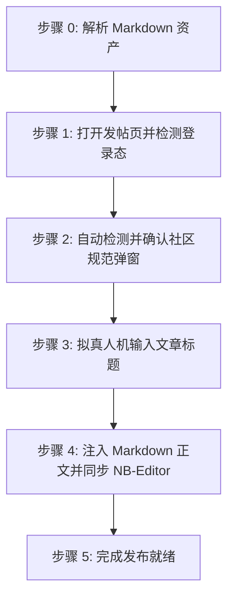

# 烧饼社区文章自动发布技能 (doudou-linuxsb)

> [!IMPORTANT]
> **【核心铁律】严禁自动点击「保存」发布！**
> 烧饼社区发帖页面的「保存」按钮点击后会**直接公开发布新主题**（平台无独立后台草稿箱）。因此，本技能在完成标题输入、Markdown 正文注入后，**必须立即停止，不得调用或触发保存/提交点击**。由用户在浏览器中做最后人工审查并由用户手动点击「保存」。

---

## 自动化执行全流程

当接收到用户指定的 Markdown 文件路径时，依次执行以下阶段：



### 步骤 0：解析 Markdown 资产

运行辅助解析脚本提取元数据（脚本路径相对本技能目录）：
```bash
node scripts/parser.mjs <Markdown文件绝对路径>
```
输出包含：
- `title`: 文章标题（自动清洗 Markdown 符号）
- `bodyContent`: 过滤掉首行重复 H1 后的 Markdown 正文（优先使用 `_cdn.md`）
- `cover`: 封面图资产信息

Agent 可在步骤 1 打开页面后，直接调用脚本一键注入文章标题与 Markdown 正文：
```javascript
import { buildBrowserPublishScript } from './scripts/linuxsb_publisher.mjs';

const code = buildBrowserPublishScript(markdownFilePath);
await evaluate_script({ pageId, function: code });
```

---

### 步骤 1：打开发帖页并检测登录态

1. **新建独立页面**：调用 `new_page` 打开 `https://linux.sb/topic_edit?fid=4`（必须每次新建独立页面，严禁复用或覆盖已有页面。URL 参数携带 `fid=4` 默认即为技术交流版块，无需额外选择与判断）。
2. 等待页面加载完成。
3. 执行脚本检测登录态：
   - 检查页面是否存在用户主页链接（`a[href*="/user/"]`）或表单元素 `form[action*="topic_edit"]`；
   - 若未登录，向用户发出明确提示请用户在浏览器中完成登录，并在登录完成后继续。

---

### 步骤 2：自动检测并确认社区规范弹窗

若页面弹出发帖规范提示遮罩（`.posting-notice-backdrop`）：
```javascript
const noticeConfirmBtn = document.querySelector('.posting-notice-confirm');
if (noticeConfirmBtn && noticeConfirmBtn.offsetParent !== null) {
  noticeConfirmBtn.scrollIntoView({ behavior: 'smooth', block: 'center' });
  noticeConfirmBtn.dispatchEvent(new MouseEvent('mouseover', { bubbles: true }));
  noticeConfirmBtn.dispatchEvent(new MouseEvent('mouseenter', { bubbles: true }));
  noticeConfirmBtn.click();
}
```
等待 400ms~700ms 确认遮罩消失。

---

### 步骤 3：拟真人机输入文章标题

1. 聚焦标题输入框 `input[name="title"]`。
2. 模拟微小随机延迟（300ms~600ms）。
3. 采用原生 Setter 设值并派发事件：
```javascript
const titleInput = document.querySelector('input[name="title"]');
if (titleInput) {
  titleInput.focus();
  const nativeSetter = Object.getOwnPropertyDescriptor(window.HTMLInputElement.prototype, 'value')?.set;
  if (nativeSetter) {
    nativeSetter.call(titleInput, articleTitle);
  } else {
    titleInput.value = articleTitle;
  }
  titleInput.dispatchEvent(new Event('input', { bubbles: true }));
  titleInput.dispatchEvent(new Event('change', { bubbles: true }));
  titleInput.dispatchEvent(new KeyboardEvent('keyup', { bubbles: true, key: ' ' }));
  titleInput.blur();
}
```
4. 随机停顿 300ms~600ms。

---

### 步骤 4：注入 Markdown 正文并同步 NB-Editor

1. 聚焦正文多行文本框 `textarea[name="body"]`。
2. 模拟微小随机延迟（400ms~700ms）。
3. 注入 Markdown 正文并派发事件：
```javascript
const textarea = document.querySelector('textarea[name="body"]');
if (textarea) {
  textarea.focus();
  const nativeSetter = Object.getOwnPropertyDescriptor(window.HTMLTextAreaElement.prototype, 'value')?.set;
  if (nativeSetter) {
    nativeSetter.call(textarea, bodyContent);
  } else {
    textarea.value = bodyContent;
  }
  textarea.dispatchEvent(new Event('input', { bubbles: true }));
  textarea.dispatchEvent(new Event('change', { bubbles: true }));
  textarea.dispatchEvent(new KeyboardEvent('keyup', { bubbles: true, key: ' ' }));
}
```
4. 同步 NB-Editor 本地草稿存储（`data-nb-editor-draft`），避免意外刷新丢失数据。
5. 随机停顿 500ms~800ms。

---

### 步骤 5：完成发布就绪

1. 资产填入完成后直接判定完成；
2. **安全隔离**：原样保留当前标签页现场供人工发布，严禁调用 `close_page`。
