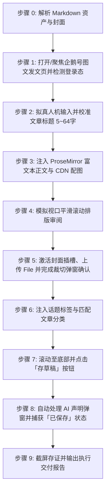

# 企鹅号图文文章自动发布到草稿箱技能 (doudou-qiehao)

本技能通过 `chrome-devtools-mcp` 控制浏览器，将用户指定的本地 Markdown 文章及其衍生资产安全发布至**企鹅号 / 腾讯内容开放平台（https://om.qq.com/main/creation/article ）的图文草稿箱**。

技能严格遵循**真实人工行为模拟与防风控规约**，通过自然的事件派发、微小随机时延抖动、企鹅号 ProseMirror ExEditor 富文本双向状态同步、视口平滑滚动排版审阅、弹窗式封面真实上传与裁切确认，以及合规 AI 生成声明自动处理，避免被平台风控拦截。同时与 `doudou-markdown-skill` 资产体系无缝集成，自动提取文章标题、摘要、标签、分类、带 CDN 高清配图的排版正文以及单图/宽屏封面。

---

## 核心规约与防风控原则

1. **草稿安全隔离**：
   - **严格限定仅保存为草稿**（点击「存草稿」按钮，捕获「已保存」通知并在 `/editorCache/update` 请求中确认保存状态），**绝对不点击「发布」或「定时发布」**，确保所有内容必须经人工最终审核后再公开发布。
2. **防风控与真实人机行为模拟 (Anti-Bot & Human Simulation)**：
   - **随机时延抖动**：所有操作之间增加正态分布随机等待（输入前 200~400ms、步骤间 400~1000ms、点击悬停 200~400ms），严禁毫秒级瞬时操作。
   - **真实事件完整性**：对于标题输入与表单交互，依次派发 `mouseover`、`mouseenter`、`mousedown`、`mouseup`、`click`、`focus`、`input`、`change`、`blur`，并同步底层 React 事件与状态。
   - **企鹅号 ProseMirror ExEditor 富文本注入**：调用 `window.ExEditor.sliceFromHTML(meta.htmlContent)` 并通过 `window.ExEditor.view.dispatch(tr)` 注入标准 HTML，自动触发平台字数统计与段落诊断，完整保留标题、代码块、加粗、引用、列表及 CDN 配图。
   - **平滑视口滚动**：模拟人类自上而下的视觉审阅，分步平滑滚动页面触发浏览器的视口可见性检测。
   - **拟真悬停与点击**：点击元素前先将其 `scrollIntoView({ behavior: 'smooth' })`，派发 `mouseover`、`mouseenter` 悬停后再触发 `click`。
   - **合规声明自动提交**：自动检测并提交平台《人工智能生成合成内容标识办法》要求的「AI生成声明」弹窗，防止阻塞流程。
3. **资产自动解析优先级**（参考 `doudou-markdown-skill` 规约）：
   - **文章标题**：限制 5～64 字以内（企鹅号官方限制 5~64 字），自动清洗 Markdown 符号（`#`、`**` 等）并智能截断/填充。
   - **文章正文**：优先读取同名目录下 `[article_name]_cdn.md`（或依据 `cdn_manifest.json` 将本地图片无缝替换为 Cloudflare R2 公开 CDN 链接），转换为带有高清配图的标准语义 HTML。
   - **文章封面**（严格遵循 `doudou-markdown-skill` 中 `baoyu-cover-image` 规约）：
     1. 优先读取同名目录下 `cover/images/` 的本地封面（优先 `cover-main-2.35x1.png` 宽屏主封面、`cover-16x9.png`、`cover.png`、`cover-square-1x1.png`）；
     2. 其次读取同名目录下 `cdn_manifest.json` 中 `type: "cover"` 的 CDN 条目；
     3. 再次读取同名目录下 `imgs/` 或 `xhs_images/images/` 下的封面图片；
     4. 若均无则跳过封面设置。
   - **话题标签**：智能提取 1~9 个技术标签，每个标签限制 8 字以内。
   - **文章分类**：智能推断匹配所属分类（如 `科技`、`财经`、`游戏` 等）。

---

## 自动化执行全流程

当接收到用户指定的 Markdown 文件路径（例如 `mds/RuoYi-SpringBoot3/byeidea.md`）时，依次执行以下流程：



---

### 步骤 0：解析 Markdown 资产与封面

运行辅助解析脚本提取元数据：
```bash
node /Users/jyx/project/doudou-qiehao-skill/scripts/parser.mjs <Markdown文件绝对路径>
```
输出包含：
- `articleTitle`: 清洗并规范至 5~64 字以内的文章标题
- `articleSummary`: 100 字以内纯文本摘要
- `category`: 智能匹配的分类（如 `科技`）
- `tags`: 智能匹配的话题标签数组（最多 9 个，每词 <= 8 字）
- `articleHtml`: 包含 CDN 图片、标题、代码块、引用与列表的语义 HTML
- `cover`: 高清封面图（Base64 与本地路径）

---

### 步骤 1：打开/聚焦发文页并检测登录态

1. 调用 `list_pages` 检查是否已有企鹅号图文发文页面（URL 包含 `om.qq.com/main/creation/article`）。
   - 若已有，调用 `select_page` 切换到该页面；
   - 若无，调用 `new_page` 打开 `https://om.qq.com/main/creation/article`。
2. 检测登录态：
   - 检查页面是否存在标题输入框 `.omui-articletitle__input1 .omui-inputautogrowing__inner` 与编辑器实例 `window.ExEditor`；
   - 若被重定向至登录页（如 `passport.qq.com` 或 `userReg`），向用户发出明确提示请用户在浏览器中登录创作者账号后再继续。

---

### 步骤 2：拟真人机输入文章标题

1. 定位 `.omui-articletitle__input1 .omui-inputautogrowing__inner`；
2. 视口滚动并聚焦，派发 `focus` 事件；
3. 模拟微小随机延迟（200ms~400ms）；
4. 设置 `titleEl.innerText = meta.title`；
5. 调用 React Handlers 中的 `onInput` 方法深度绑定 React 状态；
6. 依次派发 `input`、`change`、`blur` 事件。

---

### 步骤 3：注入企鹅号 ProseMirror 富文本正文

1. 解析 HTML 结构：调用 `window.ExEditor.sliceFromHTML(meta.htmlContent)`；
2. 调度事务注入：调用 `window.ExEditor.view.dispatch(tr)` 注入带有 CDN 图片和代码块的标准富文本；
3. 随机停顿 600ms~1000ms 让 ProseMirror 完成节点渲染、字数统计与图片块组件化。

---

### 步骤 4：模拟人工视口平滑滚动

1. 平滑滚动到页面 400px，停顿 400ms~600ms；
2. 平滑滚动到页面 900px，停顿 400ms~600ms；
3. 平滑滚动到页面 1400px（底部设置区），停顿 400ms~600ms。

---

### 步骤 5：封面插槽点击、上传与裁切确认

若存在封面图资产：
1. 定位展示封面区域的插槽 `.addCoverBtn-cls3gyHX, button.omui-button--add`；
2. 拟真悬停并点击弹出上传选择框；
3. 切换到「本地上传」标签；
4. 将封面 Base64 构造成标准 `File` 对象，通过 `DataTransfer` 注入上传 input（`input[type="file"]`）；
5. 派发 React 合成 `onChange` 事件与 DOM `change` 事件；
6. 轮询等待确认按钮（`.omui-dialog button` 文本为「确认」）变为可用状态，拟真悬停并点击确认；
7. 检查封面插槽确认封面图片已渲染呈现。

---

### 步骤 6：标签与分类配置

1. **分类设置**：若当前未选择分类，展开分类下拉框，输入分类关键词（如 `科技`）并点击选中对应选项。
2. **标签设置**：将提取的话题标签（如 `AI编程`、`架构设计` 等）依次触发 `onChange` 并派发 `Enter` 键事件注入。

---

### 步骤 7：点击「存草稿」并捕获保存状态

1. 平滑滚动至页面底部按钮区域；
2. 定位包含「存草稿」文本的按钮；
3. 拟真派发 `mouseover`、`mousedown`、`mouseup`、`click` 及 React `onClick`；
4. 自动检测并处理可能弹出的「AI生成声明」合规弹窗；
5. 读取 `.tool_message-cls1f3u-` 浮层通知，校验是否出现「已保存」；
6. 严禁触碰「发布」或「定时发布」按钮。

---

### 步骤 8：截屏存证与交付报告

1. 调用 `take_screenshot` 保存草稿保存成功的浏览器画面作为执行存证；
2. 向用户呈递包含文章标题、字数、封面状态、分类、标签及草稿存证的结构化报告。

---

## 异常与风控处理

| 异常场景 | 表现特征 | 应对与恢复策略 |
| :--- | :--- | :--- |
| **未登录 / 登录态失效** | 跳转至登录页或未找到标题框与 `window.ExEditor` | 立即暂停自动化流程，向用户发出提示请在浏览器中登录企鹅号，登录完成后继续。 |
| **标题超长/不足拦截** | 提示“标题限制5~64个字” | 解析器已自动对标题执行 5~64 字清洗与截断/填充，确保 100% 符合平台规则。 |
| **封面上传弹窗未展开** | 点击封面添加按钮无响应 | 深度遍历触发父子节点的 React `onClick` 事件，或跳过封面上传，在报告中明确提示，不阻塞草稿主体的保存。 |
| **AI生成声明弹窗遮挡** | 页面出现《人工智能生成合成内容标识办法》确认框 | 脚本内置自动检测逻辑，自动点击弹窗「提交」按钮完成合规声明并关闭弹窗。 |
| **ExEditor 注入失败** | `window.ExEditor` 未找到或未渲染 | 重新检查编辑器容器与 DOM 节点，等待页面 React 完全挂载后再注入。 |
| **保存延迟** | 未及时捕获到「已保存」提示 | 增加 3 秒轮询等待，检查 `/editorCache/update` 请求是否返回 `code: 0`。 |

---

## 脚本工具与在 Agent 中的调用方法

### 1. 运行命令行测试

```bash
# 1. 测试资产解析
node /Users/jyx/project/doudou-qiehao-skill/scripts/parser.mjs <Markdown文件路径>

# 2. 测试浏览器代码生成
node /Users/jyx/project/doudou-qiehao-skill/scripts/qiehao_publisher.mjs <Markdown文件路径>
```

### 2. 在 Agent 中配合 `chrome-devtools-mcp` 调用

```javascript
import { parseAllAssets } from '/Users/jyx/project/doudou-qiehao-skill/scripts/parser.mjs';
import { buildPublishBrowserScript } from '/Users/jyx/project/doudou-qiehao-skill/scripts/qiehao_publisher.mjs';

// 1. 解析目标 Markdown 及其同名资产目录
const meta = parseAllAssets(markdownFilePath);

// 2. 生成自包含浏览器执行代码
const code = buildPublishBrowserScript(meta);

// 3. 在企鹅号发文页执行
const result = await evaluate_script({
  pageId: publishPageId,
  function: code
});

// 4. 截屏存证
await take_screenshot({ pageId: publishPageId });
```
