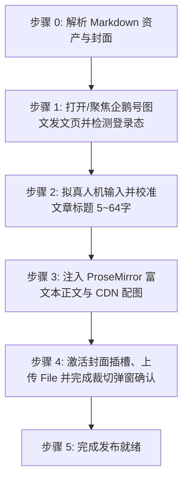

# 企鹅号图文文章自动发布技能 (doudou-qiehao)

## 自动化执行全流程

当接收到用户指定的 Markdown 文件路径时，依次执行以下流程：



---

### 步骤 0：解析 Markdown 资产与封面

运行辅助解析脚本提取元数据（脚本路径相对本技能目录，即 `SKILL.md` 所在目录）：
```bash
node scripts/parser.mjs <Markdown文件绝对路径>
```
输出包含：
- `articleTitle`: 清洗并规范至 5~64 字以内的文章标题
- `articleHtml`: 包含 CDN 图片、标题、代码块、引用与列表的语义 HTML
- `cover`: 高清封面图（Base64 与本地路径）

Agent 可在步骤 1 打开页面后，直接调用脚本一键注入文章标题、富文本正文与封面：
```javascript
import { parseAllAssets } from './scripts/parser.mjs';
import { buildPublishBrowserScript } from './scripts/qiehao_publisher.mjs';

const meta = parseAllAssets(markdownFilePath);
const code = buildPublishBrowserScript(meta);
await evaluate_script({ pageId, function: code });
```

---

### 步骤 1：打开/聚焦发文页并检测登录态

1. **新建独立页面**：调用 `new_page` 打开 `https://om.qq.com/main/creation/article`（必须每次新建独立页面，严禁复用或覆盖已有页面）。
2. 检测登录态：
   - 检查页面是否存在标题输入框 `.omui-articletitle__input1 .omui-inputautogrowing__inner` 与编辑器实例 `window.ExEditor`；
   - 若被重定向至登录页（如 `passport.qq.com` 或 `userReg`），向用户发出明确提示请用户在浏览器中登录创作者账号后再继续。

---

### 步骤 2：拟真人机输入文章标题

1. 定位 `.omui-articletitle__input1 .omui-inputautogrowing__inner`；
2. 聚焦并派发 `focus` 事件；
3. 模拟微小随机延迟（200ms~400ms）；
4. 设置 `titleEl.innerText = meta.title`；
5. 调用 React Handlers 中的 `onInput` 方法深度绑定 React 状态；
6. 依次派发 `input`、`change`、`blur` 事件。

---

### 步骤 3：极速注入 ProseMirror 富文本正文

1. **正文极速装配**：直接使用已由前序流程 R2 图床化的 `[article_name]_cdn.md` 生成的标准富文本 HTML；
2. **解析 HTML 结构**：调用 `window.ExEditor.sliceFromHTML(meta.htmlContent)`；
3. **调度事务注入**：调用 `window.ExEditor.view.dispatch(tr)` 极速注入正文；
4. **状态同步等待**：停顿 300ms~500ms 让 ProseMirror 完成节点渲染与字数统计。

---

### 步骤 4：激活封面插槽、上传 File 并完成裁切弹窗确认

若存在封面图资产：
1. 定位展示封面区域的插槽 `.addCoverBtn-cls3gyHX, button.omui-button--add`；
2. 拟真悬停并点击弹出上传选择框；
3. 切换到「本地上传」标签；
4. 将封面 Base64 构造成标准 `File` 对象，通过 `DataTransfer` 注入上传 input（`input[type="file"]`）；
5. 派发 React 合成 `onChange` 事件与 DOM `change` 事件；
6. 轮询等待确认按钮（`.omui-dialog button` 文本为「确认」）变为可用状态，点击确认；
7. 检查封面插槽确认封面图片已渲染呈现。

---

### 步骤 5：完成发布就绪

1. 资产填入完成后直接判定完成；
2. **安全隔离**：原样保留当前标签页现场供人工发布，严禁调用 `close_page`。
