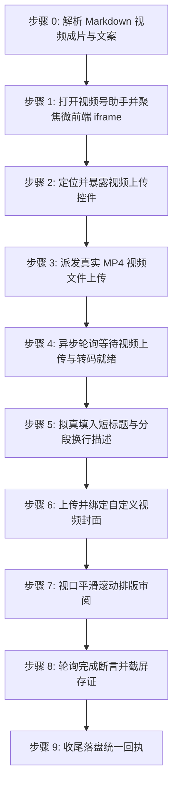

# 微信视频号自动化发布技能规范 (doudou-shipinhao)

本技能通过 `chrome-devtools-mcp` 控制 Chrome 浏览器，实现微信视频号助手（Channels Platform）的自动化视频内容填入全流程。

严格遵循**真实人工行为模拟与防风控规约**，精准穿透微前端 iframe，填入短标题、结构化换行描述与封面后依托平台原生自动保存就绪，全流程完成后原样保留页面现场供人工最终核验，绝不自动触碰发表按钮。

---

## 核心规约与防风控原则

1. **发布入口**：
   - 视频号助手发表入口：`https://channels.weixin.qq.com/platform/post/create`
   - 微前端真实子页面：`https://channels.weixin.qq.com/micro/content/post/create`（同源内嵌于 `iframe[name="content"]`）
2. **资产规范与限制**：
   - 视频成片：优先识别同名目录下 `video/*.mp4`（如 `video_manifest.json` 登记的成片）；
   - 视频作品短标题：`<= 16 字`（严格清洗截断，超出截取为 15 字 + `…`）；
   - 视频作品描述：`<= 1000 字`（保留多行分段换行排版，末尾追加 `#话题` 标签，严禁单行塌陷）；
   - 视频封面图：优先解析同名目录下 `cover.png` 或 `video_cover.png`。
3. **安全隔离（绝对底线）**：
   - 视频上传与信息填写完毕后，**严禁主动点击「保存草稿」按钮**，**绝对严禁触碰「发表」按钮**，依托平台原生自动保存，保留在当前编辑页就绪态供人工最终确认。
4. **完成判定必须客观可断言**：
   - 必须以客观断言求值为 `true` 判定完成（视频上传进度 100% 且草稿状态可见），严禁以固定延时代替完成。超时标记 `timeout` 并保留页面，严禁误报 `success`。
5. **收尾必须落盘回执**：
   - 执行完毕必须调用 `scripts/receipt.mjs write` 写入回执，供上层调度读取。
6. **微前端 iframe 穿透与人机行为模拟**：
   - 优先通过 `iframe[name="content"]`（`iframe.contentDocument`）操作内部控件；
   - 输入前等待 200~400ms，短标题使用原生 Setter 并同步 Vue `internalValue`；
   - 描述富文本通过 `innerText` 注入并触发 Vue `updateDescData` 方法，确保字数统计与状态同步。
7. **发布完成后保留页面（严禁自动关闭）**：
   - 每次执行必须调用 `new_page` 新建独立标签页（严禁复用已有页面）；流程完成后严禁调用 `close_page`，原样保留页面现场。

---

## 完成断言与回执协议 (Completion Assertion & Receipt)

### 完成断言

| 项 | 值 |
| :--- | :--- |
| **断言规则** | 视频上传进度达 100% 且「草稿」状态可见 |
| **超时窗口** | 45 秒，轮询间隔 1.5 秒 |
| **通过** | 登记 `success` |
| **超时** | 登记 `timeout`（保留页面，严禁登记为 success） |

```javascript
// 在 evaluate_script 中求值
() => {
  const iframe = document.querySelector('iframe[name="content"]');
  const doc = iframe && iframe.contentDocument ? iframe.contentDocument : document;
  const t = doc.body ? doc.body.innerText : '';
  const done = /100%|上传完成|上传成功/.test(t);
  const draft = /草稿/.test(t);
  return { passed: done && draft, uploadDone: done, draftVisible: draft };
};
```

### 状态枚举（六个终态）

| 状态 | 含义 |
| :--- | :--- |
| `success` | 草稿已保存且完成断言通过 |
| `ready_for_review` | 内容已填入就绪待人工发布 |
| `needs_login` | 登录态缺失/过期，已保留页面待补登 |
| `failed` | 明确失败（选择器失效、注入异常） |
| `timeout` | 完成断言在 45s 窗口内未成立 |
| `skipped` | 资产缺失或用户主动跳过 |

### 存证截图统一命名

统一存至同名文章目录下的 `publishes/screenshots/` 目录：
- 视频截图：`publishes/screenshots/shipinhao_video.png`

### 临时脚本与中间文件存放规约

所有临时注入脚本、临时 payload 等文件必须统一放置在目标 Markdown 文章对应的同名资产目录下，严禁污染工作区或项目根目录。

### 回执落盘

```bash
node scripts/receipt.mjs write <Markdown文件绝对路径> --payload-file <json文件路径>
```

`--payload` 结构示例：

```json
{
  "skill": "doudou-shipinhao",
  "platform": "微信视频号",
  "platformSlug": "shipinhao",
  "startedAt": "2026-09-09T08:00:00.000Z",
  "results": [
    {
      "mode": "video",
      "modeDesc": "视频",
      "status": "success",
      "statusText": "草稿已保存",
      "title": "……",
      "screenshot": "screenshots/shipinhao_video.png",
      "assertion": { "rule": "视频上传进度达 100% 且「草稿」状态可见", "passed": true }
    }
  ]
}
```

---

## 自动化执行全流程

当接收到用户指定的 Markdown 文件路径时，依次执行以下阶段：



### 步骤 0：解析 Markdown 视频成片与文案

运行辅助解析脚本提取元数据：

```bash
node scripts/parser.mjs <Markdown文件绝对路径>
```

输出包含：
- `shortTitle`: 清洗并规范至 16 字以内的短标题
- `videoDesc`: 结构化分段换行描述文案（含末尾 `#话题` 标签）
- `tags`: 提取的话题列表
- `video`: 视频成片信息（`videoPath`、`hasVideo`）
- `cover`: 封面图信息（Base64 与文件路径）

---

### 步骤 1：打开视频号助手并聚焦微前端 iframe

1. **新建独立页面**：调用 `new_page` 打开 `https://channels.weixin.qq.com/platform/post/create`。
2. 等待页面及主内嵌 `iframe[name="content"]` 加载完成。
3. 执行脚本检测登录态：
   - 检查页面是否存在登录二维码，若未登录，向用户发送提示，等待扫码登录完成后继续。

---

### 步骤 2：定位并暴露视频上传控件

执行脚本穿透微前端 `iframe[name="content"]`，将隐藏的 `input[type="file"]` 暴露给 accessibility tree：

```javascript
(() => {
  const iframe = document.querySelector('iframe[name="content"]');
  const doc = iframe && iframe.contentDocument ? iframe.contentDocument : document;
  const fileInput = doc.querySelector('input[type="file"]');
  if (fileInput) {
    fileInput.id = 'doudou-channels-file-input';
    fileInput.style.display = 'inline-block';
    fileInput.style.position = 'fixed';
    fileInput.style.top = '10px';
    fileInput.style.right = '10px';
    fileInput.style.zIndex = '999999';
    fileInput.style.width = '120px';
    fileInput.style.height = '36px';
    fileInput.style.opacity = '0.05';
    return { success: true, id: fileInput.id };
  }
  return { success: false, error: '未找到 input[type="file"]' };
})();
```

---

### 步骤 3：派发真实 MP4 视频文件上传

调用 `upload_file` 将本地 `.mp4` 视频文件派发至上传控件：

```javascript
await upload_file({
  pageId: targetPageId,
  uid: fileInputUid,
  filePaths: [meta.video.videoPath]
});
```

---

### 步骤 4：异步轮询等待视频上传与转码就绪

异步轮询微前端文档状态（最长等待 120 秒），检测上传进度与视频预览就绪：

```javascript
// 在 evaluate_script 中求值
(() => {
  const iframe = document.querySelector('iframe[name="content"]');
  const doc = iframe && iframe.contentDocument ? iframe.contentDocument : document;
  const bodyText = doc.body ? doc.body.innerText : '';
  const hasCancelUpload = bodyText.includes('取消上传');
  const hasVideo = !!doc.querySelector('video, .cover-preview, [class*="cover-preview"]');
  const saveBtn = Array.from(doc.querySelectorAll('button, .weui-desktop-btn')).find(b => b.innerText.includes('保存草稿'));
  const isSaveDisabled = saveBtn ? (saveBtn.disabled || saveBtn.className.includes('disabled')) : true;

  return { ready: !hasCancelUpload && (hasVideo || !isSaveDisabled) };
})();
```

---

### 步骤 5：拟真填入短标题与分段换行描述

1. **自动关闭可能的引导弹窗**：关闭「我知道了」等新手提示。
2. **填入短标题（<=16字）**：设置原生 Setter 并同步 Vue `internalValue`：

```javascript
const iframe = document.querySelector('iframe[name="content"]');
const doc = iframe && iframe.contentDocument ? iframe.contentDocument : document;
const titleInput = doc.querySelector('input[placeholder*="填写短标题"]');
if (titleInput && cleanTitle) {
  titleInput.focus();
  const setter = Object.getOwnPropertyDescriptor(window.HTMLInputElement.prototype, 'value')?.set;
  if (setter) setter.call(titleInput, cleanTitle);
  else titleInput.value = cleanTitle;
  titleInput.dispatchEvent(new Event('input', { bubbles: true, composed: true }));
  titleInput.dispatchEvent(new Event('change', { bubbles: true, composed: true }));

  // 同步 Vue 内部状态
  let cur = titleInput;
  let vueComp = null;
  while (cur && !vueComp) {
    if (cur.__vue__) vueComp = cur.__vue__;
    cur = cur.parentElement;
  }
  if (vueComp && vueComp.$data) {
    vueComp.$data.internalValue = cleanTitle;
    vueComp.$data.internalStatus = 'normal';
  }
  titleInput.blur();
}
```

3. **填入多行分段换行描述（<=1000字）**：

```javascript
const editor = doc.querySelector('.input-editor[contenteditable="true"]') || doc.querySelector('[contenteditable="true"]');
if (editor && meta.videoDesc) {
  editor.focus();
  editor.innerText = meta.videoDesc;
  editor.dispatchEvent(new Event('input', { bubbles: true, composed: true }));
  editor.dispatchEvent(new Event('change', { bubbles: true, composed: true }));

  let cur = editor;
  let editorVue = null;
  while (cur && !editorVue) {
    if (cur.__vue__) editorVue = cur.__vue__;
    cur = cur.parentElement;
  }
  if (editorVue && typeof editorVue.updateDescData === 'function') {
    editorVue.updateDescData();
  }
  editor.blur();
}
```

---

### 步骤 6：上传并绑定自定义视频封面

若存在封面图资产（`meta.coverBase64`）：

1. 在微前端内定位「设置封面」或图片上传 input；
2. 构造标准 `File` 对象并设置到文件上传 input，派发 `change` 事件；
3. 检查并点击弹窗「确定」或「完成」按钮确认封面绑定；
4. 验证封面预览已更新。

---

### 步骤 7：视口平滑滚动排版审阅

平滑微调视口滚动，模拟人工检查排版并触发渲染：

```javascript
const scrollContainer = doc.querySelector('#container-wrap') || doc.documentElement || window;
if (scrollContainer.scrollBy) {
  scrollContainer.scrollBy({ top: 150, behavior: 'smooth' });
  // 延时后
  scrollContainer.scrollTo({ top: 0, behavior: 'smooth' });
}
```

---

### 步骤 8：轮询完成断言并截屏存证

1. 依托平台原生自动保存与就绪机制，轮询完成断言（1.5s 间隔，最长 45s）直至通过。
2. **绝对严禁点击「保存草稿」或「发表」按钮**。
3. 调用 `take_screenshot` 保存当前编辑状态截图至 `publishes/screenshots/shipinhao_video.png`。
4. 原样保留当前标签页，严禁关闭。

---

### 步骤 9：收尾落盘统一回执

```bash
node scripts/receipt.mjs write <Markdown文件绝对路径> --payload-file <json文件路径>
```

---

## 异常与风控处理

| 异常场景 | 表现特征 | 应对与恢复策略 |
| :--- | :--- | :--- |
| **未登录 / 登录态过期** | 呈现微信扫码登录页 | 立即停止自动化输入，向用户发送提示，等待用户在手机微信中确认登录后再继续。 |
| **微前端 iframe 未加载** | `iframe[name="content"]` 不存在 | 增加 2~3 秒等待重试，或刷新页面重新进入。 |
| **短标题超长（>16字）** | 字数校验报错 | 步骤 0 自动清洗截断为 15 字 + `…`，保证合规。 |
| **视频上传超时 / 网络波动** | 进度停滞超过 120 秒 | 标记该模态 `timeout`，保留当前页面现场，交由人工接管。 |
| **视频封面上传弹窗未确认** | 弹出裁剪框但未自动关闭 | 增加 1.5s 缓冲重试点击弹窗内部确定按钮。 |

---

## 脚本工具与使用方法

以下路径均相对本技能目录（`SKILL.md` 所在目录）：

- `scripts/parser.mjs`：解析 Markdown 资产、提取规范短标题（<=16字）、结构化分段描述（<=1000字）与封面。
- `scripts/shipinhao_publisher.mjs`：视频号发布浏览器端注入脚本生成器（微前端 iframe 穿透、上传控件暴露、就绪轮询、Vue 状态同步）。
- `scripts/receipt.mjs`：标准化收尾回执落盘工具。

### Agent 调用范式

```javascript
import { parseAllAssets } from "./scripts/parser.mjs";
import {
  buildPrepareUploadBrowserScript,
  buildWaitUploadReadyBrowserScript,
  buildSaveDraftBrowserScript,
} from "./scripts/shipinhao_publisher.mjs";

// 1. 解析目标 Markdown 视频成片与文案（parseAllAssets 为同步函数）
const meta = parseAllAssets(markdownFilePath);

// 2. 新建独立页面并进入视频发布页
const pageId = await new_page({ url: "https://channels.weixin.qq.com/platform/post/create" });

// 3. 暴露 iframe 内的上传控件并取得 uid
await evaluate_script({ pageId, function: buildPrepareUploadBrowserScript() });

// 4. 派发真实视频文件上传
await upload_file({ pageId, filePaths: [meta.video.videoPath] });

// 5. 轮询等待上传与转码就绪（最长 120 秒）
await evaluate_script({ pageId, function: buildWaitUploadReadyBrowserScript(120) });

// 6. 填入短标题、分段描述与封面（依托平台原生自动保存）
await evaluate_script({ pageId, function: buildSaveDraftBrowserScript(meta) });

// 7. 截屏存证并保留页面（严禁调用 close_page）
await take_screenshot({ pageId, filePath: "publishes/screenshots/shipinhao_video.png" });

// 8. 落盘统一回执
```
