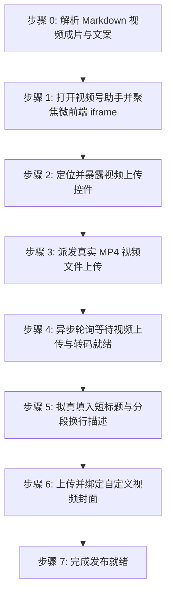

# 微信视频号自动化发布技能规范 (doudou-shipinhao)

## 自动化执行全流程

当接收到用户指定的 Markdown 文件路径时，依次执行以下阶段：



### 步骤 0：解析 Markdown 视频成片与文案

运行辅助解析脚本提取元数据：

```bash
node scripts/parser.mjs <Markdown文件绝对路径>
```

输出包含：
- `shortTitle`: 清洗并规范至 16 字以内的短标题
- `videoDesc`: 结构化分段换行描述文案（含末尾 `#话题` 标签）
- `video`: 视频成片信息（`videoPath`、`hasVideo`）
- `cover`: 封面图信息（Base64 与文件路径）

Agent 可直接调用 `scripts/shipinhao_publisher.mjs` 配合 `chrome-devtools-mcp` 注入视频信息：
```javascript
import { parseAllAssets } from './scripts/parser.mjs';
import {
  buildPrepareUploadBrowserScript,
  buildSaveDraftBrowserScript,
} from './scripts/shipinhao_publisher.mjs';

const meta = parseAllAssets(markdownFilePath);
// 暴露上传控件: buildPrepareUploadBrowserScript()
// 填入短标题、分段换行描述与封面: buildSaveDraftBrowserScript(meta)
```

---

### 步骤 1：打开视频号助手并聚焦微前端 iframe

1. **新建独立页面**：调用 `new_page` 打开 `https://channels.weixin.qq.com/platform/post/create`。
2. 等待页面及主内嵌 `iframe[name="content"]` 加载完成。
3. 执行脚本检测登录态：
   - 检查页面是否存在登录二维码，若未登录，向用户发送提示，等待扫码登录完成后继续。

---

### 步骤 2：定位并暴露视频上传控件

执行脚本穿透微前端 `iframe[name="content"]`，将隐藏的 `input[type="file"]` 暴露给 accessibility tree：

```javascript
(() => {
  const iframe = document.querySelector('iframe[name="content"]');
  const doc = iframe && iframe.contentDocument ? iframe.contentDocument : document;
  const fileInput = doc.querySelector('input[type="file"]');
  if (fileInput) {
    fileInput.id = 'doudou-channels-file-input';
    fileInput.style.display = 'inline-block';
    fileInput.style.position = 'fixed';
    fileInput.style.top = '10px';
    fileInput.style.right = '10px';
    fileInput.style.zIndex = '999999';
    fileInput.style.width = '120px';
    fileInput.style.height = '36px';
    fileInput.style.opacity = '0.05';
    return { success: true, id: fileInput.id };
  }
  return { success: false, error: '未找到 input[type="file"]' };
})();
```

---

### 步骤 3：派发真实 MP4 视频文件上传

调用 `upload_file` 将本地 `.mp4` 视频文件派发至上传控件：

```javascript
await upload_file({
  pageId: targetPageId,
  uid: fileInputUid,
  filePaths: [meta.video.videoPath]
});
```

---

### 步骤 4：异步轮询等待视频上传与转码就绪

异步轮询微前端文档状态（最长等待 120 秒），检测上传进度与视频预览就绪：

```javascript
// 在 evaluate_script 中求值
(() => {
  const iframe = document.querySelector('iframe[name="content"]');
  const doc = iframe && iframe.contentDocument ? iframe.contentDocument : document;
  const bodyText = doc.body ? doc.body.innerText : '';
  const hasCancelUpload = bodyText.includes('取消上传');
  const hasVideo = !!doc.querySelector('video, .cover-preview, [class*="cover-preview"]');
  const saveBtn = Array.from(doc.querySelectorAll('button, .weui-desktop-btn')).find(b => b.innerText.includes('保存草稿'));
  const isSaveDisabled = saveBtn ? (saveBtn.disabled || saveBtn.className.includes('disabled')) : true;

  return { ready: !hasCancelUpload && (hasVideo || !isSaveDisabled) };
})();
```

---

### 步骤 5：拟真填入短标题与分段换行描述

1. **自动关闭可能的引导弹窗**：关闭「我知道了」等新手提示。
2. **填入短标题（<=16字）**：设置原生 Setter 并同步 Vue `internalValue`：

```javascript
const iframe = document.querySelector('iframe[name="content"]');
const doc = iframe && iframe.contentDocument ? iframe.contentDocument : document;
const titleInput = doc.querySelector('input[placeholder*="填写短标题"]');
if (titleInput && cleanTitle) {
  titleInput.focus();
  const setter = Object.getOwnPropertyDescriptor(window.HTMLInputElement.prototype, 'value')?.set;
  if (setter) setter.call(titleInput, cleanTitle);
  else titleInput.value = cleanTitle;
  titleInput.dispatchEvent(new Event('input', { bubbles: true, composed: true }));
  titleInput.dispatchEvent(new Event('change', { bubbles: true, composed: true }));

  // 同步 Vue 内部状态
  let cur = titleInput;
  let vueComp = null;
  while (cur && !vueComp) {
    if (cur.__vue__) vueComp = cur.__vue__;
    cur = cur.parentElement;
  }
  if (vueComp && vueComp.$data) {
    vueComp.$data.internalValue = cleanTitle;
    vueComp.$data.internalStatus = 'normal';
  }
  titleInput.blur();
}
```

3. **填入多行分段换行描述（<=1000字）**：

```javascript
const editor = doc.querySelector('.input-editor[contenteditable="true"]') || doc.querySelector('[contenteditable="true"]');
if (editor && meta.videoDesc) {
  editor.focus();
  editor.innerText = meta.videoDesc;
  editor.dispatchEvent(new Event('input', { bubbles: true, composed: true }));
  editor.dispatchEvent(new Event('change', { bubbles: true, composed: true }));

  let cur = editor;
  let editorVue = null;
  while (cur && !editorVue) {
    if (cur.__vue__) editorVue = cur.__vue__;
    cur = cur.parentElement;
  }
  if (editorVue && typeof editorVue.updateDescData === 'function') {
    editorVue.updateDescData();
  }
  editor.blur();
}
```

---

### 步骤 6：上传并绑定自定义视频封面

若存在封面图资产（`meta.coverBase64`）：

1. 在微前端内定位「设置封面」或图片上传 input；
2. 构造标准 `File` 对象并设置到文件上传 input，派发 `change` 事件；
3. 检查并点击弹窗「确定」或「完成」按钮确认封面绑定；
4. 验证封面预览已更新。

---

### 步骤 7：完成发布就绪

1. 资产填入完成后直接判定完成；
2. **安全隔离**：原样保留当前标签页现场供人工发布，严禁调用 `close_page`。
