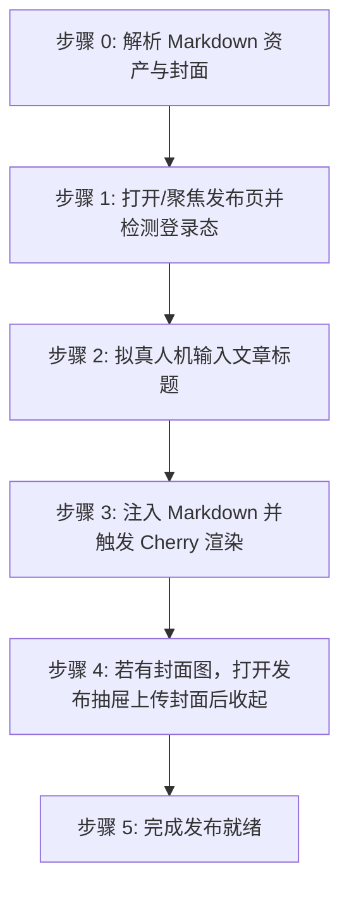

# 腾讯云开发者社区文章自动发布到草稿技能 (doudou-tencent)

## 自动化执行全流程

当接收到用户指定的 Markdown 文件路径时，依次执行以下阶段：



### 步骤 0：解析 Markdown 资产与封面

运行辅助解析脚本或内置逻辑提取元数据（脚本路径相对本技能目录，即 `SKILL.md` 所在目录）：
```bash
node scripts/parser.mjs <Markdown文件绝对路径>
```
输出包含：
- `title`: 文章标题（自动清洗 Markdown 符号）
- `bodyContent`: 过滤掉首行重复 H1 后的 Markdown 正文（优先使用 `_cdn.md`）
- `cover`: 封面图信息（CDN URL 或 Local Base64）

Agent 可在步骤 1 打开页面后，直接调用脚本一键注入文章标题、Markdown 正文与封面：
```javascript
import { buildBrowserPublishScript } from './scripts/tencent_publisher.mjs';

const code = buildBrowserPublishScript(markdownFilePath);
await evaluate_script({ pageId, function: code });
```

---

### 步骤 1：打开/聚焦发布页并检测登录态

1. **新建独立页面**：调用 `new_page` 打开 `https://cloud.tencent.com/developer/article/write-new`（必须每次新建独立页面，严禁复用或覆盖已有页面）。
2. 等待页面加载（`waitForStableDom` 或随机等待 1200ms）。
3. 执行脚本检测登录态：
   - 检查是否存在 `.cdc-article-editor` 或标题输入框 `.cdc-article-editor__title-input`；
   - 若被重定向至登录页，向用户发出明确提示请用户在浏览器中扫码登录，并在登录完成后继续。

---

### 步骤 2：拟真人机输入文章标题

1. 聚焦标题输入框 `.cdc-article-editor__title-input`。
2. 模拟微小随机延迟（300ms~600ms）。
3. 设置标题值并重置 React `_valueTracker`，派发 DOM 事件并同步 React Fiber：
```javascript
const titleEl = document.querySelector('.cdc-article-editor__title-input');
if (titleEl) {
  titleEl.focus();
  const nativeSetter = Object.getOwnPropertyDescriptor(HTMLTextAreaElement.prototype, 'value')?.set;
  if (nativeSetter) nativeSetter.call(titleEl, articleTitle);
  else titleEl.value = articleTitle;
  if (titleEl._valueTracker) titleEl._valueTracker.setValue('');
  titleEl.dispatchEvent(new Event('input', { bubbles: true }));
  titleEl.dispatchEvent(new Event('change', { bubbles: true }));
  titleEl.blur();
}
```
4. 随机停顿 400ms~800ms。

---

### 步骤 3：注入 Markdown 并触发 Cherry 渲染

腾讯云开发者社区采用腾讯开源的 `Cherry Markdown` 编辑器：
1. 从 `.cdc-article-editor` React 组件树中获取 `cherryApi` 实例；
2. 调用 `cherryApi.setMarkdown(bodyContent)` 注入正文，并同步外部 `onChange`：
```javascript
if (cherryApi && typeof cherryApi.setMarkdown === 'function') {
  cherryApi.setMarkdown(bodyContent);
}
if (cherryCompFiber && cherryCompFiber.memoizedProps?.onChange) {
  cherryCompFiber.memoizedProps.onChange(bodyContent);
}
```
3. 随机停顿 800ms~1500ms，让编辑器完成 Markdown 词法分析、代码高亮与实时预览渲染。

---

### 步骤 4：若有封面图，打开发布抽屉上传封面后收起

若存在封面图资产（CDN URL 或本地 Base64）：
1. 寻找「去发布」按钮（`.cdc-btn--primary`）点击展开 `.editor-publish-drawer` 抽屉；
2. 获取抽屉内的封面上传输入框 `.img-cover-input` 及其 React Fiber，派发 `File` 对象；
3. 激活并确认裁剪弹窗（点击「确定」或「裁剪并使用」）；
4. **极简原则**：严禁在抽屉中选择来源、填写摘要或配置标签；
5. 点击抽屉右上角关闭图标安全收起抽屉。

---

### 步骤 5：完成发布就绪

1. 资产填入完成后直接判定完成；
2. **安全隔离**：原样保留当前标签页现场供人工发布，严禁调用 `close_page`。
