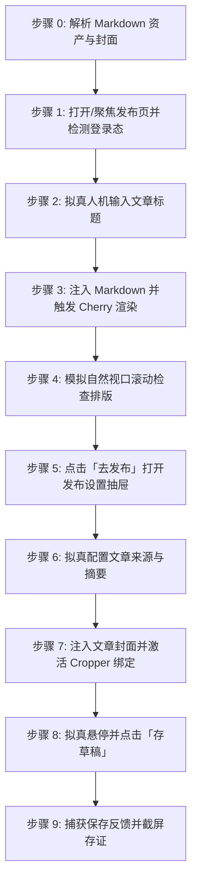

# 腾讯云开发者社区文章自动发布到草稿技能 (doudou-tencent)

本技能通过 `chrome-devtools-mcp` 控制浏览器，将用户指定的 Markdown 文件发布至**腾讯云开发者社区（https://cloud.tencent.com/developer/article/write-new ）的草稿箱**。

技能严格遵循**真实人工行为模拟与防风控规约**，通过自然的事件派发、微小随机时延、视口平滑滚动及悬停交互，避免被平台风控拦截。自动提取文章标题、摘要、CDN 版 Markdown 正文以及宽屏封面图（文章标签与自定义关键词由用户自行在界面中填写）。

---

## 核心规约与防风控原则

1. **草稿安全隔离**：
   - **严格限定仅点击「存草稿」按钮**，绝对不触发公开发布，确保所有内容必须经人工最终确认后再公开发布。
2. **防风控与真实人机行为模拟 (Anti-Bot & Human Simulation)**：
   - **随机时延抖动**：所有操作之间增加正态分布随机等待（输入前 300~600ms、步骤间 500~1500ms、点击前 400~700ms），严禁毫秒级并发。
   - **真实事件完整性**：对于表单与文本输入，依次派发 `focus`、`keydown`、`input`、`keyup`、`change`、`blur`，并重置 React `_valueTracker` 与同步 React Fiber State。
   - **平滑视口滚动**：模拟人类自上而下的视觉审查，分步平滑滚动页面触发浏览器的视口可见性检测。
   - **拟真悬停与点击**：点击按钮前先将视口滚动到按钮可见区域，派发 `mouseover`/`mouseenter` 悬停 400~700ms 后再触发 `click`。
3. **资产自动解析优先级**：
   - **正文**：优先使用同名目录下已将本地图片替换为图床 URL 的 `[article_name]_cdn.md`；若无则使用原 Markdown 文件。
   - **封面图**：
     1. 优先读取同名目录下 `cdn_manifest.json` 中 `type: "cover"` 的 CDN 链接（优先 2.35:1 / 16:9 宽屏主封面）；
     2. 其次读取同名目录下 `cover/images/` 的本地图片文件（如 `cover-main-2.35x1.png`、`cover-16x9.png`）；
     3. 再次从 Markdown 正文中提取第一张图片链接或本地路径；
     4. 若均无则跳过封面设置。
   - **摘要**：提炼 80~180 字纯文本摘要（腾讯云限制 200 字以内）。
   - **标签与关键词**：不自动填充，留由用户自行按需在发布抽屉中添加。

---

## 自动化执行全流程

当接收到用户指定的 Markdown 文件路径（例如 `mds/AICoding/ddagent.md`）时，依次执行以下 9 个阶段：



### 步骤 0：解析 Markdown 资产与封面

运行辅助解析脚本或内置逻辑提取元数据（脚本路径相对本技能目录，即 `SKILL.md` 所在目录）：
```bash
node scripts/parser.mjs <Markdown文件绝对路径>
```
输出包含：
- `title`: 文章标题（自动清洗 Markdown 符号）
- `summary`: 80~180 字纯文本摘要
- `bodyContent`: 过滤掉首行重复 H1 后的 Markdown 正文（优先使用 `_cdn.md`）
- `cover`: 封面图信息（CDN URL 或 Local Base64）

---

### 步骤 1：打开/聚焦发布页并检测登录态

1. 调用 `list_pages` 检查是否已有腾讯云发布页（URL 包含 `cloud.tencent.com/developer/article/write-new`）。
   - 若已有，直接调用 `select_page` 切换到该页面；
   - 若无，调用 `new_page` 打开 `https://cloud.tencent.com/developer/article/write-new`。
2. 等待页面加载（`waitForStableDom` 或随机等待 1200ms）。
3. 执行脚本检测登录态：
   - 检查是否存在 `.cdc-article-editor` 或标题输入框 `.cdc-article-editor__title-input`；
   - 若被重定向至登录页，向用户发出明确提示请用户在浏览器中扫码登录，并在登录完成后继续。

---

### 步骤 2：拟真人机输入文章标题

1. 聚焦标题输入框 `.cdc-article-editor__title-input`。
2. 模拟微小随机延迟（300ms~600ms）。
3. 设置标题值并重置 React `_valueTracker`，派发 DOM 事件并同步 React Fiber：
```javascript
const titleEl = document.querySelector('.cdc-article-editor__title-input');
if (titleEl) {
  titleEl.focus();
  const nativeSetter = Object.getOwnPropertyDescriptor(HTMLTextAreaElement.prototype, 'value')?.set;
  if (nativeSetter) nativeSetter.call(titleEl, articleTitle);
  else titleEl.value = articleTitle;
  if (titleEl._valueTracker) titleEl._valueTracker.setValue('');
  titleEl.dispatchEvent(new Event('input', { bubbles: true }));
  titleEl.dispatchEvent(new Event('change', { bubbles: true }));
  titleEl.blur();
}
```
4. 随机停顿 400ms~800ms。

---

### 步骤 3：注入 Markdown 并触发 Cherry 渲染

腾讯云开发者社区采用腾讯开源的 `Cherry Markdown` 编辑器：
1. 从 `.cdc-article-editor` React 组件树中获取 `cherryApi` 实例；
2. 调用 `cherryApi.setMarkdown(bodyContent)` 注入正文，并同步外部 `onChange`：
```javascript
if (cherryApi && typeof cherryApi.setMarkdown === 'function') {
  cherryApi.setMarkdown(bodyContent);
}
if (cherryCompFiber && cherryCompFiber.memoizedProps?.onChange) {
  cherryCompFiber.memoizedProps.onChange(bodyContent);
}
```
3. 随机停顿 800ms~1500ms，让编辑器完成 Markdown 词法分析、代码高亮与实时预览渲染。

---

### 步骤 4：模拟自然视口滚动检查排版

模拟人类作者自上而下检查文章排版：
1. 平滑滚动到页面 350px 处，等待 400ms~700ms；
2. 平滑滚动回顶部，等待 300ms~600ms：
```javascript
window.scrollTo({ top: 350, behavior: 'smooth' });
// 延时后
window.scrollTo({ top: 0, behavior: 'smooth' });
```

---

### 步骤 5：点击「去发布」打开发布设置抽屉

1. 寻找「去发布」按钮（`.cdc-btn--primary`）：
   `const publishBtn = Array.from(document.querySelectorAll('button')).find(b => b.innerText.includes('去发布'));`
2. 视口滚动至按钮可见区域，派发 `mouseover`/`mouseenter` 悬停 300~600ms 后点击：
   `publishBtn.click();`
3. 随机停顿 800ms~1400ms，等待 `.editor-publish-drawer` 抽屉展开。

---

### 步骤 6：拟真配置文章来源与摘要

在展开的发布抽屉中：
1. **文章来源**：设置 `sourceType: 1`（原创），派发 DOM 点击并同步 React 状态。
2. **文章摘要**：聚焦 `.editor-publish-drawer__textarea-main` 填入摘要文本并触发 React `userSummary` 状态同步。
3. **技术标签与自定义关键词**：不自动填充，留由用户自行按需在发布抽屉中配置。
4. 随机停顿 400ms~800ms。

---

### 步骤 7：注入文章封面并激活 Cropper 绑定

若存在封面图资产（CDN URL 或本地 Base64）：
1. 在浏览器端将图片转换为 `File` 对象（`new File([blob], 'cover.png', { type: blob.type })`）；
2. 获取抽屉内的封面上传输入框 `.img-cover-input` 及其 React Fiber；
3. 派发文件变更事件 `cInputFiber.memoizedProps.onChange({ target: { files: [file] } })`；
4. 激活抽屉内的 `react-cropper` 裁剪组件，初始化 `cropperRef.current.cropper`；
5. 随机停顿 800ms~1500ms。

---

### 步骤 8：拟真悬停并点击「存草稿」

1. 寻找抽屉底部的「存草稿」按钮元素：
   `const draftBtn = Array.from(drawer.querySelectorAll('button')).find(b => b.innerText.trim() === '存草稿');`
2. 将视口平滑滚动至按钮完全可见：
   `draftBtn.scrollIntoView({ behavior: 'smooth', block: 'center' });`
3. 模拟鼠标悬停派发事件：
   `draftBtn.dispatchEvent(new MouseEvent('mouseover', { bubbles: true }));`
   `draftBtn.dispatchEvent(new MouseEvent('mouseenter', { bubbles: true }));`
4. 拟真停顿 400ms~700ms。
5. 触发点击：
   `draftBtn.click();`

---

### 步骤 9：捕获保存反馈并截屏存证

1. 等待 2.5~3.5 秒，检测 URL 中的 `draftId` 参数（如 `?draftId=312086`）以及页面状态文字「文章已于 刚刚 保存到草稿」；
2. 调用 `take_screenshot` 保存当前页面截图作为存证；
3. 输出结构化结果报告（文章标题、草稿 ID、标签、摘要、封面状态等）。

---

## 异常与风控处理

| 异常场景 | 表现特征 | 应对与恢复策略 |
| :--- | :--- | :--- |
| **未登录 / 登录态过期** | 未找到 `.cdc-article-editor` 或跳转至登录页 | 立即停止自动化输入，向用户发送提示，等待用户在浏览器中扫码登录后再继续。 |
| **发布抽屉未展开** | 点击「去发布」后未出现 `.editor-publish-drawer` | 自动降级为直接在编辑器顶栏点击「存草稿」按钮，保证文章主体内容不丢失。 |
| **封面上传失败 / 超时** | Cropper 初始化失败或图片网络拉取失败 | 降级跳过封面注入，在最终报告中标记封面待手动绑定，不阻塞草稿主体的保存。 |
| **标签输入受限** | 超过 5 个标签上限 | 自动截取前 5 个最核心的标签注入，避免触发平台错误提示。 |
| **防重复保存拦截** | 存草稿按钮处于 `is-disabled` 或 loading 状态 | 确保调用间隔大于 3 秒，避免高频连击。 |

---

## 脚本工具与使用方法

以下路径均相对本技能目录（`SKILL.md` 所在目录），执行前先切换到该目录，或将其拼接为绝对路径使用。

- `scripts/parser.mjs`：解析 Markdown，提取标题、摘要、标签、正文与封面资产。
- `scripts/tencent_publisher.mjs`：浏览器注入脚本生成器（编辑器状态同步与防风控人机模拟）。

1. **直接运行 Node.js 脚本生成注入代码**：
```bash
node scripts/tencent_publisher.mjs <Markdown文件路径>
```

2. **在 Agent 中配合 `chrome-devtools-mcp` 调用**：
```javascript
import { buildBrowserPublishScript } from './scripts/tencent_publisher.mjs';

// 1. 生成自包含执行代码
const code = buildBrowserPublishScript(markdownFilePath);

// 2. 调用 evaluate_script 执行发布
const result = await evaluate_script({
  pageId: targetPageId,
  function: code
});

// 3. 截屏存证
await take_screenshot({ pageId: targetPageId });
```
