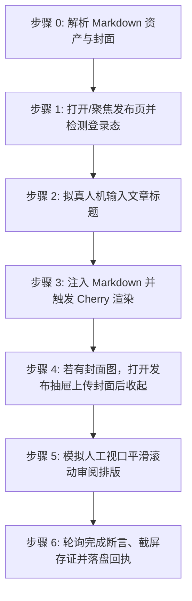

# 腾讯云开发者社区文章自动发布到草稿技能 (doudou-tencent)

本技能通过 `chrome-devtools-mcp` 控制浏览器，将用户指定的 Markdown 文件发布至**腾讯云开发者社区（https://cloud.tencent.com/developer/article/write-new ）的草稿箱**。

技能严格遵循**真实人工行为模拟与防风控规约**，通过自然的事件派发、微小随机时延、视口平滑滚动及悬停交互，避免被平台风控拦截。自动提取文章标题、摘要、CDN 版 Markdown 正文以及宽屏封面图（文章标签与自定义关键词由用户自行在界面中填写）。

---

## 核心规约与防风控原则

1. **草稿安全隔离与平台原生自动保存**：
   - **绝对不触发公开发布**，严禁点击「发布」按钮；同时**无需主动寻找或点击「存草稿」按钮**。腾讯云编辑器在正文注入、标题更新及抽屉配置后会自动触发原生防抖保存。脚本在配置完成后平滑关闭抽屉，模拟作者审阅，轮询完成断言直至通过。
2. **完成判定必须客观可断言（严禁以「已等待」代替「已完成」）**：
   - 「静候自动保存生效」是**等待动作**，不是验收条件。必须以**完成断言**（见「完成断言与回执协议」）求值为 `true` 才允许判定完成。
   - 断言未通过即为未完成：登记 `timeout` 并保留页面，**严禁登记为 `success`**。
3. **收尾必须落盘回执（父级编排的唯一完成信号）**：
   - 无论成功、失败、缺登录、超时还是跳过，收尾都必须调用 `scripts/receipt.mjs write` 写入回执。
   - 父级 `doudou-UGC-skill` 不解析自然语言汇报，只读回执文件；**缺回执会让父级永久阻塞后续平台**。
4. **防风控与真实人机行为模拟 (Anti-Bot & Human Simulation)**：
   - **随机时延抖动**：所有操作之间增加正态分布随机等待（输入前 300~600ms、步骤间 500~1500ms、点击前 400~700ms），严禁毫秒级并发。
   - **真实事件完整性**：对于表单与文本输入，依次派发 `focus`、`keydown`、`input`、`keyup`、`change`、`blur`，并重置 React `_valueTracker` 与同步 React Fiber State。
   - **平滑视口滚动**：模拟人类自上而下的视觉审查，分步平滑滚动页面触发浏览器的视口可见性检测。
   - **拟真悬停与点击**：交互前先将视口滚动到目标元素可见区域，派发 `mouseover`/`mouseenter` 悬停 400~700ms 后再交互。
5. **资产自动解析优先级**：
   - **正文**：优先使用同名目录下已将本地图片替换为图床 URL 的 `[article_name]_cdn.md`；若无则使用原 Markdown 文件。
   - **封面图**：
     1. 优先读取同名目录下 `cdn_manifest.json` 中 `type: "cover"` 的 CDN 链接（优先 2.35:1 / 16:9 宽屏主封面）；
     2. 其次读取同名目录下 `cover/images/` 的本地图片文件（如 `cover-main-2.35x1.png`、`cover-16x9.png`）；
     3. 再次从 Markdown 正文中提取第一张图片链接或本地路径；
     4. 若均无则跳过封面设置。
   - **摘要**：提炼 80~180 字纯文本摘要（腾讯云限制 200 字以内）。
   - **标签与关键词**：不自动填充，留由用户自行按需在发布抽屉中添加。
6. **发布完成后保留页面（严禁自动关闭）**：
   - 注入与存证截图完成后，**严禁调用 `close_page` 或以任何方式关闭当前平台页面**，必须原样保留页面现场，供用户人工复核草稿内容、补充登录或手动确认发布。
   - 未登录、验证码拦截、网络超时等异常中断的场景同样适用：保留页面交由用户接管，不得清理关闭。

---

## 完成断言与回执协议 (Completion Assertion & Receipt)

> 本段是**父级串行编排的硬契约**。父级（`doudou-UGC-skill`）不读自然语言汇报，只读落盘回执；没有回执，父级会认为本平台仍在进行中而永久阻塞后续平台。

### 完成断言

**严禁以「已等待 N 秒」代替「已完成」。** 必须轮询下面这条可求值的客观判据：

| 项 | 值 |
| :--- | :--- |
| **断言规则** | URL 出现 draftId=\d+ |
| **超时窗口** | 45 秒，轮询间隔 1.5 秒 |
| **通过** | 登记 `success` |
| **超时** | 登记 `timeout`（`statusText` 说明未在 45s 内成立），保留页面，**严禁登记为 success** |

```javascript
// 在 evaluate_script 中求值，返回结构化断言结果
() => {
  const m = location.href.match(/draftId=(\d+)/);
  const saved = /保存成功|已保存/.test(document.body.innerText);
  return { passed: Boolean(m), draftId: m?.[1] ?? null, draftUrl: m ? location.href : null, savedTip: saved };
};
```

### 状态枚举（六个终态，仅此六种可写入回执）

| 状态 | 含义 |
| :--- | :--- |
| `success` | 草稿已保存且完成断言通过 |
| `ready_for_review` | 内容已填入就绪，平台禁止自动保存（腾讯云开发者社区不适用） |
| `needs_login` | 登录态缺失/过期，已保留页面待补登 |
| `failed` | 明确失败（选择器失效、注入异常） |
| `timeout` | 完成断言在 45s 窗口内未成立 |
| `skipped` | 资产缺失或用户主动跳过 |

### 存证截图统一命名

必须存至 publishes/screenshots/tencent_article.png（格式 `<platformSlug>_<mode>.png`），**不得使用技能私有命名**——父级看板按统一命名反查存证。

### 临时脚本与中间文件存放规约（严禁污染工作区根目录）

- **统一落盘位置**：自动化发文执行过程中，凡需生成的任何临时注入脚本（如浏览器富文本注入 `.mjs` / `.js`）、临时数据载荷（如 `--payload-file <json>`）、调试脚本或中间辅助文件，**严禁放置在当前工作区根目录、项目根目录或技能目录中**！
- **强制同名资产目录**：所有临时文件**必须统一放置在目标 Markdown 文章对应的同名资产目录下**（即去除 `.md` 后缀的同名资产目录），文件名建议统一以 `scratch_` 为前缀。
- **可追溯与可清理**：执行完毕且回执落盘后，临时中间文件安全留存于同名资产目录供事后复核排查，或由清理指令统一清空，彻底避免根目录污染。

### 回执落盘（收尾必调，异常也要写）

```bash
node scripts/receipt.mjs write <Markdown文件绝对路径> --payload-file <json文件路径>
```

> 载荷含正则/反斜杠时**务必用 `--payload-file`**，直接内联 `--payload` 会被 shell 转义破坏。

`--payload` 结构（`results` 为逐模态数组，本技能含 `article`）：

```json
{
  "skill": "doudou-tencent",
  "platform": "腾讯云开发者社区",
  "platformSlug": "tencent",
  "startedAt": "<技能启动时即记录，不要收尾时倒填>",
  "results": [
    {
      "mode": "article",
      "modeDesc": "Markdown长文",
      "status": "success",
      "statusText": "草稿已保存",
      "title": "……",
      "screenshot": "screenshots/tencent_article.png",
      "assertion": { "rule": "URL 出现 draftId=\\d+", "passed": true }
    }
  ]
}
```

脚本会强校验并拒绝不合规回执：非终态 `status`、缺 `statusText`、非 `skipped` 却缺 `screenshot` 一律报错退出，从源头杜绝脏数据流入看板。

---

## 自动化执行全流程

当接收到用户指定的 Markdown 文件路径时，依次执行以下 9 个阶段：



### 步骤 0：解析 Markdown 资产与封面

运行辅助解析脚本或内置逻辑提取元数据（脚本路径相对本技能目录，即 `SKILL.md` 所在目录）：
```bash
node scripts/parser.mjs <Markdown文件绝对路径>
```
输出包含：
- `title`: 文章标题（自动清洗 Markdown 符号）
- `summary`: 80~180 字纯文本摘要
- `bodyContent`: 过滤掉首行重复 H1 后的 Markdown 正文（优先使用 `_cdn.md`）
- `cover`: 封面图信息（CDN URL 或 Local Base64）

---

### 步骤 1：打开/聚焦发布页并检测登录态

1. 调用 `list_pages` 检查是否已有腾讯云发布页（URL 包含 `cloud.tencent.com/developer/article/write-new`）。
   - 若已有，直接调用 `select_page` 切换到该页面；
   - 若无，调用 `new_page` 打开 `https://cloud.tencent.com/developer/article/write-new`。
2. 等待页面加载（`waitForStableDom` 或随机等待 1200ms）。
3. 执行脚本检测登录态：
   - 检查是否存在 `.cdc-article-editor` 或标题输入框 `.cdc-article-editor__title-input`；
   - 若被重定向至登录页，向用户发出明确提示请用户在浏览器中扫码登录，并在登录完成后继续。

---

### 步骤 2：拟真人机输入文章标题

1. 聚焦标题输入框 `.cdc-article-editor__title-input`。
2. 模拟微小随机延迟（300ms~600ms）。
3. 设置标题值并重置 React `_valueTracker`，派发 DOM 事件并同步 React Fiber：
```javascript
const titleEl = document.querySelector('.cdc-article-editor__title-input');
if (titleEl) {
  titleEl.focus();
  const nativeSetter = Object.getOwnPropertyDescriptor(HTMLTextAreaElement.prototype, 'value')?.set;
  if (nativeSetter) nativeSetter.call(titleEl, articleTitle);
  else titleEl.value = articleTitle;
  if (titleEl._valueTracker) titleEl._valueTracker.setValue('');
  titleEl.dispatchEvent(new Event('input', { bubbles: true }));
  titleEl.dispatchEvent(new Event('change', { bubbles: true }));
  titleEl.blur();
}
```
4. 随机停顿 400ms~800ms。

---

### 步骤 3：注入 Markdown 并触发 Cherry 渲染

腾讯云开发者社区采用腾讯开源的 `Cherry Markdown` 编辑器：
1. 从 `.cdc-article-editor` React 组件树中获取 `cherryApi` 实例；
2. 调用 `cherryApi.setMarkdown(bodyContent)` 注入正文，并同步外部 `onChange`：
```javascript
if (cherryApi && typeof cherryApi.setMarkdown === 'function') {
  cherryApi.setMarkdown(bodyContent);
}
if (cherryCompFiber && cherryCompFiber.memoizedProps?.onChange) {
  cherryCompFiber.memoizedProps.onChange(bodyContent);
}
```
3. 随机停顿 800ms~1500ms，让编辑器完成 Markdown 词法分析、代码高亮与实时预览渲染。

---

### 步骤 4：模拟自然视口滚动检查排版

模拟人类作者自上而下检查文章排版：
1. 平滑滚动到页面 350px 处，等待 400ms~700ms；
2. 平滑滚动回顶部，等待 300ms~600ms：
```javascript
window.scrollTo({ top: 350, behavior: 'smooth' });
// 延时后
window.scrollTo({ top: 0, behavior: 'smooth' });
```

---

### 步骤 4：若有封面图，打开发布抽屉上传封面后收起

若存在封面图资产（CDN URL 或本地 Base64）：
1. 寻找「去发布」按钮（`.cdc-btn--primary`）点击展开 `.editor-publish-drawer` 抽屉；
2. 获取抽屉内的封面上传输入框 `.img-cover-input` 及其 React Fiber，派发 `File` 对象；
3. 激活并确认裁剪弹窗（点击「确定」或「裁剪并使用」）；
4. **极简原则**：严禁在抽屉中选择来源、填写摘要或配置标签；
5. 点击抽屉右上角关闭图标安全收起抽屉。

---

### 步骤 5：模拟人工视口平滑滚动审阅排版

1. 平滑滚动视口，模拟作者自上而下复核文章正文；
2. 拟真停顿 2500ms~3500ms，让腾讯云前端防抖定时器触发原生草稿自动同步（无需也不得点击「发布」或主动点击「存草稿」）。

---

### 步骤 6：轮询完成断言并截屏存证

1. 检测页面状态文字（如「文章已于 刚刚 保存到草稿」或草稿参数 `draftId`）；
2. 保持页面完全打开（严禁调用 `close_page`），调用 `take_screenshot` 保存当前页面截图作为存证（`publishes/screenshots/tencent_article.png`）；
3. 输出结构化结果报告（文章标题、状态 `ready_auto_saved`、draftId、封面状态等）。

---

## 异常与风控处理

| 异常场景 | 表现特征 | 应对与恢复策略 |
| :--- | :--- | :--- |
| **未登录 / 登录态过期** | 未找到 `.cdc-article-editor` 或跳转至登录页 | 立即停止自动化输入，向用户发送提示，等待用户在浏览器中扫码登录后再继续。 |
| **发布抽屉未展开** | 点击「去发布」后未出现 `.editor-publish-drawer` | 降级跳过抽屉设置，文章标题和正文已在主编辑器注入并自动保存，不阻塞流程。 |
| **封面上传失败 / 超时** | Cropper 初始化失败或图片网络拉取失败 | 降级跳过封面注入，在最终报告中标记封面待手动绑定，不阻塞主体的保存。 |
| **标签输入受限** | 超过 5 个标签上限 | 自动截取前 5 个最核心的标签注入，避免触发平台错误提示。 |
| **误触发布防护** | 平台界面存在醒目的「确认发布」按钮 | 严禁点击任何发布按钮，所有操作完成后停留在编辑页面供人工复核。 |

---

## 脚本工具与使用方法

以下路径均相对本技能目录（`SKILL.md` 所在目录），执行前先切换到该目录，或将其拼接为绝对路径使用。

- `scripts/parser.mjs`：解析 Markdown，提取标题、摘要、标签、正文与封面资产。
- `scripts/tencent_publisher.mjs`：浏览器注入脚本生成器（编辑器状态同步与防风控人机模拟）。

1. **直接运行 Node.js 脚本生成注入代码**：
```bash
node scripts/tencent_publisher.mjs <Markdown文件路径>
```

2. **在 Agent 中配合 `chrome-devtools-mcp` 调用**：
```javascript
import { buildBrowserPublishScript } from './scripts/tencent_publisher.mjs';

// 1. 生成自包含执行代码
const code = buildBrowserPublishScript(markdownFilePath);

// 2. 调用 evaluate_script 执行发布
const result = await evaluate_script({
  pageId: targetPageId,
  function: code
});

// 3. 截屏存证
await take_screenshot({ pageId: targetPageId });
```
