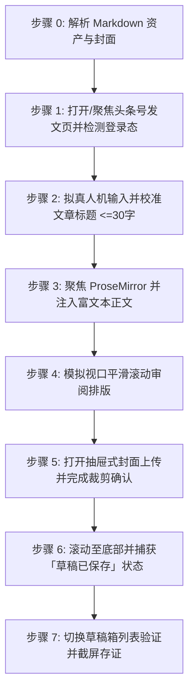

# 头条号文章自动发布到草稿箱技能 (doudou-toutiao)

本技能通过 `chrome-devtools-mcp` 控制浏览器，将用户指定的本地 Markdown 文章及其衍生资产安全发布至**头条号创作者平台（https://mp.toutiao.com/profile_v4/graphic/publish ）的草稿箱**。

技能严格遵循**真实人工行为模拟与防风控规约**，通过自然的事件派发、微小随机时延抖动、ByteDance Sylph / ProseMirror 富文本双向同步、视口平滑滚动审阅及抽屉式封面真实上传，避免被平台风控拦截。同时与 `doudou-markdown-skill` 资产体系无缝集成，自动提取文章标题、摘要、标签、带 CDN 高清配图的排版正文以及宽屏封面图。

---

## 核心规约与防风控原则

1. **草稿安全隔离**：
   - **严格限定仅保存为草稿**（等待页面自动提示「草稿已保存」并在草稿箱列表验证），**绝对不点击「预览并发布」或「定时发布」**，确保所有内容必须经人工最终审核后再公开发布。
2. **防风控与真实人机行为模拟 (Anti-Bot & Human Simulation)**：
   - **随机时延抖动**：所有操作之间增加正态分布随机等待（输入前 200~500ms、步骤间 400~1000ms、点击悬停 200~400ms），严禁毫秒级瞬时操作。
   - **真实事件完整性**：对于标题输入与表单交互，依次派发 `focus`、`keydown`、`input`、`keyup`、`change`、`blur`，并同步底层 React 状态。
   - **ProseMirror / Sylph 富文本注入**：利用 React Fiber 上的 Editor 实例（`reactEditor.pasteContent`）及标准 `ClipboardEvent('paste')` 注入内容，完整保留标题、代码块、加粗、引用、列表及 CDN 配图。
   - **平滑视口滚动**：模拟人类自上而下的视觉审阅，分步平滑滚动页面触发浏览器的视口可见性检测。
   - **拟真悬停与点击**：点击元素前先将其 `scrollIntoView({ behavior: 'smooth' })`，派发 `mouseover`、`mouseenter` 悬停后再触发 `click`。
3. **资产自动解析优先级**（参考 `doudou-markdown-skill` 规约）：
   - **文章标题**：限制 2～30 字以内，自动清洗 Markdown 符号（`#`、`**` 等）并智能截断。
   - **文章正文**：优先读取同名目录下 `[article_name]_cdn.md`（或依据 `cdn_manifest.json` 将本地图片无缝替换为 Cloudflare R2 公开 CDN 链接），转换为带有高清配图的标准语义 HTML。
   - **文章封面**：
     1. 优先读取同名目录下 `xhs_images/images/` 下第 1 张封面卡片（如 `01-cover.png`）；
     2. 其次读取同名目录下 `cdn_manifest.json` 中 `type: "cover"` 的 CDN 链接；
     3. 再次读取同名目录下 `cover/images/` 的本地图片（如 `cover-main-2.35x1.png`、`cover-16x9.png`、`cover-square-1x1.png`）；
     4. 若均无则跳过封面设置。

---

## 自动化执行全流程

当接收到用户指定的 Markdown 文件路径（例如 `mds/AICoding/ddagent.md`）时，依次执行以下流程：



---

### 步骤 0：解析 Markdown 资产与封面

运行辅助解析脚本提取元数据（脚本路径相对本技能目录，即 `SKILL.md` 所在目录）：
```bash
node scripts/parser.mjs <Markdown文件绝对路径>
```
输出包含：
- `articleTitle`: 清洗并截断至 2~30 字以内的文章标题
- `articleSummary`: 100 字以内纯文本摘要
- `tags`: 智能匹配的话题标签数组（最多 4 个）
- `articleHtml`: 包含 CDN 图片、标题、引用与列表的语义 HTML
- `cover`: 高清封面图（Base64 与本地路径）

---

### 步骤 1：打开/聚焦发文页并检测登录态

1. 调用 `list_pages` 检查是否已有头条号发文页面（URL 包含 `mp.toutiao.com/profile_v4/graphic/publish`）。
   - 若已有，调用 `select_page` 切换到该页面；
   - 若无，调用 `new_page` 打开 `https://mp.toutiao.com/profile_v4/graphic/publish`。
2. 检测登录态：
   - 检查页面是否存在标题输入框 `textarea` 与 ProseMirror 编辑器 `.ProseMirror`；
   - 若被重定向至登录页，向用户发出明确提示请用户在浏览器中扫码登录后再继续。

---

### 步骤 2：拟真人机输入文章标题

1. 定位 `textarea[placeholder*="请输入文章标题"]`（或 `textarea`）；
2. 视口滚动并聚焦，派发 `focus` 事件；
3. 模拟微小随机延迟（200ms~400ms）；
4. 通过 `HTMLTextAreaElement` 原生属性 setter 填入清洗后的 2~30 字标题；
5. 依次派发 `input`、`change`、`blur` 事件。

---

### 步骤 3：注入 ProseMirror 富文本正文

1. 定位 `.ProseMirror` 内容可编辑区域并聚焦；
2. 获取 React Fiber 上的 Sylph 编辑器实例（`reactEditor`）；
3. 清除旧占位内容，调用 `reactEditor.pasteContent(meta.htmlContent)`；
4. 降级方案：派发带有 `text/html` 的 `ClipboardEvent('paste')`；
5. 随机停顿 600ms~1000ms 让 ProseMirror 完成节点渲染与字数统计。

---

### 步骤 4：模拟人工视口平滑滚动

1. 平滑滚动到页面 400px，停顿 500ms~800ms；
2. 平滑滚动到页面 900px，停顿 500ms~800ms；
3. 平滑滚动回顶部，停顿 300ms~500ms。

---

### 步骤 5：抽屉式封面真实上传与确认

若存在封面图资产：
1. 定位展示封面区域的添加按钮 `.article-cover-add`（或 `.article-cover-img-replace`）；
2. 拟真悬停并点击展开 `.byte-drawer` 图片上传抽屉；
3. 将封面 Base64 构造成标准 `File` 对象，通过 `DataTransfer` 注入上传 input（`.btn-upload-handle input`）；
4. 触发 input 的 React `onChange` 事件并派发 `change`；
5. 等待 1500ms~2000ms 裁剪/确认弹窗出现，拟真悬停并点击「确定」或「完成」按钮；
6. 检查 `.article-cover-images-wrap` 确认封面已渲染呈现。

---

### 步骤 6：等待草稿云端同步保存

1. 平滑滚动至页面底部 `.publish-footer`；
2. 等待 2500ms~3500ms；
3. 读取底部状态文本，校验是否呈现「草稿已保存」或字数统计；
4. 严禁触碰「预览并发布」按钮。

---

### 步骤 7：草稿箱列表验证与截屏存证

1. 调用 `new_page` 或 `navigate_page` 访问头条草稿箱页面：
   `https://mp.toutiao.com/profile_v4/manage/draft`
2. 检查草稿列表 `.article-draft-item` 中是否存在刚刚发布的文章标题；
3. 调用 `take_screenshot` 保存草稿列表截图作为执行存证；
4. 向用户呈递包含文章标题、字数、封面状态及草稿存证的结构化报告。

---

## 异常与风控处理

| 异常场景 | 表现特征 | 应对与恢复策略 |
| :--- | :--- | :--- |
| **未登录 / 登录态失效** | 跳转至登录页或未找到标题框 | 立即暂停自动化流程，向用户发出提示请在浏览器中扫码登录，登录完成后继续。 |
| **标题超长拦截** | 提示“标题限制2~30个字” | 解析器已自动对标题执行 30 字强截断，确保 100% 符合平台规则。 |
| **封面上传抽屉未展开** | 点击 `.article-cover-add` 无响应 | 降级检查 `.article-cover-img-replace` 或跳过封面上传，在报告中明确提示，不阻塞草稿主体的保存。 |
| **ProseMirror 粘贴失败** | `reactEditor` 未找到或未渲染 | 自动降级为派发原生 `ClipboardEvent('paste')` 或注入 `<p>` 段落。 |
| **自动保存延迟** | 底部仍显示“草稿保存中” | 额外增加 3 秒轮询等待，直至捕获到“草稿已保存”。 |

---

## 脚本工具与在 Agent 中的调用方法

以下路径均相对本技能目录（`SKILL.md` 所在目录），执行前先切换到该目录，或将其拼接为绝对路径使用。

- `scripts/parser.mjs`：解析 Markdown，提取标题、摘要、话题标签、语义 HTML 与封面资产。
- `scripts/toutiao_publisher.mjs`：浏览器注入脚本生成器（编辑器状态同步与防风控人机模拟）。

### 1. 运行命令行测试

```bash
# 1. 测试资产解析
node scripts/parser.mjs <Markdown文件路径>

# 2. 测试浏览器代码生成
node scripts/toutiao_publisher.mjs <Markdown文件路径>
```

### 2. 在 Agent 中配合 `chrome-devtools-mcp` 调用

```javascript
import { parseAllAssets } from './scripts/parser.mjs';
import { buildPublishBrowserScript } from './scripts/toutiao_publisher.mjs';

// 1. 解析目标 Markdown 及其同名资产目录
const meta = parseAllAssets(markdownFilePath);

// 2. 生成自包含浏览器执行代码
const code = buildPublishBrowserScript(meta);

// 3. 在头条号发文页执行
const result = await evaluate_script({
  pageId: publishPageId,
  function: code
});

// 4. 打开草稿箱并截屏存证
await navigate_page({
  pageId: draftPageId,
  url: 'https://mp.toutiao.com/profile_v4/manage/draft'
});
await take_screenshot({ pageId: draftPageId });
```
