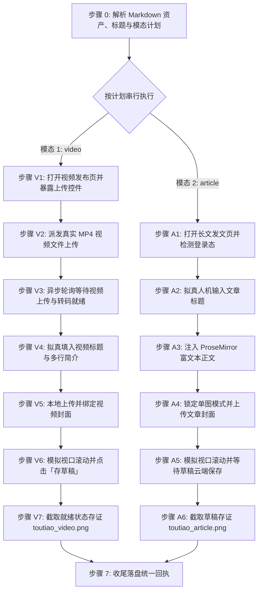

# 今日头条/头条号自动化发布草稿技能 (doudou-toutiao)

本技能通过 `chrome-devtools-mcp` 控制浏览器，实现今日头条/头条号创作者平台（https://mp.toutiao.com ）的**视频投稿**与**长文图文**双模态自动化发布全流程。

技能严格遵循**真实人工行为模拟与防风控规约**，视频优先上传并留存就绪态，长文草稿自动保存，双模态执行完成后原样保留页面现场供人工最终核验。

---

## 核心规约与防风控原则

1. **发布入口**：
   - 长文图文：`https://mp.toutiao.com/profile_v4/graphic/publish`
   - 视频投稿：`https://mp.toutiao.com/profile_v4/xigua/upload-video`
   - 草稿箱管理：`https://mp.toutiao.com/profile_v4/manage/draft`
2. **模态判定与串行执行原则**：
   - **默认全模态**：用户未明确指定模态时，默认发布全部可用模态（`video` + `article`）。执行顺序恒为 `video` → `article`。
   - **显式指定**：用户明确指定（如「只发视频」或「只发文章」）时，仅执行指定模态。
   - **资产缺失处理**：若缺少对应资产（如无 `video/*.mp4` 则跳过视频，无排版 HTML 则跳过文章），自动跳过并在回执中登记原因，继续执行其他可用模态。
3. **草稿安全隔离（绝对底线）**：
   - **长文图文**：等待页面自动提示「草稿已保存」，严禁点击「预览并发布」或「定时发布」。
   - **视频投稿**：表单配置完成后点击「存草稿」暂存，保持就绪状态并截屏存证，**绝对严禁点击最终「发布」确认按钮**。
4. **完成判定必须客观可断言**：
   - 必须以客观断言求值为 `true` 判定完成，严禁以固定延时代替完成。超时则标记 `timeout` 并保留页面，严禁误报 `success`。
5. **收尾必须落盘回执**：
   - 执行完毕必须调用 `scripts/receipt.mjs write` 写入回执，供上层调度读取。
6. **防风控与真实人机行为模拟**：
   - **随机时延抖动**：输入前等待 200~500ms、步骤间 400~1000ms、悬停 200~400ms。
   - **完整事件派发**：表单输入依次派发 `focus`、`keydown`、`input`、`keyup`、`change`、`blur`，并使用 React 原生 Property Setter 同步状态。
   - **视口平滑滚动**：模拟人类自上而下分步平滑滚动页面，触发视口可见性与排版渲染。
7. **发布完成后保留页面（严禁自动关闭）**：
   - 每次执行必须调用 `new_page` 新建独立标签页（严禁复用已有页面）；流程完成后严禁调用 `close_page`，原样保留页面供人工核验。

---

## 完成断言与回执协议 (Completion Assertion & Receipt)

### 完成断言

| 项 | 值 |
| :--- | :--- |
| **断言规则** | 页面出现「已保存」/「草稿已保存」状态文字 |
| **超时窗口** | 45 秒，轮询间隔 1.5 秒 |
| **通过** | 登记 `success` |
| **超时** | 登记 `timeout`（保留页面，严禁登记为 success） |

```javascript
// 在 evaluate_script 中求值
() => {
  const footerEl = document.querySelector('.publish-footer');
  const footerText = footerEl ? footerEl.innerText : '';
  const bodyText = document.body ? document.body.innerText : '';
  const saved = /草稿已保存|已保存|保存成功/.test(footerText) || /草稿已保存|已保存|保存成功/.test(bodyText);
  return { passed: saved, footerText: footerText.replace(/\n/g, ' | '), draftUrl: location.href };
};
```

### 状态枚举（六个终态）

| 状态 | 含义 |
| :--- | :--- |
| `success` | 草稿已保存且完成断言通过 |
| `ready_for_review` | 内容已填入就绪（视频模态适用） |
| `needs_login` | 登录态缺失/过期，已保留页面待补登 |
| `failed` | 明确失败（选择器失效、注入异常） |
| `timeout` | 完成断言在 45s 窗口内未成立 |
| `skipped` | 资产缺失或用户主动跳过 |

### 存证截图统一命名

统一存至同名文章目录下的 `publishes/screenshots/` 目录：
- 长文图文：`publishes/screenshots/toutiao_article.png`
- 视频投稿：`publishes/screenshots/toutiao_video.png`

### 临时脚本与中间文件存放规约

所有临时注入脚本、临时 payload 等文件必须统一放置在目标 Markdown 文章对应的同名资产目录下，严禁污染工作区或项目根目录。

### 回执落盘

```bash
node scripts/receipt.mjs write <Markdown文件绝对路径> --payload-file <json文件路径>
```

`--payload` 结构示例：

```json
{
  "skill": "doudou-toutiao",
  "platform": "今日头条",
  "platformSlug": "toutiao",
  "startedAt": "2026-09-09T08:00:00.000Z",
  "results": [
    {
      "mode": "video",
      "modeDesc": "视频",
      "status": "ready_for_review",
      "statusText": "表单就绪待人工发布",
      "title": "……",
      "screenshot": "screenshots/toutiao_video.png",
      "assertion": { "rule": "视频上传完成且表单就绪", "passed": true }
    },
    {
      "mode": "article",
      "modeDesc": "长文图文",
      "status": "success",
      "statusText": "草稿已保存",
      "title": "……",
      "screenshot": "screenshots/toutiao_article.png",
      "assertion": { "rule": "页面出现「已保存」/「草稿已保存」状态文字", "passed": true }
    }
  ]
}
```

---

## 自动化执行全流程

当接收到用户指定的 Markdown 文件路径时，依次执行以下阶段（默认按 `video` → `article` 顺序串行执行）：



### 步骤 0：解析 Markdown 资产、标题字数与模态计划

运行辅助解析脚本提取元数据：

```bash
node scripts/parser.mjs <Markdown文件绝对路径> [模态] [--title "自定义新标题"]
```

输出包含：
- `publishPlan`: 模态执行计划（`modes`: `['video', 'article']`，`skipped` 被跳过模态及原因）
- `articleTitle`: 清洗后的文章标题；`titleWords`: 平台计算字数
- `articleSummary`: 纯文本摘要
- `articleHtml`: 替换 CDN 后的语义化排版 HTML
- `cover`: 封面信息（Base64 / 文件名）
- `video`: 视频信息（成片路径 `videoPath`、标题 `videoTitle`、简介 `videoDesc`）

> **标题字数规约**：平台全角汉字/符号=1字，半角英文/数字/标点=0.5字，上限 30 字。若 `titleWords > 30`，需结合文章主旨提炼不超过 30 字的精炼新标题，并通过 `--title "新标题"` 重新解析注入。

---

### 模式 A：发布视频草稿（video 模态，优先执行）

#### 步骤 V1：打开视频发布页并暴露上传控件

1. **新建独立页面**：调用 `new_page` 打开 `https://mp.toutiao.com/profile_v4/xigua/upload-video`。
2. 等待页面加载完成。
3. 执行脚本将隐藏的 `input[type="file"]` 暴露给 accessibility tree：

```javascript
const fileInput = document.querySelector('input[type="file"]');
if (fileInput) {
  fileInput.id = 'doudou-toutiao-video-input';
  fileInput.style.display = 'inline-block';
  fileInput.style.position = 'fixed';
  fileInput.style.top = '10px';
  fileInput.style.right = '10px';
  fileInput.style.zIndex = '999999';
  fileInput.style.width = '120px';
  fileInput.style.height = '36px';
  fileInput.style.opacity = '0.05';
}
```

---

#### 步骤 V2：派发真实 MP4 视频文件上传

调用 `upload_file` 将本地 `.mp4` 视频文件派发至上传控件：

```javascript
await upload_file({
  pageId: targetPageId,
  uid: fileInputUid,
  filePaths: [meta.video.videoPath]
});
```

---

#### 步骤 V3：异步轮询等待视频上传与转码就绪

异步轮询页面状态（间隔 2 秒，最长 120 秒），直到出现「上传成功」或「重新上传」且无「上传中」：

```javascript
// 在 evaluate_script 中轮询检测
() => {
  const text = document.body ? document.body.innerText : '';
  const hasSuccess = text.includes('上传成功') || text.includes('重新上传');
  const isUploading = text.includes('上传中') || text.includes('已上传:');
  return { ready: hasSuccess && !isUploading };
};
```

---

#### 步骤 V4：拟真输入视频标题与多行简介

使用 React 原生 property setter 写入视频标题与简介，并派发原生事件：

```javascript
// 1. 输入视频标题（<=30字）
const titleInput = document.querySelector('input.xigua-input, input[placeholder*="0～30"], input[placeholder*="1～30"]');
if (titleInput && meta.videoTitle) {
  titleInput.focus();
  const setter = Object.getOwnPropertyDescriptor(window.HTMLInputElement.prototype, 'value')?.set;
  if (setter) setter.call(titleInput, meta.videoTitle);
  else titleInput.value = meta.videoTitle;
  titleInput.dispatchEvent(new Event('input', { bubbles: true, composed: true }));
  titleInput.dispatchEvent(new Event('change', { bubbles: true, composed: true }));
  titleInput.blur();
}

// 2. 填写多行视频简介
const descArea = document.querySelector('textarea.abstract, textarea[placeholder*="视频简介"], .byte-textarea.abstract');
if (descArea && meta.videoDesc) {
  descArea.focus();
  const setter = Object.getOwnPropertyDescriptor(window.HTMLTextAreaElement.prototype, 'value')?.set;
  if (setter) setter.call(descArea, meta.videoDesc);
  else descArea.value = meta.videoDesc;
  descArea.dispatchEvent(new Event('input', { bubbles: true, composed: true }));
  descArea.dispatchEvent(new Event('change', { bubbles: true, composed: true }));
  descArea.blur();
}
```

---

#### 步骤 V5：本地上传并绑定视频封面

若存在封面图资产（`meta.cover.base64` 或 `meta.videoCover.base64`）：

1. 点击封面设置触发器 `.fake-upload-trigger`；
2. 在弹出的 `.m-xigua-dialog` 中切换至「本地上传」Tab；
3. 将图片转换为 `File` 对象并设置到文件上传 input，派发 `change` 事件；
4. 等待封面编辑画布呈现，依次点击第一道「确定」按钮与二次确认弹窗；
5. 验证 `.xigua-poster-editor` 已成功挂载封面图。

---

#### 步骤 V6：模拟视口滚动并点击「存草稿」

1. 平滑滚动视口模拟人工审查：

```javascript
window.scrollBy({ top: 150, behavior: 'smooth' });
// 延时后
window.scrollTo({ top: 0, behavior: 'smooth' });
```

2. 查找并点击「存草稿」按钮暂存：

```javascript
const draftBtn = Array.from(document.querySelectorAll('button, .byte-btn')).find(b => (b.innerText || '').trim() === '存草稿' && b.offsetWidth > 0);
if (draftBtn) draftBtn.click();
```

---

#### 步骤 V7：截取就绪状态存证并保留页面

1. 检查发布按钮可见性，确认表单已处于就绪态。
2. **严禁点击最终「发布」按钮**，内容保留在当前页面供人工最终审阅。
3. 调用 `take_screenshot` 保存截图至 `publishes/screenshots/toutiao_video.png`。
4. 原样保留当前标签页，严禁关闭。

---

### 模式 B：发布长文图文草稿（article 模态）

#### 步骤 A1：打开长文发文页并检测登录态

1. **新建独立页面**：调用 `new_page` 打开 `https://mp.toutiao.com/profile_v4/graphic/publish`。
2. 等待页面加载完成。
3. 检测登录态：
   - 检查是否存在标题输入框 `textarea, input[placeholder*="请输入文章标题"]` 及正文编辑区 `.ProseMirror`；
   - 若未登录，向用户发送提示，等待扫码登录完成后继续。

---

#### 步骤 A2：拟真人机输入文章标题

1. 聚焦标题输入框 `textarea, input[placeholder*="请输入文章标题"]`。
2. 模拟微小随机延时（200~400ms）。
3. 使用原生 property setter 写入标题（<=30字）并派发事件：

```javascript
const titleEl = document.querySelector('textarea, input[placeholder*="请输入文章标题"]');
if (titleEl) {
  titleEl.focus();
  const descArea = Object.getOwnPropertyDescriptor(window.HTMLTextAreaElement.prototype, 'value');
  const descInput = Object.getOwnPropertyDescriptor(window.HTMLInputElement.prototype, 'value');
  const setter = (descArea && descArea.set) || (descInput && descInput.set);
  if (setter) setter.call(titleEl, meta.articleTitle);
  else titleEl.value = meta.articleTitle;
  titleEl.dispatchEvent(new Event('input', { bubbles: true }));
  titleEl.dispatchEvent(new Event('change', { bubbles: true }));
  titleEl.blur();
}
```

---

#### 步骤 A3：注入 ProseMirror / Sylph 富文本正文

头条号采用 ProseMirror 富文本编辑器体系：

1. 聚焦编辑器容器 `.ProseMirror`；
2. 优先通过 React Fiber 上的 Editor 实例调用 `reactEditor.pasteContent(htmlContent)`；
3. 降级方案：派发包含 `text/html` 的标准 `ClipboardEvent('paste')` 剪贴板事件：

```javascript
const pmEl = document.querySelector('.ProseMirror') || document.querySelector('[contenteditable="true"]');
if (pmEl) {
  pmEl.focus();
  const fiberKey = Object.keys(pmEl.parentElement || {}).find(k => k.startsWith('__reactInternalInstance$') || k.startsWith('__reactFiber$'));
  let fiber = pmEl.parentElement ? pmEl.parentElement[fiberKey] : null;
  let reactEditor = null;
  while (fiber) {
    const propsEditor = fiber.memoizedProps && fiber.memoizedProps.editor;
    const stateEditor = fiber.stateNode && (fiber.stateNode.editor || fiber.stateNode.view);
    if (propsEditor || stateEditor) {
      reactEditor = propsEditor || stateEditor;
      break;
    }
    fiber = fiber.return;
  }
  if (reactEditor && typeof reactEditor.pasteContent === 'function') {
    reactEditor.pasteContent(meta.articleHtml.htmlContent);
  } else {
    const dt = new DataTransfer();
    dt.setData('text/html', meta.articleHtml.htmlContent);
    dt.setData('text/plain', meta.articleTitle + '\n\n' + meta.articleSummary);
    pmEl.dispatchEvent(new ClipboardEvent('paste', { clipboardData: dt, bubbles: true, cancelable: true }));
  }
}
```

---

#### 步骤 A4：强制锁定「单图」并上传确认封面

1. **锁定单图模式（严禁三图或无封面）**：
   - 检查「展示封面」单选组件，穿透 React Fiber 直接调用 RadioGroup 的 `onChange(2)` 或模拟点击「单图」单选标签：

```javascript
const singleRadioLabel = Array.from(document.querySelectorAll('.article-cover-radio-group label, label.byte-radio')).find(l => (l.innerText || '').trim().includes('单图'));
if (singleRadioLabel) {
  const fiberKey = Object.keys(singleRadioLabel).find(k => k.startsWith('__reactFiber$') || k.startsWith('__reactInternalInstance$'));
  let fiber = singleRadioLabel[fiberKey];
  while (fiber) {
    if (fiber.memoizedProps && typeof fiber.memoizedProps.onChange === 'function') {
      fiber.memoizedProps.onChange(2); // 2: 单图, 3: 三图, 1: 无封面
      break;
    }
    fiber = fiber.return;
  }
  singleRadioLabel.click();
}
```

2. **上传封面图片**：
   - 点击 `.article-cover-add` 展开 `.byte-drawer` 抽屉；
   - 切换至「上传图片」Tab；
   - 提交封面 `File` 对象至上传 input 并派发 `change` 事件；
   - 等待确认按钮激活并点击确定完成裁剪绑定；
   - 再次校验单图模式未被重置。

---

#### 步骤 A5：模拟自然视口滚动并等待草稿云端保存

1. 模拟人工自上而下审查排版，平滑滚动至页面底部：

```javascript
window.scrollTo({ top: document.body.scrollHeight, behavior: 'smooth' });
```

2. 轮询完成断言（1.5s 间隔，最长 45s），检查底部 `.publish-footer` 是否呈现「草稿已保存」：

```javascript
const footerEl = document.querySelector('.publish-footer');
const footerText = footerEl ? footerEl.innerText : '';
const isDraftSaved = footerText.includes('草稿已保存') || footerText.includes('草稿将自动保存') || footerText.includes('共');
```

---

#### 步骤 A6：截取草稿存证并保留页面

1. 确认断言通过后，调用 `take_screenshot` 保存当前页面截图至 `publishes/screenshots/toutiao_article.png`。
2. 原样保留当前标签页，严禁关闭。

---

### 步骤 7：收尾落盘统一回执

多模态全部执行完毕后（或出现不可恢复异常时），构造统一回执并落盘：

```bash
node scripts/receipt.mjs write <Markdown文件绝对路径> --payload-file <json文件路径>
```

---

## 异常与风控处理

| 异常场景 | 表现特征 | 应对与恢复策略 |
| :--- | :--- | :--- |
| **未登录 / 登录态过期** | 未找到标题输入框或正文编辑区 | 立即停止自动化输入，向用户发送提示，等待用户在浏览器中完成扫码登录后再继续。 |
| **标题超长（>30字）** | 字数统计报红或超出上限 | 步骤 0 自动检测，结合主旨提炼精炼新标题（<=30字），通过 `--title` 重新注入。 |
| **视频成片缺失** | 未检测到 `video/*.mp4` | 自动跳过视频模态并在回执中登记 `skipped`，正常继续执行长文图文模态。 |
| **视频上传超时 / 网络波动** | 上传进度停滞超过 120 秒 | 标记该模态 `timeout`，保留当前页面，继续执行长文模态。 |
| **ProseMirror 注入异常** | React Fiber 实例不可获取 | 降级使用标准 `ClipboardEvent('paste')` 派发富文本，确保内容注入。 |
| **封面抽屉确定按钮未激活** | 抽屉打开后未找到确定按钮 | 等待 2~3 秒图片上传与后端裁切就绪后重试，或降级保留已有封面。 |

---

## 脚本工具与使用方法

以下路径均相对本技能目录（`SKILL.md` 所在目录）：

- `scripts/parser.mjs`：解析 Markdown 资产、提炼标题、校验字数与生成确定性模态计划 `publishPlan`。
- `scripts/toutiao_publisher.mjs`：浏览器端自包含注入脚本生成器（长文图文 Sylph/ProseMirror 注入、视频上传就绪核验与表单填充）。
- `scripts/receipt.mjs`：标准化收尾回执落盘工具。

### Agent 调用范式

```javascript
import { parseAllAssets, calcPlatformWords } from "./scripts/parser.mjs";
import {
  buildPublishBrowserScript,
  buildPrepareVideoUploadBrowserScript,
  buildWaitVideoUploadReadyBrowserScript,
  buildVideoPublishBrowserScript,
} from "./scripts/toutiao_publisher.mjs";

// 1. 解析目标 Markdown 资产（若原标题超 30 字，提炼后通过 overrideTitle 重新注入）
let meta = parseAllAssets(markdownFilePath, "undsky", requestedModes ?? null);
if (calcPlatformWords(meta.articleTitle) > 30) {
  const conciseTitle = /* 提炼 <=30 字精炼新标题 */;
  meta = parseAllAssets(markdownFilePath, "undsky", requestedModes ?? null, conciseTitle);
}

// 2. 读取确定性模态计划（按 video -> article 顺序串行执行）
const { modes, skipped } = meta.publishPlan;

for (const mode of modes) {
  if (mode === "video") {
    // 视频发布：新建页面 -> 暴露控件 -> 上传文件 -> 轮询就绪 -> 填充表单 -> 截屏存证
    const pageId = await new_page({ url: "https://mp.toutiao.com/profile_v4/xigua/upload-video" });
    await evaluate_script({ pageId, function: buildPrepareVideoUploadBrowserScript() });
    await upload_file({ pageId, filePaths: [meta.video.videoPath] });
    await evaluate_script({ pageId, function: buildWaitVideoUploadReadyBrowserScript(120) });
    await evaluate_script({ pageId, function: buildVideoPublishBrowserScript(meta) });
    await take_screenshot({ pageId, filePath: "publishes/screenshots/toutiao_video.png" });
  } else if (mode === "article") {
    // 长文发布：新建页面 -> 注入标题正文与封面 -> 轮询草稿保存 -> 截屏存证
    const pageId = await new_page({ url: "https://mp.toutiao.com/profile_v4/graphic/publish" });
    await evaluate_script({ pageId, function: buildPublishBrowserScript(meta) });
    await take_screenshot({ pageId, filePath: "publishes/screenshots/toutiao_article.png" });
  }
}

// 3. 落盘统一回执（原样保留页面现场，严禁调用 close_page）
```
