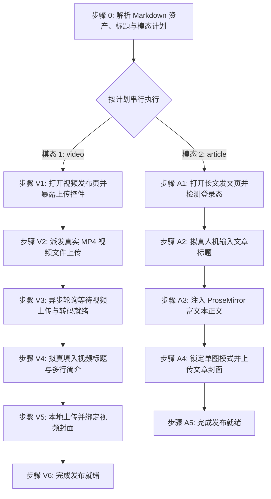

# 今日头条/头条号自动化发布草稿技能 (doudou-toutiao)

## 自动化执行全流程

当接收到用户指定的 Markdown 文件路径时，依次执行以下阶段（默认按 `video` → `article` 顺序串行执行）：



### 步骤 0：解析 Markdown 资产、标题字数与模态计划

运行辅助解析脚本提取元数据：

```bash
node scripts/parser.mjs <Markdown文件绝对路径> [模态] [--title "自定义新标题"]
```

输出包含：
- `publishPlan`: 模态执行计划（`modes`: `['video', 'article']`，`skipped` 被跳过模态及原因）
- `articleTitle`: 清洗后的文章标题；`titleWords`: 平台计算字数
- `articleHtml`: 替换 CDN 后的语义化排版 HTML
- `cover`: 封面信息（Base64 / 文件名）
- `video`: 视频信息（成片路径 `videoPath`、标题 `videoTitle`、简介 `videoDesc`）

> **标题字数规约**：平台全角汉字/符号=1字，半角英文/数字/标点=0.5字，上限 30 字。若 `titleWords > 30`，需结合文章主旨提炼不超过 30 字的精炼新标题，并通过 `--title "新标题"` 重新解析注入。

Agent 可直接调用 `scripts/toutiao_publisher.mjs` 配合 `chrome-devtools-mcp` 注入视频与长文草稿：
```javascript
import { parseAllAssets } from './scripts/parser.mjs';
import {
  buildPublishBrowserScript,
  buildPrepareVideoUploadBrowserScript,
} from './scripts/toutiao_publisher.mjs';

const meta = parseAllAssets(markdownFilePath, 'undsky', requestedModes ?? null);
// 视频页: buildPrepareVideoUploadBrowserScript()
// 长文页: buildPublishBrowserScript(meta)
```

---

### 模式 A：发布视频草稿（video 模态，优先执行）

#### 步骤 V1：打开视频发布页并暴露上传控件

1. **新建独立页面**：调用 `new_page` 打开 `https://mp.toutiao.com/profile_v4/xigua/upload-video`。
2. 等待页面加载完成。
3. 执行脚本将隐藏的 `input[type="file"]` 暴露给 accessibility tree：

```javascript
const fileInput = document.querySelector('input[type="file"]');
if (fileInput) {
  fileInput.id = 'doudou-toutiao-video-input';
  fileInput.style.display = 'inline-block';
  fileInput.style.position = 'fixed';
  fileInput.style.top = '10px';
  fileInput.style.right = '10px';
  fileInput.style.zIndex = '999999';
  fileInput.style.width = '120px';
  fileInput.style.height = '36px';
  fileInput.style.opacity = '0.05';
}
```

---

#### 步骤 V2：派发真实 MP4 视频文件上传

调用 `upload_file` 将本地 `.mp4` 视频文件派发至上传控件：

```javascript
await upload_file({
  pageId: targetPageId,
  uid: fileInputUid,
  filePaths: [meta.video.videoPath]
});
```

---

#### 步骤 V3：异步轮询等待视频上传与转码就绪

异步轮询页面状态（间隔 2 秒，最长 120 秒），直到出现「上传成功」或「重新上传」且无「上传中」：

```javascript
// 在 evaluate_script 中轮询检测
() => {
  const text = document.body ? document.body.innerText : '';
  const hasSuccess = text.includes('上传成功') || text.includes('重新上传');
  const isUploading = text.includes('上传中') || text.includes('已上传:');
  return { ready: hasSuccess && !isUploading };
};
```

---

#### 步骤 V4：拟真输入视频标题与多行简介

使用 React 原生 property setter 写入视频标题与简介，并派发原生事件：

```javascript
// 1. 输入视频标题（<=30字）
const titleInput = document.querySelector('input.xigua-input, input[placeholder*="0～30"], input[placeholder*="1～30"]');
if (titleInput && meta.videoTitle) {
  titleInput.focus();
  const setter = Object.getOwnPropertyDescriptor(window.HTMLInputElement.prototype, 'value')?.set;
  if (setter) setter.call(titleInput, meta.videoTitle);
  else titleInput.value = meta.videoTitle;
  titleInput.dispatchEvent(new Event('input', { bubbles: true, composed: true }));
  titleInput.dispatchEvent(new Event('change', { bubbles: true, composed: true }));
  titleInput.blur();
}

// 2. 填写多行视频简介
const descArea = document.querySelector('textarea.abstract, textarea[placeholder*="视频简介"], .byte-textarea.abstract');
if (descArea && meta.videoDesc) {
  descArea.focus();
  const setter = Object.getOwnPropertyDescriptor(window.HTMLTextAreaElement.prototype, 'value')?.set;
  if (setter) setter.call(descArea, meta.videoDesc);
  else descArea.value = meta.videoDesc;
  descArea.dispatchEvent(new Event('input', { bubbles: true, composed: true }));
  descArea.dispatchEvent(new Event('change', { bubbles: true, composed: true }));
  descArea.blur();
}
```

---

#### 步骤 V5：本地上传并绑定视频封面

若存在封面图资产（`meta.cover.base64` 或 `meta.videoCover.base64`）：

1. 点击封面设置触发器 `.fake-upload-trigger`；
2. 在弹出的 `.m-xigua-dialog` 中切换至「本地上传」Tab；
3. 将图片转换为 `File` 对象并设置到文件上传 input，派发 `change` 事件；
4. 等待封面编辑画布呈现，依次点击第一道「确定」按钮与二次确认弹窗；
5. 验证 `.xigua-poster-editor` 已成功挂载封面图。

---

#### 步骤 V6：完成发布就绪

1. 资产填入完成后直接判定完成；
2. **安全隔离**：原样保留当前标签页现场供人工发布，严禁调用 `close_page`。

---

### 模式 B：发布长文图文草稿（article 模态）

#### 步骤 A1：打开长文发文页并检测登录态

1. **新建独立页面**：调用 `new_page` 打开 `https://mp.toutiao.com/profile_v4/graphic/publish`。
2. 等待页面加载完成。
3. 检测登录态：
   - 检查是否存在标题输入框 `textarea, input[placeholder*="请输入文章标题"]` 及正文编辑区 `.ProseMirror`；
   - 若未登录，向用户发送提示，等待扫码登录完成后继续。

---

#### 步骤 A2：拟真人机输入文章标题

1. 聚焦标题输入框 `textarea, input[placeholder*="请输入文章标题"]`。
2. 模拟微小随机延时（200~400ms）。
3. 使用原生 property setter 写入标题（<=30字）并派发事件：

```javascript
const titleEl = document.querySelector('textarea, input[placeholder*="请输入文章标题"]');
if (titleEl) {
  titleEl.focus();
  const descArea = Object.getOwnPropertyDescriptor(window.HTMLTextAreaElement.prototype, 'value');
  const descInput = Object.getOwnPropertyDescriptor(window.HTMLInputElement.prototype, 'value');
  const setter = (descArea && descArea.set) || (descInput && descInput.set);
  if (setter) setter.call(titleEl, meta.articleTitle);
  else titleEl.value = meta.articleTitle;
  titleEl.dispatchEvent(new Event('input', { bubbles: true }));
  titleEl.dispatchEvent(new Event('change', { bubbles: true }));
  titleEl.blur();
}
```

---

#### 步骤 A3：注入 ProseMirror / Sylph 富文本正文

头条号采用 ProseMirror 富文本编辑器体系：

1. 聚焦编辑器容器 `.ProseMirror`；
2. 优先通过 React Fiber 上的 Editor 实例调用 `reactEditor.pasteContent(htmlContent)`；
3. 降级方案：派发包含 `text/html` 的标准 `ClipboardEvent('paste')` 剪贴板事件：

```javascript
const pmEl = document.querySelector('.ProseMirror') || document.querySelector('[contenteditable="true"]');
if (pmEl) {
  pmEl.focus();
  const fiberKey = Object.keys(pmEl.parentElement || {}).find(k => k.startsWith('__reactInternalInstance$') || k.startsWith('__reactFiber$'));
  let fiber = pmEl.parentElement ? pmEl.parentElement[fiberKey] : null;
  let reactEditor = null;
  while (fiber) {
    const propsEditor = fiber.memoizedProps && fiber.memoizedProps.editor;
    const stateEditor = fiber.stateNode && (fiber.stateNode.editor || fiber.stateNode.view);
    if (propsEditor || stateEditor) {
      reactEditor = propsEditor || stateEditor;
      break;
    }
    fiber = fiber.return;
  }
  if (reactEditor && typeof reactEditor.pasteContent === 'function') {
    reactEditor.pasteContent(meta.articleHtml.htmlContent);
  } else {
    const dt = new DataTransfer();
    dt.setData('text/html', meta.articleHtml.htmlContent);
    dt.setData('text/plain', meta.articleTitle + '\n\n' + meta.articleSummary);
    pmEl.dispatchEvent(new ClipboardEvent('paste', { clipboardData: dt, bubbles: true, cancelable: true }));
  }
}
```

---

#### 步骤 A4：强制锁定「单图」并上传确认封面

1. **锁定单图模式（严禁三图或无封面）**：
   - 检查「展示封面」单选组件，穿透 React Fiber 直接调用 RadioGroup 的 `onChange(2)` 或模拟点击「单图」单选标签：

```javascript
const singleRadioLabel = Array.from(document.querySelectorAll('.article-cover-radio-group label, label.byte-radio')).find(l => (l.innerText || '').trim().includes('单图'));
if (singleRadioLabel) {
  const fiberKey = Object.keys(singleRadioLabel).find(k => k.startsWith('__reactFiber$') || k.startsWith('__reactInternalInstance$'));
  let fiber = singleRadioLabel[fiberKey];
  while (fiber) {
    if (fiber.memoizedProps && typeof fiber.memoizedProps.onChange === 'function') {
      fiber.memoizedProps.onChange(2); // 2: 单图, 3: 三图, 1: 无封面
      break;
    }
    fiber = fiber.return;
  }
  singleRadioLabel.click();
}
```

2. **上传封面图片**：
   - 点击 `.article-cover-add` 展开 `.byte-drawer` 抽屉；
   - 切换至「上传图片」Tab；
   - 提交封面 `File` 对象至上传 input 并派发 `change` 事件；
   - 等待确认按钮激活并点击确定完成裁剪绑定；
   - 再次校验单图模式未被重置。

---

#### 步骤 A5：完成发布就绪

1. 资产填入完成后直接判定完成；
2. **安全隔离**：原样保留当前标签页现场供人工发布，严禁调用 `close_page`。
