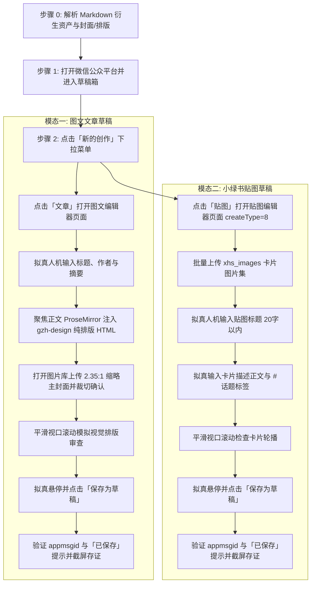

# 微信公众平台文章与贴图自动发布到草稿技能 (doudou-weixin)

本技能通过 `chrome-devtools-mcp` 控制浏览器，将用户指定的本地 Markdown 文章及其衍生资产发布至**微信公众平台（https://mp.weixin.qq.com ）的草稿箱**。

技能原生支持**「图文文章 (Article)」**与**「图文贴图 (Sticker)」**双模态创作发布，严格遵循**真实人工行为模拟与防风控规约**，通过自然的事件派发、微小随机时延抖动、ProseMirror 原生富文本解析、视口平滑滚动及悬停交互，避免被微信平台风控拦截。自动提取文章标题、作者、摘要、排版 HTML 正文、宽屏封面图以及小红书/微信图文卡片集。

---

## 核心规约与防风控原则

1. **草稿安全隔离**：
   - **严格限定仅点击「保存为草稿」按钮**，绝对不触发「发表」或「群发」，确保所有内容必须经人工最终审核后再公开发布。
2. **防风控与真实人机行为模拟 (Anti-Bot & Human Simulation)**：
   - **随机时延抖动**：所有操作之间增加正态分布随机等待（输入前 300~600ms、步骤间 600~1500ms、点击前 400~700ms），严禁毫秒级并发。
   - **真实事件完整性**：对于表单输入，依次派发 `focus`、`keydown`、`input`、`keyup`、`change`、`blur`，并同步底层隐藏 textarea/input 与 ProseMirror 编辑器。
   - **ProseMirror 原生富文本注入**：通过派发带有 `text/html` 的 `ClipboardEvent('paste')`，利用微信编辑器官方 DOMParser 解析并渲染复杂排版，保证样式与结构 100% 官方兼容。
   - **平滑视口滚动**：模拟人类自上而下的视觉审查，分步平滑滚动页面触发浏览器的视口可见性检测。
   - **拟真悬停与点击**：点击按钮前先将视口滚动到按钮可见区域，派发 `mouseover`/`mouseenter` 悬停 400~600ms 后再触发 `click`。
3. **资产自动解析与获取规范**：
   - **文章正文 HTML**：
     - 必须优先读取同名目录下由 `gzh-design` 生成的**纯排版正文 HTML**：`path/to/article_name/article_name_排版_主题(ID).html`（绝对不要使用带复制工具栏的 `_预览.html`）；
     - 注入时先全选清空 ProseMirror 编辑器，派发带有 `text/html` 的 `paste` 事件（辅以 `document.execCommand('insertHTML', false, html)` 保底并同步 `input` 事件），确保主题配色、标题组件、引言卡片、阴影圆角等样式 100% 完整保留。
   - **文章封面图**：
     - 严格优先选用 **2.35:1 宽屏主封面**，且**必须优先选用 `_thumb` 缩略图**（如 `cover/images/cover-2.35x1_thumb.png`，或 `cdn_manifest.json` 中记录的 `thumb_path` / CDN 链接）；若无 `_thumb` 则降级选用 `cover-2.35x1.png`、`cover-16x9_thumb.png` 或 `cover-16x9.png`；
     - 自动展开图片选择弹窗（`.weui-desktop-dialog_img-picker`），将封面文件注入上传，选中刚上传的第一张图片，点击「下一步」进入裁切页面，点击「确认」完成封面绑定。
   - **贴图卡片集**：读取同名目录下 `xhs_images/images/`（或 `xhs_images/`）的所有卡片图片（如 `01-cover.png`, `02-resources.png`, ...），排除 `*_yuantu.png` 原图，按序号升序批量上传至贴图选择器。
   - **标题与摘要**：
     - 文章标题：64 字以内纯文本；贴图标题：20 字以内精炼文案。
     - 摘要：80~120 字纯文本（微信公众号限制 120 字以内）。
     - 贴图描述：100~300 字核心要点梳理 + `#话题标签`。

---

## 自动化执行全流程

当接收到用户指定的 Markdown 文件路径（例如 `mds/AICoding/dddownsmartedu.md`）时，依次执行以下阶段：



---

### 步骤 0：解析 Markdown 资产与贴图

运行辅助解析脚本提取文章与贴图的完整元数据（脚本路径相对本技能目录，即 `SKILL.md` 所在目录）：
```bash
node scripts/parser.mjs <Markdown文件绝对路径>
```
输出包含：
- `title`: 清洗后的文章标题（64 字以内）
- `author`: 作者名称（默认“豆豆”）
- `summary`: 80~120 字精炼纯文本摘要
- `tags`: 核心话题标签列表
- `stickerDesc`: 包含要点总结与 `#标签` 的贴图描述文案
- `articleHtml`: `gzh-design` 摸鱼绿/橄榄手记等纯排版正文 HTML
- `cover`: 2.35:1 宽屏主封面（Base64 与 CDN 信息）
- `stickerImages`: 图文卡片序列（Base64 数组）

---

### 步骤 1：打开微信公众平台并进入草稿箱

1. 调用 `list_pages` 检查是否已有微信公众平台后台页面（URL 包含 `mp.weixin.qq.com`）。
   - 若已有，调用 `select_page` 切换到该页面；
   - 若无，调用 `new_page` 打开 `https://mp.weixin.qq.com`。
2. 检测登录态：
   - 检查页面是否存在 `.weui-desktop-menu` 或左侧「内容管理」菜单；
   - 若被重定向至登录页，向用户发出提示请用户在浏览器中微信扫码登录。
3. 模拟点击左侧菜单「草稿箱」（`a.weui-desktop-menu__link` 包含“草稿箱”），进入草稿箱列表页面（URL 包含 `type=77&action=list_card`）。

---

### 步骤 2：触发「新的创作」

在草稿箱页面中：
1. 定位绿色「新的创作」按钮（`.weui-desktop-btn_primary`，文字为“新的创作”）；
2. 派发点击事件展开下拉创作菜单（包含「文章」、「选择已有内容」、「贴图」、「视频」、「播客」等选项）。

---

### 步骤 3：发布「图文文章」到草稿

1. 点击下拉菜单中的「文章」选项（`.weui-desktop-dropdown__list-ele` 包含“文章”）；
2. 浏览器将自动新开图文编辑器页面（URL 包含 `appmsg_edit_v2` 或 `type=10`）；
3. 调用 `list_pages` 与 `select_page` 聚焦到文章编辑器页面；
4. 调用 `evaluate_script` 执行 `buildArticleBrowserScript(meta)`：
   - 拟真输入作者 `#author` 与摘要 `#js_description`；
   - 拟真输入标题 ProseMirror 并同步 `#title`；
   - 聚焦正文 ProseMirror，派发 `ClipboardEvent('paste')` 注入 `gzh-design` 排版 HTML；
   - 若存在封面图，派发 `drop` 事件至 `#js_cover_area`；
   - 模拟平滑向下滚动 380px 审查排版后滚回顶部；
   - 拟真悬停并点击「保存为草稿」按钮（`#js_submit button`）；
   - 等待 2.5 秒，捕获 `appmsgid` 与页面「已保存」提示；
5. 调用 `take_screenshot` 保存文章草稿截图存证。

---

### 步骤 4：发布「贴图卡片」到草稿

1. 切换回草稿箱页面，再次点击「新的创作」；
2. 点击下拉菜单中的「贴图」选项（`.weui-desktop-dropdown__list-ele` 包含“贴图”）；
3. 浏览器将自动新开贴图编辑器页面（URL 包含 `createType=8`）；
4. 调用 `list_pages` 与 `select_page` 聚焦到贴图编辑器页面；
5. 调用 `evaluate_script` 执行 `buildStickerBrowserScript(meta)`：
   - 将 `xhs_images` 的所有卡片转为 `File` 对象，通过 `DataTransfer` 赋值给贴图上传 input，派发 `change` 触发批量上传；
   - 拟真输入贴图标题（20 字以内）；
   - 拟真输入贴图描述（要点梳理 + `#话题标签`）；
   - 模拟平滑视口滚动；
   - 拟真悬停并点击「保存为草稿」按钮（`#js_submit button`）；
   - 等待 2.5 秒，捕获 `appmsgid` 与页面「已保存」提示；
6. 调用 `take_screenshot` 保存贴图草稿截图存证。

---

## 异常与风控处理

| 异常场景 | 表现特征 | 应对与恢复策略 |
| :--- | :--- | :--- |
| **未登录 / 登录态过期** | 跳转至二维码登录页或未找到菜单 | 立即停止自动化输入，向用户发送提示，等待用户在浏览器中扫码登录后再继续。 |
| **ProseMirror 粘贴受限** | ClipboardEvent 未被拦截或正文为空 | 自动降级为直接替换 `bodyPm.innerHTML` 并派发 `input` 事件，确保内容不丢失。 |
| **封面上传/拖拽超时** | 封面区域未识别 drop 事件 | 降级跳过封面注入，在最终报告中标记封面待手动绑定，不阻塞草稿主体的保存。 |
| **贴图卡片缺失** | 未检测到 `xhs_images/images` 目录 | 自动降级为纯文本贴图或仅执行文章草稿发布，在报告中清晰提示。 |
| **防重复保存拦截** | 保存按钮处于 loading 或 disabled 状态 | 每次保存操作之间间隔至少 3 秒，避免高频连击。 |

---

## 脚本工具与使用方法

以下路径均相对本技能目录（`SKILL.md` 所在目录），执行前先切换到该目录，或将其拼接为绝对路径使用。

- `scripts/parser.mjs`：解析 Markdown，提取标题、作者、摘要、话题、贴图文案、排版 HTML 与封面/图文卡片资产。
- `scripts/weixin_publisher.mjs`：文章与贴图发布浏览器注入脚本生成器（编辑器状态同步与防风控人机模拟）。

1. **直接运行 Node.js 脚本测试资产解析与代码生成**：
```bash
node scripts/parser.mjs <Markdown文件路径>
node scripts/weixin_publisher.mjs <Markdown文件路径>
```

2. **在 Agent 中配合 `chrome-devtools-mcp` 全流程调用**：
```javascript
import { parseAllAssets } from './scripts/parser.mjs';
import { buildArticleBrowserScript, buildStickerBrowserScript } from './scripts/weixin_publisher.mjs';

// 1. 解析目标 Markdown
const meta = parseAllAssets(markdownFilePath);

// 2. 在文章页执行发布
const articleCode = buildArticleBrowserScript(meta);
const articleResult = await evaluate_script({
  pageId: articlePageId,
  function: articleCode
});

// 3. 在贴图页执行发布
const stickerCode = buildStickerBrowserScript(meta);
const stickerResult = await evaluate_script({
  pageId: stickerPageId,
  function: stickerCode
});
```
