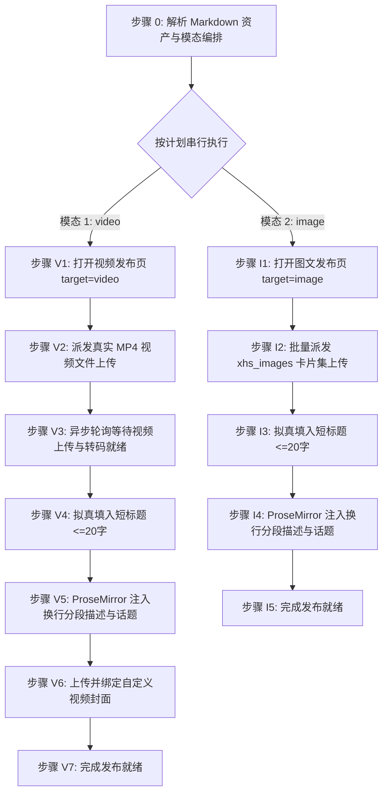

# 小红书自动化发布草稿技能规范 (doudou-xiaohongshu)

## 自动化执行全流程

当接收到用户指定的 Markdown 文件路径时，依次执行以下阶段（默认按 `video` → `image` 顺序串行执行）：



### 步骤 0：解析 Markdown 资产与模态编排

运行辅助解析脚本提取元数据：

```bash
node scripts/parser.mjs <Markdown文件绝对路径> [可选模态]
```

输出包含：
- `publishPlan`: 确定性执行计划（`modes` 包含要发布的模态，`skipped` 记录跳过原因）
- `title` / `videoTitle`: 严格截断至 20 字以内的短标题
- `descPreview`: 包含要点总结与 `#话题标签` 的多行换行描述文案
- `video`: 视频成片信息（`videoPath`、`hasVideo`）
- `cardPaths`: 全量 3:4 图文卡片本地路径列表（升序排列）
- `coverBase64`: 封面图 Base64

Agent 可直接调用 `scripts/xhs_publisher.mjs` 配合 `chrome-devtools-mcp` 一键执行注入：
```javascript
import { parseAllAssets } from './scripts/parser.mjs';
import {
  buildVideoPostBrowserScript,
  buildImagePostBrowserScript,
} from './scripts/xhs_publisher.mjs';

const meta = parseAllAssets(markdownFilePath, 'undsky', requestedModes ?? null);
const { modes, skipped } = meta.publishPlan;

// 逐模态串行执行（video -> image）
for (const mode of modes) {
  if (mode === 'video') {
    const pageId = await new_page({ url: 'https://creator.xiaohongshu.com/publish/publish?target=video' });
    await upload_file({ pageId, filePaths: [meta.video.videoPath] });
    await evaluate_script({ pageId, function: buildVideoPostBrowserScript(meta) });
  } else if (mode === 'image') {
    const pageId = await new_page({ url: 'https://creator.xiaohongshu.com/publish/publish?target=image' });
    await upload_file({ pageId, filePaths: meta.cardPaths });
    await evaluate_script({ pageId, function: buildImagePostBrowserScript(meta) });
  }
}
```

---

### 模式 A：发布视频笔记草稿（video 模态，优先执行）

#### 步骤 V1：打开视频发布页并检测登录态

1. **新建独立页面**：调用 `new_page` 打开 `https://creator.xiaohongshu.com/publish/publish?target=video`。
2. 等待页面加载完成，若有未登录提示向用户发送提示扫码。

---

#### 步骤 V2：派发真实 MP4 视频文件上传

调用 `upload_file` 将本地 `.mp4` 视频文件派发至上传控件 `input.upload-input, input[type="file"]`：

```javascript
await upload_file({
  pageId: targetPageId,
  filePaths: [meta.video.videoPath]
});
```

---

#### 步骤 V3：异步轮询等待视频上传与转码就绪

异步轮询（最长等待 120 秒），检测出现「重新上传」或标题输入框就绪：

```javascript
// 在 evaluate_script 中求值
(() => {
  const text = document.body ? document.body.innerText : '';
  const ready = text.includes('重新上传') || !!document.querySelector('input[placeholder*="填写标题"]');
  return { ready };
})();
```

---

#### 步骤 V4：拟真填入短标题（<=20字）

聚焦标题输入框，通过原生 Setter 写入短标题并派发事件：

```javascript
const titleInput = document.querySelector('input[placeholder*="填写标题"], input.d-text') || document.querySelector('input');
if (titleInput && meta.title) {
  titleInput.focus();
  const setter = Object.getOwnPropertyDescriptor(window.HTMLInputElement.prototype, 'value')?.set;
  if (setter) setter.call(titleInput, meta.title);
  else titleInput.value = meta.title;
  titleInput.dispatchEvent(new Event('input', { bubbles: true, composed: true }));
  titleInput.dispatchEvent(new Event('change', { bubbles: true, composed: true }));
  titleInput.blur();
}
```

---

#### 步骤 V5：ProseMirror 注入换行分段描述与话题（<=1000字）

聚焦编辑器，通过 ProseMirror 命令注入包含 `<p>` 段落结构的内容：

```javascript
const descEl = document.querySelector('.tiptap.ProseMirror, [contenteditable="true"]');
if (descEl && meta.description) {
  descEl.focus();
  if (descEl.editor && descEl.editor.commands && descEl.editor.commands.setContent) {
    const htmlFormatted = meta.description.split('\n').map(line => `<p>${line || '<br>'}</p>`).join('');
    descEl.editor.commands.setContent(htmlFormatted, true);
  } else {
    document.execCommand('selectAll', false, null);
    document.execCommand('insertText', false, meta.description);
  }
  descEl.dispatchEvent(new Event('input', { bubbles: true, composed: true }));
  descEl.dispatchEvent(new Event('blur', { bubbles: true, composed: true }));
}
```

---

#### 步骤 V6：上传并绑定自定义视频封面

若存在封面图资产（`meta.coverBase64`）：

1. 点击「设置封面」或「修改封面」按钮唤起弹窗；
2. 切换至「上传封面」Tab；
3. 将图片转换为 `File` 对象并设置到文件上传 input；
4. 点击确定完成裁剪保存。

---

#### 步骤 V7：完成发布就绪

1. 资产填入完成后直接判定完成；
2. **安全隔离**：原样保留当前标签页现场供人工发布，严禁调用 `close_page`。

---

### 模式 B：发布图文笔记草稿（image 模态）

#### 步骤 I1：打开图文发布页并检测登录态

1. **新建独立页面**：调用 `new_page` 打开 `https://creator.xiaohongshu.com/publish/publish?target=image`。
2. 等待页面加载完成。

---

#### 步骤 I2：批量派发 xhs_images 卡片集上传

调用 `upload_file` 批量上传全部 3:4 卡片文件路径：

```javascript
await upload_file({
  pageId: targetPageId,
  filePaths: meta.cardPaths
});
```

---

#### 步骤 I3：拟真填入短标题（<=20字）

设置 `input[placeholder*="填写标题"]` 原生 Setter 并派发原生事件。

---

#### 步骤 I4：ProseMirror 注入换行分段描述与话题（<=1000字）

聚焦 `.tiptap.ProseMirror`，通过 `editor.commands.setContent` 注入分段结构化文本，保持段落间清晰换行。

---

#### 步骤 I5：完成发布就绪

1. 资产填入完成后直接判定完成；
2. **安全隔离**：原样保留当前标签页现场供人工发布，严禁调用 `close_page`。
