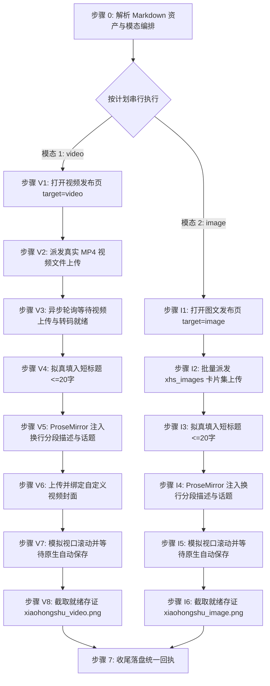

# 小红书自动化发布草稿技能规范 (doudou-xiaohongshu)

本技能通过 `chrome-devtools-mcp` 控制 Chrome 浏览器，实现小红书创作者服务平台（Creator Studio）的**视频笔记**与**图文笔记**双模态自动化发布全流程。

严格遵循**真实人工行为模拟与防风控规约**，视频异步轮询上传就绪，图文全量卡片批量上传，ProseMirror 富文本状态双向同步，全流程完成后原样保留页面现场供人工最终核验，绝不自动触碰发布按钮。

---

## 核心规约与防风控原则

1. **发布入口**：
   - 视频笔记：`https://creator.xiaohongshu.com/publish/publish?target=video`
   - 图文笔记：`https://creator.xiaohongshu.com/publish/publish?target=image`
2. **模态判定与串行执行原则**：
   - **默认全模态**：用户未明确指定模态时，默认发布全部可用模态（`video` + `image`）。执行顺序恒为 `video` → `image`。
   - **显式指定**：用户明确指定时，严格仅执行指定模态。
   - **资产缺失处理**：若缺少对应资产（无 `video/*.mp4` 则跳过视频笔记，无 `xhs_images/images/` 则跳过图文笔记），自动跳过并在回执中登记原因，继续执行其他可用模态。
3. **草稿安全隔离（绝对底线）**：
   - 依托平台实时自动保存机制，**无需也不得点击「暂存离开」按钮**（避免跳出当前编辑页破坏现场），**绝对严禁点击「发布」按钮**，保留编辑现场供人工最终确认。
4. **完成判定必须客观可断言**：
   - 必须以客观断言求值为 `true` 判定完成，严禁以固定延时代替完成。超时标记 `timeout` 并保留页面，严禁误报 `success`。
5. **收尾必须落盘回执**：
   - 执行完毕必须调用 `scripts/receipt.mjs write` 写入回执，供上层调度读取。
6. **防风控与真实人机行为模拟**：
   - **微小随机延时**：所有交互前插入 250~650ms 随机延迟；
   - **原生事件与 ProseMirror 同步**：标题派发 `input` 与 `change` 事件；描述使用 ProseMirror `setContent(htmlFormatted, true)` 保持段落换行与富文本响应式状态；
   - **平滑视口滚动**：模拟人工阅读分步平滑滚动页面；
   - **新手引导处理**：自动检测并关闭「我知道了」等新手提示浮层。
7. **发布完成后保留页面（严禁自动关闭）**：
   - 每次执行必须调用 `new_page` 新建独立标签页（严禁复用已有页面）；流程完成后严禁调用 `close_page`，原样保留页面现场。

---

## 完成断言与回执协议 (Completion Assertion & Receipt)

### 完成断言

| 项 | 值 |
| :--- | :--- |
| **断言规则** | 编辑器内状态就绪且平台自动保存生效 |
| **超时窗口** | 45 秒，轮询间隔 1.5 秒 |
| **通过** | 登记 `success` |
| **超时** | 登记 `timeout`（保留页面，严禁登记为 success） |

```javascript
// 在 evaluate_script 中求值
() => {
  const t = document.body ? document.body.innerText : '';
  const ready = !!document.querySelector('.tiptap.ProseMirror, [contenteditable="true"]');
  const inDraft = /草稿|已保存/.test(t) || ready;
  return { passed: inDraft, ready, url: location.href };
};
```

### 状态枚举（六个终态）

| 状态 | 含义 |
| :--- | :--- |
| `success` | 内容填入就绪且平台自动保存通过 |
| `ready_for_review` | 内容已填入就绪待人工发布 |
| `needs_login` | 登录态缺失/过期，已保留页面待补登 |
| `failed` | 明确失败（选择器失效、注入异常） |
| `timeout` | 完成断言在 45s 窗口内未成立 |
| `skipped` | 资产缺失或用户主动跳过 |

### 存证截图统一命名

统一存至同名文章目录下的 `publishes/screenshots/` 目录：
- 视频笔记：`publishes/screenshots/xiaohongshu_video.png`
- 图文笔记：`publishes/screenshots/xiaohongshu_image.png`

### 临时脚本与中间文件存放规约

所有临时注入脚本、临时 payload 等文件必须统一放置在目标 Markdown 文章对应的同名资产目录下，严禁污染工作区或项目根目录。

### 回执落盘

```bash
node scripts/receipt.mjs write <Markdown文件绝对路径> --payload-file <json文件路径>
```

`--payload` 结构示例：

```json
{
  "skill": "doudou-xiaohongshu",
  "platform": "小红书",
  "platformSlug": "xiaohongshu",
  "startedAt": "2026-09-09T08:00:00.000Z",
  "results": [
    {
      "mode": "video",
      "modeDesc": "视频笔记",
      "status": "success",
      "statusText": "草稿已保存",
      "title": "……",
      "screenshot": "screenshots/xiaohongshu_video.png",
      "assertion": { "rule": "视频上传完成且表单就绪", "passed": true }
    },
    {
      "mode": "image",
      "modeDesc": "图文笔记",
      "status": "success",
      "statusText": "草稿已保存",
      "title": "……",
      "screenshot": "screenshots/xiaohongshu_image.png",
      "assertion": { "rule": "图文卡片上传完成且表单就绪", "passed": true }
    }
  ]
}
```

---

## 自动化执行全流程

当接收到用户指定的 Markdown 文件路径时，依次执行以下阶段（默认按 `video` → `image` 顺序串行执行）：



### 步骤 0：解析 Markdown 资产与模态编排

运行辅助解析脚本提取元数据：

```bash
node scripts/parser.mjs <Markdown文件绝对路径> [可选模态]
```

输出包含：
- `publishPlan`: 确定性执行计划（`modes` 包含要发布的模态，`skipped` 记录跳过原因）
- `title` / `videoTitle`: 严格截断至 20 字以内的短标题
- `descPreview`: 包含要点总结与 `#话题标签` 的多行换行描述文案
- `video`: 视频成片信息（`videoPath`、`hasVideo`）
- `cardPaths`: 全量 3:4 图文卡片本地路径列表（升序排列）
- `coverBase64`: 封面图 Base64

---

### 模式 A：发布视频笔记草稿（video 模态，优先执行）

#### 步骤 V1：打开视频发布页并检测登录态

1. **新建独立页面**：调用 `new_page` 打开 `https://creator.xiaohongshu.com/publish/publish?target=video`。
2. 等待页面加载完成，若有未登录提示向用户发送提示扫码。

---

#### 步骤 V2：派发真实 MP4 视频文件上传

调用 `upload_file` 将本地 `.mp4` 视频文件派发至上传控件 `input.upload-input, input[type="file"]`：

```javascript
await upload_file({
  pageId: targetPageId,
  filePaths: [meta.video.videoPath]
});
```

---

#### 步骤 V3：异步轮询等待视频上传与转码就绪

异步轮询（最长等待 120 秒），检测出现「重新上传」或标题输入框就绪：

```javascript
// 在 evaluate_script 中求值
(() => {
  const text = document.body ? document.body.innerText : '';
  const ready = text.includes('重新上传') || !!document.querySelector('input[placeholder*="填写标题"]');
  return { ready };
})();
```

---

#### 步骤 V4：拟真填入短标题（<=20字）

聚焦标题输入框，通过原生 Setter 写入短标题并派发事件：

```javascript
const titleInput = document.querySelector('input[placeholder*="填写标题"], input.d-text') || document.querySelector('input');
if (titleInput && meta.title) {
  titleInput.focus();
  const setter = Object.getOwnPropertyDescriptor(window.HTMLInputElement.prototype, 'value')?.set;
  if (setter) setter.call(titleInput, meta.title);
  else titleInput.value = meta.title;
  titleInput.dispatchEvent(new Event('input', { bubbles: true, composed: true }));
  titleInput.dispatchEvent(new Event('change', { bubbles: true, composed: true }));
  titleInput.blur();
}
```

---

#### 步骤 V5：ProseMirror 注入换行分段描述与话题（<=1000字）

聚焦编辑器，通过 ProseMirror 命令注入包含 `<p>` 段落结构的内容：

```javascript
const descEl = document.querySelector('.tiptap.ProseMirror, [contenteditable="true"]');
if (descEl && meta.description) {
  descEl.focus();
  if (descEl.editor && descEl.editor.commands && descEl.editor.commands.setContent) {
    const htmlFormatted = meta.description.split('\n').map(line => `<p>${line || '<br>'}</p>`).join('');
    descEl.editor.commands.setContent(htmlFormatted, true);
  } else {
    document.execCommand('selectAll', false, null);
    document.execCommand('insertText', false, meta.description);
  }
  descEl.dispatchEvent(new Event('input', { bubbles: true, composed: true }));
  descEl.dispatchEvent(new Event('blur', { bubbles: true, composed: true }));
}
```

---

#### 步骤 V6：上传并绑定自定义视频封面

若存在封面图资产（`meta.coverBase64`）：

1. 点击「设置封面」或「修改封面」按钮唤起弹窗；
2. 切换至「上传封面」Tab；
3. 将图片转换为 `File` 对象并设置到文件上传 input；
4. 点击确定完成裁剪保存。

---

#### 步骤 V7：模拟视口滚动并等待原生自动保存

平滑滚动视口审查排版，依托平台实时自动保存能力，轮询完成断言直至通过。**严格绝不点击「暂存离开」或「发布」按钮**。

---

#### 步骤 V8：截取就绪存证并保留页面

1. 调用 `take_screenshot` 保存当前视频编辑状态截图至 `publishes/screenshots/xiaohongshu_video.png`。
2. 原样保留当前标签页，严禁关闭。

---

### 模式 B：发布图文笔记草稿（image 模态）

#### 步骤 I1：打开图文发布页并检测登录态

1. **新建独立页面**：调用 `new_page` 打开 `https://creator.xiaohongshu.com/publish/publish?target=image`。
2. 等待页面加载完成。

---

#### 步骤 I2：批量派发 xhs_images 卡片集上传

调用 `upload_file` 批量上传全部 3:4 卡片文件路径：

```javascript
await upload_file({
  pageId: targetPageId,
  filePaths: meta.cardPaths
});
```

---

#### 步骤 I3：拟真填入短标题（<=20字）

设置 `input[placeholder*="填写标题"]` 原生 Setter 并派发原生事件。

---

#### 步骤 I4：ProseMirror 注入换行分段描述与话题（<=1000字）

聚焦 `.tiptap.ProseMirror`，通过 `editor.commands.setContent` 注入分段结构化文本，保持段落间清晰换行。

---

#### 步骤 I5：模拟视口滚动并等待原生自动保存

平滑微调滚动视口，等待平台实时自动保存生效。**严格绝不点击「暂存离开」或「发布」按钮**。

---

#### 步骤 I6：截取就绪存证并保留页面

1. 调用 `take_screenshot` 保存当前图文编辑状态截图至 `publishes/screenshots/xiaohongshu_image.png`。
2. 原样保留当前标签页，严禁关闭。

---

### 步骤 7：收尾落盘统一回执

多模态全部执行完毕后，构造统一回执并落盘：

```bash
node scripts/receipt.mjs write <Markdown文件绝对路径> --payload-file <json文件路径>
```

---

## 异常与风控处理

| 异常场景 | 表现特征 | 应对与恢复策略 |
| :--- | :--- | :--- |
| **未登录 / 登录态过期** | 呈现扫码登录页或弹窗 | 立即停止自动化输入，向用户发送提示，等待用户扫码登录完成后继续。 |
| **新手引导浮层遮挡** | 弹出新功能提示覆盖表单 | 自动检测并点击「我知道了」按钮关闭浮层。 |
| **短标题超长（>20字）** | 字数校验报错 | 步骤 0 自动清洗截断至 20 字以内。 |
| **视频上传超时 / 网络波动** | 进度停滞超过 120 秒 | 标记该模态 `timeout`，保留页面现场，继续执行下一模态。 |
| **描述换行丢失** | 富文本折叠为单行 | 使用 `<p>` 标签分段并通过 `editor.commands.setContent` 注入。 |

---

## 脚本工具与使用方法

以下路径均相对本技能目录（`SKILL.md` 所在目录）：

- `scripts/parser.mjs`：解析 Markdown 资产、提取短标题、格式化描述与确定性计划 `publishPlan`。
- `scripts/xhs_publisher.mjs`：小红书发布浏览器端注入脚本生成器（涵盖 ProseMirror 状态双向同步、段落换行保留与防风控人机交互）。
- `scripts/receipt.mjs`：标准化收尾回执落盘工具。

### Agent 调用范式

```javascript
import { parseAllAssets } from "./scripts/parser.mjs";
import {
  buildImagePostBrowserScript,
  buildVideoPostBrowserScript,
} from "./scripts/xhs_publisher.mjs";

// 1. 解析目标 Markdown 资产（同步函数，自动编排确定性计划）
const meta = parseAllAssets(markdownFilePath, "undsky", requestedModes ?? null);
const { modes, skipped } = meta.publishPlan;

// 2. 逐模态串行执行（video -> image）
for (const mode of modes) {
  if (mode === "video") {
    const pageId = await new_page({ url: "https://creator.xiaohongshu.com/publish/publish?target=video" });
    await upload_file({ pageId, filePaths: [meta.video.videoPath] });
    await evaluate_script({ pageId, function: buildVideoPostBrowserScript(meta) });
    await take_screenshot({ pageId, filePath: "publishes/screenshots/xiaohongshu_video.png" });
  } else if (mode === "image") {
    const pageId = await new_page({ url: "https://creator.xiaohongshu.com/publish/publish?target=image" });
    await upload_file({ pageId, filePaths: meta.cardPaths });
    await evaluate_script({ pageId, function: buildImagePostBrowserScript(meta) });
    await take_screenshot({ pageId, filePath: "publishes/screenshots/xiaohongshu_image.png" });
  }
}

// 3. 落盘统一回执（原样保留所有页面，严禁调用 close_page）
```
