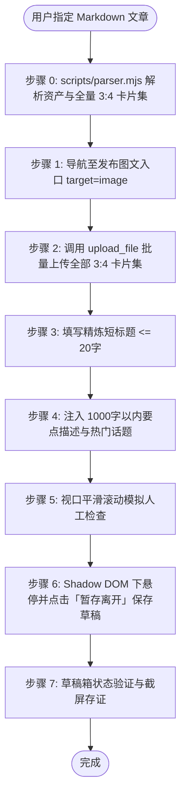

# 小红书图文笔记自动化发布草稿技能规范 (doudou-xiaohongshu)

本技能通过 `chrome-devtools-mcp` 控制 Chrome 浏览器，实现小红书创作者服务平台（Creator Studio）的**图文笔记**自动化草稿发布全流程。

---

## 📌 核心发布入口

- **发布图文入口**：`https://creator.xiaohongshu.com/publish/publish?from=menu&target=image`

---

## 🎨 资产规范与路径映射

| 资产类型 | 规范路径 / 规则 | 说明 |
| :--- | :--- | :--- |
| **源 Markdown 文章** | `path/to/article_name.md` | 用户指定的源文章 |
| **图文卡片集** | `path/to/article_name/xhs_images/images/` | 全量提取目录下所有 3:4 高清卡片，按自然文件名升序排列（自动排除 `_yuantu.png`，不限卡片张数，平台支持最多 18 张） |
| **图文笔记标题** | `<= 20 字` | 提炼吸睛短标题，严格截断至 20 字以内 |
| **图文作品描述** | `<= 1000 字` | 核心观点总结 + 序号干货清单 + `#热门话题标签`（含 `#干货分享`、`#AI编程` 等） |

---

## 🛡️ 防风控与人机行为模拟规约

1. **随机时延抖动**：所有交互前插入 250ms ~ 650ms 随机延迟（`sleep(ms + Math.floor(Math.random() * 200))`），模拟人类打字与反应节奏。
2. **原生事件完整派发**：标题输入触发 `input` 与 `change` 事件（带 `bubbles: true, composed: true`）；富文本描述使用 ProseMirror `setContent` 或 `document.execCommand` 保持响应式同步。
3. **真实鼠标与视口交互**：点击操作前先将元素 `scrollIntoView({ behavior: 'smooth', block: 'center' })`，派发 `mouseover`、`mouseenter` 再执行 `click`；分步平滑滚动页面模拟人工审阅。
4. **Web Component 与 Shadow DOM 适配**：小红书底部操作栏采用自定义元素 `<xhs-publish-btn>`，优先定位其 Shadow DOM (`_sr`) 内的「暂存离开」按钮。
5. **绝对安全隔离底线**：全流程终点统一点击「**暂存离开**」，严禁误触直接「发布」。

---

## 🚀 图文自动化发布执行流程

---

## 🛠️ 核心脚本

以下路径均相对本技能目录（`SKILL.md` 所在目录），执行前先切换到该目录，或将其拼接为绝对路径使用。

- [scripts/parser.mjs](scripts/parser.mjs)：解析 Markdown、提取图文短标题（<=20字）、结构化要点描述与热门话题、全量读取 3:4 小红书图文卡片集。
- [scripts/xhs_publisher.mjs](scripts/xhs_publisher.mjs)：图文发布浏览器注入脚本生成器（涵盖 ProseMirror 状态同步、Shadow DOM 交互与防风控人机模拟）。
