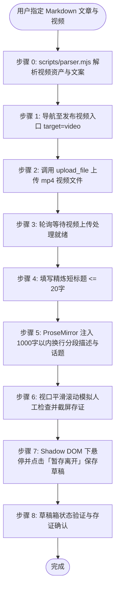

# 小红书自动化发布草稿技能规范 (doudou-xiaohongshu)

本技能通过 `chrome-devtools-mcp` 控制 Chrome 浏览器，实现小红书创作者服务平台（Creator Studio）的**视频笔记**与**图文笔记**自动化草稿发布全流程。

---

## 📌 核心发布入口

- **发布视频入口**：`https://creator.xiaohongshu.com/publish/publish?target=video`
- **发布图文入口**：`https://creator.xiaohongshu.com/publish/publish?target=image`

---

## 🎨 资产规范与路径映射

| 资产类型 | 规范路径 / 规则 | 说明 |
| :--- | :--- | :--- |
| **源 Markdown 文章** | `path/to/article_name.md` | 用户指定的源文章 |
| **视频成片文件** | `path/to/article_name/video/[video_name].mp4` 或 `[article_name].mp4` | 成品高清视频（优先识别 `video_manifest.json` 登记输出） |
| **视频笔记短标题** | `<= 20 字` | 提炼吸睛精炼标题，严格截断至 20 字以内 |
| **视频作品描述** | `<= 1000 字` | 核心观点总结 + 序号干货清单 + `#热门话题标签`（严格保持段落换行） |
| **图文卡片集** | `path/to/article_name/xhs_images/images/` | 全量提取目录下所有 3:4 高清卡片，按自然文件名升序排列（排除 `_yuantu.png`） |
| **图文笔记短标题** | `<= 20 字` | 提炼吸睛精炼短标题，严格截断至 20 字以内 |
| **图文作品描述** | `<= 1000 字` | 核心观点总结 + 序号干货清单 + `#热门话题标签`（严格保持段落换行） |

---

## 🛡️ 防风控与人机行为模拟规约

1. **随机时延抖动**：所有交互前插入 250ms ~ 650ms 随机延迟（`sleep(ms + Math.floor(Math.random() * 200))`），模拟人类打字与反应节奏。
2. **原生事件完整派发**：标题输入触发 `input` 与 `change` 事件（带 `bubbles: true, composed: true`）；富文本描述使用 ProseMirror `setContent(htmlFormatted, true)` 保持段落换行与响应式状态同步。
3. **真实鼠标与视口交互**：点击操作前先将元素 `scrollIntoView({ behavior: 'smooth', block: 'center' })`，派发 `mouseover`、`mouseenter` 再执行 `click`；分步平滑滚动页面模拟人工审阅。
4. **Web Component 与 Shadow DOM 适配**：小红书底部操作栏采用自定义元素 `<xhs-publish-btn>`，优先定位其 Shadow DOM (`_sr`) 内的「暂存离开」按钮。
5. **绝对安全隔离底线**：全流程终点统一点击「**暂存离开**」，严禁误触直接「发布」。
6. **确定性草稿保存与存证**：完成编辑后截取存证图片（`xhs_video_draft_proof.png` / `xhs_draft_proof.png`），并验证草稿箱计数与草稿列表。

---

## 🚀 双模态自动化发布执行流程

### 模式 A：发布视频笔记草稿（Video Post）

1. **导航页面**：访问 `https://creator.xiaohongshu.com/publish/publish?target=video`。
2. **真实视频上传**：解析目标文章目录下的 `video/` 获取 `.mp4` 文件，通过 `upload_file` 派发至 `input.upload-input`。
3. **轮询等待就绪**：监控页面出现「重新上传」或标题输入框就绪。
4. **填充标题**：填写精炼短标题（<= 20 字）至 `input[placeholder*="填写标题"], input.d-text`。
5. **填充描述与话题**：通过 ProseMirror `setContent` 注入 `
` 段落结构描述与热门话题标签（<= 1000 字），严格保证段落换行。
6. **模拟审阅与存证**：平滑滚动视口，截取编辑状态截图保存至 `xhs_video_draft_proof.png`。
7. **暂存草稿**：定位 `<xhs-publish-btn>` 的 Shadow DOM (`_sr`) 下的「暂存离开」按钮，悬停并点击保存。
8. **验证存证**：返回上传页，验证「草稿箱」新增对应视频笔记草稿。

---

### 模式 B：发布图文笔记草稿（Image-Text Post）

1. **导航页面**：访问 `https://creator.xiaohongshu.com/publish/publish?target=image`。
2. **真实卡片批量上传**：解析目录下的 `xhs_images/images/`，通过 `upload_file` 批量上传全部 3:4 卡片。
3. **填充标题与描述**：填写短标题（<= 20 字），注入分段换行作品描述与话题标签（<= 1000 字）。
4. **模拟审阅与存证**：平滑滚动视口，截取编辑状态截图保存至 `xhs_draft_proof.png`。
5. **暂存草稿与验证**：Shadow DOM 下点击「暂存离开」保存至图文草稿箱。

---

## 🛠️ 核心脚本

以下路径均相对本技能目录（`SKILL.md` 所在目录），执行前先切换到该目录，或将其拼接为绝对路径使用。

- [scripts/parser.mjs](scripts/parser.mjs)：解析 Markdown、提取视频（.mp4）/图文短标题（<=20字）、结构化分段要点描述与热门话题、全量读取 3:4 小红书图文卡片集。
- [scripts/xhs_publisher.mjs](scripts/xhs_publisher.mjs)：视频与图文发布浏览器注入脚本生成器（涵盖 ProseMirror 状态双向同步、换行保留、Shadow DOM 交互与防风控人机模拟）。
