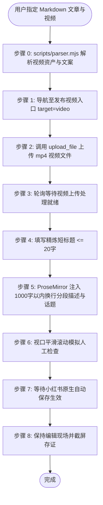

# 小红书自动化发布草稿技能规范 (doudou-xiaohongshu)

本技能通过 `chrome-devtools-mcp` 控制 Chrome 浏览器，实现小红书创作者服务平台（Creator Studio）的**视频笔记**与**图文笔记**自动化草稿发布全流程。

---

## 📌 核心发布入口

- **发布视频入口**：`https://creator.xiaohongshu.com/publish/publish?target=video`
- **发布图文入口**：`https://creator.xiaohongshu.com/publish/publish?target=image`

---

## 🎯 模态选择规约（默认全模态发布）

小红书同时支持**视频笔记 / 图文笔记**两种模态。模态的取舍**不允许由 Agent 自行揣测或随意挑一个执行**，必须严格遵循以下判定链：

1. **用户未明确指定模态 => 默认发布全部可用模态**。
   - 「把这篇发小红书」「发布到小红书草稿箱」「发一下 xxx.md」等未点名模态的指令，一律理解为**视频笔记 + 图文笔记全发**，而非只发其中一种。
   - **严禁**以「资产多、耗时长、担心风控」等理由自行缩减模态；也**严禁**中途反问用户「要发视频还是图文」——默认答案就是两种都发。
2. **用户明确指定模态 => 严格只发指定的那些**。
   - 如「只发图文笔记」「仅发视频」，则严格按指定集合执行，不得擅自追加其他模态。
3. **模态所需资产缺失 => 自动跳过该模态，其余照常发布**。
   - 缺失不是失败：跳过并在最终报告里明确登记原因，**绝不因为某一模态缺资产而中断整个任务**。
   - 若用户显式点名的模态恰好缺资产，同样跳过，并在报告中提示需要补齐的资产路径。

### 模态可用性判定表

| 模态 | 必需资产 | 缺失时的处置 |
| :--- | :--- | :--- |
| **视频笔记（video）** | `video/*.mp4` 成片（`meta.video.hasVideo === true`） | 跳过视频模态，登记「未找到 video/*.mp4 视频成片」 |
| **图文笔记（image）** | `xhs_images/images/` 3:4 卡片集（`meta.cardCount > 0`） | 跳过图文模态，登记「未找到 3:4 图文卡片集」 |

### 确定性模态计划（由解析器给出，禁止手工推断）

`parseAllAssets()` 已内置模态编排，直接读取 `meta.publishPlan`，**不要自行拼凑模态列表**：

```javascript
import { parseAllAssets } from "./scripts/parser.mjs";

// requestedModes 留空 / null => 默认全模态；传入 "视频" 或 ["image"] => 只发指定模态
const meta = parseAllAssets(markdownFilePath, "undsky", requestedModes ?? null);

meta.publishPlan;
// {
//   requested: [],                     // 归一化后的用户指定模态（空数组 = 用户未指定）
//   userSpecified: false,              // false => 走默认全发
//   modes: ["video", "image"],         // 本次实际要执行的模态（已按推荐顺序排序）
//   skipped: [{ mode, label, reason }],// 被跳过的模态及原因
//   summary: "用户未指定模态 => 默认发布全部可用模态｜将发布：视频笔记 + 图文笔记"
// }
```

命令行同样可校验计划（第三个参数留空即默认全模态）：

```bash
node scripts/parser.mjs <Markdown文件绝对路径>          # 默认全模态
node scripts/parser.mjs <Markdown文件绝对路径> "视频"    # 仅指定模态
```

### 多模态串行执行规约

- **执行顺序**：`video` → `image`（视频上传与转码最慢，优先启动；图文卡片上传较快，随后执行）。
- **状态隔离**：每个模态**必须重新导航到自己的发布入口**（`target=video` / `target=image`），严禁复用上一模态的编辑器页面或残留内容。
- **失败隔离**：单个模态失败（上传超时、验证码拦截、选择器失效等）**只标记该模态失败并继续下一个模态**，不得终止剩余模态。
- **页面保留**：所有模态执行完毕后，**全部页面一律原样保留**（详见防风控规约第 7 条），不得关闭。
- **统一汇总报告**：任务结束时输出逐模态结果表，含状态、标题、存证截图路径与跳过原因：

  | 模态 | 状态 | 标题 | 存证截图 / 原因 |
  | :--- | :--- | :--- | :--- |
  | 视频笔记 | ✅ 就绪/原生自动保存 | ... | `xhs_video_draft_proof.png` |
  | 图文笔记 | ⏭️ 已跳过 | — | 未找到 3:4 图文卡片集 |

---

## 🎨 资产规范与路径映射

| 资产类型 | 规范路径 / 规则 | 说明 |
| :--- | :--- | :--- |
| **源 Markdown 文章** | `path/to/article_name.md` | 用户指定的源文章 |
| **视频成片文件** | `path/to/article_name/video/[video_name].mp4` 或 `[article_name].mp4` | 成品高清视频（优先识别 `video_manifest.json` 登记输出） |
| **视频笔记短标题** | `<= 20 字` | 提炼吸睛精炼标题，严格截断至 20 字以内 |
| **视频作品描述** | `<= 1000 字` | 核心观点总结 + 序号干货清单 + `#热门话题标签`（严格保持段落换行） |
| **图文卡片集** | `path/to/article_name/xhs_images/images/` | 全量提取目录下所有 3:4 高清卡片，按自然文件名升序排列（排除 `_yuantu.png`） |
| **图文笔记短标题** | `<= 20 字` | 提炼吸睛精炼短标题，严格截断至 20 字以内 |
| **图文作品描述** | `<= 1000 字` | 核心观点总结 + 序号干货清单 + `#热门话题标签`（严格保持段落换行） |

---

## 🛡️ 防风控与人机行为模拟规约

1. **随机时延抖动**：所有交互前插入 250ms ~ 650ms 随机延迟（`sleep(ms + Math.floor(Math.random() * 200))`），模拟人类打字与反应节奏。
2. **原生事件完整派发**：标题输入触发 `input` 与 `change` 事件（带 `bubbles: true, composed: true`）；富文本描述使用 ProseMirror `setContent(htmlFormatted, true)` 保持段落换行与响应式状态同步。
3. **真实鼠标与视口交互**：点击操作前先将元素 `scrollIntoView({ behavior: 'smooth', block: 'center' })`，派发 `mouseover`、`mouseenter` 再执行 `click`；分步平滑滚动页面模拟人工审阅。
4. **绝对安全隔离底线**：严禁点击「发布」按钮；同时**无需也不得主动点击「暂存离开」按钮**（避免跳出当前编辑页面破坏现场）。小红书平台在输入后会自动实时同步保存，全流程终点停留在当前编辑页供人工复核。
5. **确定性原生自动保存与存证**：完成编辑后平滑视口滚动审阅排版，等待 2.5 秒原生自动保存生效，截取编辑状态截图存证（`xhs_video_draft_proof.png` / `xhs_draft_proof.png`）。
6. **发布完成后保留页面（严禁自动关闭）**：全流程完成后，**严禁调用 `close_page` 或以任何方式关闭当前页面**，必须原样保留页面现场，供用户人工复核草稿、补充登录或手动确认发布；未登录、验证码拦截、上传超时等异常中断的场景同样适用，保留页面交由用户接管。

---

## 🚀 双模态自动化发布执行流程

> 下列模式**不是「择一执行」的选项**，而是逐模态执行的操作手册：按「模态选择规约」得出的 `publishPlan.modes` 依次执行其中每一个模态（默认两种全发）。模式字母仅为编号，实际执行顺序恒为 `video` → `image`。

### 模式 A：发布视频笔记草稿（Video Post）



1. **导航页面**：访问 `https://creator.xiaohongshu.com/publish/publish?target=video`。
2. **真实视频上传**：解析目标文章目录下的 `video/` 获取 `.mp4` 文件，通过 `upload_file` 派发至 `input.upload-input`。
3. **轮询等待就绪**：监控页面出现「重新上传」或标题输入框就绪。
4. **填充标题**：填写精炼短标题（<= 20 字）至 `input[placeholder*="填写标题"], input.d-text`。
5. **填充描述与话题**：通过 ProseMirror `setContent` 注入 `<p>` 段落结构描述与热门话题标签（<= 1000 字），严格保证段落换行。
6. **模拟审阅**：平滑滚动视口，模拟人工复核。
7. **等待原生自动保存**：依托小红书平台实时自动保存能力，等待 2.5 秒（严禁点击暂存离开跳出页面，严禁点击发布）。
8. **截图存证并保留现场**：截取当前编辑状态截图保存至 `xhs_video_draft_proof.png`，保留页面供人工最终确认。

---

### 模式 B：发布图文笔记草稿（Image-Text Post）

1. **导航页面**：访问 `https://creator.xiaohongshu.com/publish/publish?target=image`。
2. **真实卡片批量上传**：解析目录下的 `xhs_images/images/`，通过 `upload_file` 批量上传全部 3:4 卡片。
3. **填充标题与描述**：填写短标题（<= 20 字），注入分段换行作品描述与话题标签（<= 1000 字）。
4. **模拟审阅**：平滑滚动视口，模拟人工阅读检查。
5. **等待原生自动保存与存证**：依托平台原生自动保存等待 2.5 秒，截取当前编辑状态截图保存至 `xhs_draft_proof.png`，保留编辑页面现场。

---

## 🛠️ 核心脚本

以下路径均相对本技能目录（`SKILL.md` 所在目录），执行前先切换到该目录，或将其拼接为绝对路径使用。

- [scripts/parser.mjs](scripts/parser.mjs)：解析 Markdown、提取视频（.mp4）/图文短标题（<=20字）、结构化分段要点描述与热门话题、全量读取 3:4 小红书图文卡片集；并产出确定性模态计划 `publishPlan`（`PUBLISH_MODES` / `normalizeRequestedModes` / `resolvePublishPlan`）。
- [scripts/xhs_publisher.mjs](scripts/xhs_publisher.mjs)：视频与图文发布浏览器注入脚本生成器（涵盖 ProseMirror 状态双向同步、换行保留、Shadow DOM 交互与防风控人机模拟）。

### Agent 调用范式

```javascript
import { parseAllAssets } from "./scripts/parser.mjs";
import {
  buildImagePostBrowserScript,
  buildVideoPostBrowserScript,
} from "./scripts/xhs_publisher.mjs";

// 1. 解析目标 Markdown（parseAllAssets 为同步函数）
//    requestedModes 留空 => 默认全模态；仅当用户明确点名模态时才传入
const meta = parseAllAssets(markdownFilePath, "undsky", requestedModes ?? null);

// 2. 读取确定性模态计划，严禁自行推断要发哪些模态
const { modes, skipped, summary } = meta.publishPlan;
console.log(summary); // 例：用户未指定模态 => 默认发布全部可用模态｜将发布：视频笔记 + 图文笔记

// 3. 逐模态串行执行（video -> image）；单模态失败不影响后续模态
const results = [];
for (const mode of modes) {
  // 3.1 每个模态都重新导航至各自入口
  await navigate_page({
    pageId,
    url: `https://creator.xiaohongshu.com/publish/publish?target=${mode}`,
  });

  try {
    if (mode === "video") {
      // 先 upload_file 派发 meta.video.videoPath，轮询上传就绪，再填充文案并等待原生自动保存
      results.push(await evaluate_script({ pageId, function: buildVideoPostBrowserScript(meta) }));
    } else {
      // 先 upload_file 批量上传 meta.cardFilePaths，再填充标题与描述并等待原生自动保存
      results.push(await evaluate_script({ pageId, function: buildImagePostBrowserScript(meta) }));
    }
  } catch (e) {
    results.push({ mode, ok: false, error: String(e) }); // 记录失败并继续下一模态
  }
}

// 4. 汇总逐模态结果 + skipped 跳过原因，输出统一报告（页面一律保留不关闭）
```
