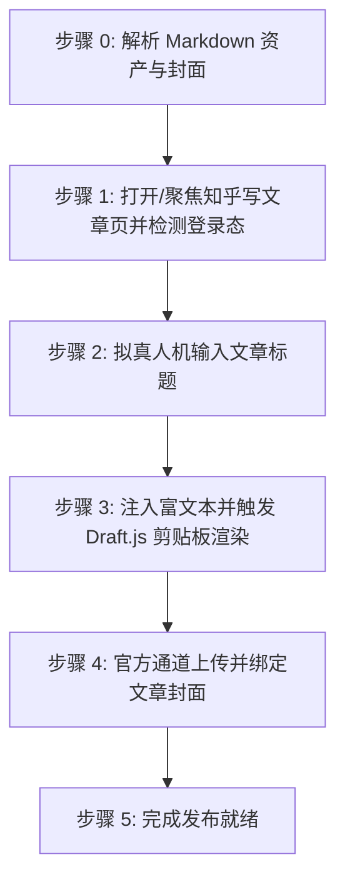

# 知乎专栏文章自动发布到草稿技能 (doudou-zhihu)

## 自动化执行全流程

当接收到用户指定的 Markdown 文件路径时，依次执行以下极简阶段（严格遵循文章仅标题、正文、封面三要素）：



### 步骤 0：解析 Markdown 资产与封面

运行辅助解析脚本提取元数据：

```bash
node scripts/parser.mjs <Markdown文件绝对路径>
```

输出包含：

- `title`: 文章标题（自动清洗 Markdown 符号）
- `bodyContent`: 过滤掉首行重复 H1 后的 Markdown 正文（优先使用 `_cdn.md`）
- `htmlContent`: 适配知乎 Draft.js 剪贴板规范的富文本 HTML
- `cover`: 封面图信息（CDN URL 或 Local Base64）

Agent 可在步骤 1 打开页面后，直接调用脚本一键注入文章标题、富文本正文、话题与封面：
```javascript
import { buildBrowserPublishScript } from './scripts/zhihu_publisher.mjs';

const code = buildBrowserPublishScript(markdownFilePath);
await evaluate_script({ pageId, function: code });
```

---

### 步骤 1：打开/聚焦知乎写文章页并检测登录态

1. **新建独立页面**：调用 `new_page` 打开 `https://zhuanlan.zhihu.com/write`（必须每次新建独立页面，严禁复用或覆盖已有页面）。
2. 等待页面加载完成。
3. 执行脚本检测登录态：
   - 检查是否存在标题输入框 `textarea[placeholder*="请输入标题"]` 及编辑器容器 `.notranslate.public-DraftEditor-content`；
   - 若未登录，向用户发出明确提示请用户在浏览器中扫码登录，并在登录完成后继续。
4. 自动检测并确认关闭可能弹出的干扰对话框（如破解复制插件提示「仍要继续」）。

---

### 步骤 2：拟真人机输入文章标题

1. 聚焦标题输入框 `textarea[placeholder*="请输入标题"]`。
2. 模拟微小随机延迟（300ms~600ms）。
3. 使用 React 原生 property setter 设置标题值，并派发 `input` 与 `change` 事件：

```javascript
const titleTextarea = document.querySelector(
  '.WriteIndex-titleInput textarea, textarea[placeholder*="请输入标题"]',
);
if (titleTextarea) {
  titleTextarea.focus();
  const setter = Object.getOwnPropertyDescriptor(
    window.HTMLTextAreaElement.prototype,
    "value",
  ).set;
  setter.call(titleTextarea, articleTitle);
  titleTextarea.dispatchEvent(new Event("input", { bubbles: true }));
  titleTextarea.dispatchEvent(new Event("change", { bubbles: true }));
  titleTextarea.blur();
}
```

4. 随机停顿 500ms~900ms。

---

### 步骤 3：注入富文本并触发 Draft.js 剪贴板渲染

知乎专栏采用 Facebook Draft.js 富文本编辑器体系：

1. 聚焦编辑器容器 `.notranslate.public-DraftEditor-content`；
2. 构造包含 `text/html` 和 `text/plain` 格式的 `DataTransfer` 剪贴板对象；
3. 派发真实的 `paste` 剪贴板事件，触发知乎词法分析器构建 ContentState（自动生成标题、加粗、列表、代码块、引用与图片等）：

```javascript
const editorEl = document.querySelector(
  ".notranslate.public-DraftEditor-content",
);
if (editorEl) {
  editorEl.focus();
  const dataTransfer = new DataTransfer();
  dataTransfer.setData("text/html", htmlContent);
  dataTransfer.setData("text/plain", bodyContent);
  const pasteEvent = new ClipboardEvent("paste", {
    clipboardData: dataTransfer,
    bubbles: true,
    cancelable: true,
  });
  editorEl.dispatchEvent(pasteEvent);
}
```

4. 随机停顿 1200ms~2000ms，让编辑器完成富文本与图片语法树构建与渲染。

---

### 步骤 4：官方通道上传并绑定文章封面

若存在封面图资产（CDN URL 或本地 Base64）：

1. 在浏览器端将图片转换为 `File` 对象（`new File([blob], 'cover.png', { type: blob.type })`）；
2. 获取知乎官方封面上传输入组件 `input.UploadPicture-input` 上的 React Props；
3. 调用 `props.onChange({ target: { files: [file] } })` 触发官方通道上传与绑定；
4. 监听封面状态由「添加文章封面」变更为「更换 / 删除」；
5. 随机停顿 600ms~1000ms。

---

### 步骤 5：完成发布就绪

1. 资产填入完成后直接判定完成；
2. **安全隔离**：原样保留当前标签页现场供人工发布，严禁调用 `close_page`。
