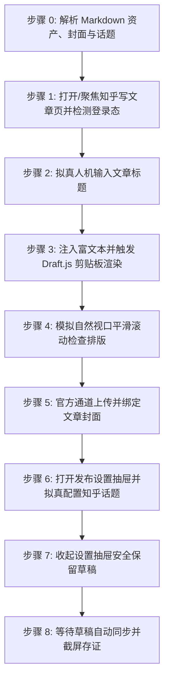

# 知乎专栏文章自动发布到草稿技能 (doudou-zhihu)

本技能通过 `chrome-devtools-mcp` 控制浏览器，将用户指定的本地 Markdown 文件发布至**知乎专栏创作者编辑器（https://zhuanlan.zhihu.com/write ）的草稿箱**。

技能严格遵循**真实人工行为模拟与防风控规约**，通过自然的事件派发、微小随机时延抖动、视口平滑滚动及悬停交互，避免被知乎平台风控拦截。同时与 `doudou-markdown-skill` 资产体系无缝集成，自动提取文章标题、摘要、知乎官方话题、CDN 版 Markdown 正文以及宽屏封面图。

---

## 核心规约与防风控原则

1. **草稿安全隔离（绝对底线）**：
   - **严格限定仅保存到草稿箱**，绝对不点击最终「发布」确认按钮，确保所有内容必须经人工最终确认后再公开发布。
   - 知乎编辑器具有实时自动同步草稿机制，文章在完成标题、正文、封面与话题设置后，等待 2.5~3.5 秒即可完成云端草稿同步。
2. **防风控与真实人机行为模拟 (Anti-Bot & Human Simulation)**：
   - **随机时延抖动**：所有操作之间增加正态分布随机等待（输入前 300~600ms、步骤间 600~1500ms、点击悬停 300~500ms），严禁毫秒级突发调用。
   - **真实事件完整性**：对于表单输入，依次派发 `focus`、`keydown`、`input`、`keyup`、`change`、`blur`，并使用 React 原生 Property Setter 同步受控组件状态。
   - **平滑视口滚动**：模拟人类自上而下的视觉审查，分步平滑滚动页面触发浏览器的视口可见性检测。
   - **拟真悬停与点击**：点击按钮前先将视口滚动到按钮可见区域，派发 `mouseover`/`mouseenter` 悬停 300~500ms 后再触发 `click`。
3. **资产自动解析优先级**（参考 `doudou-markdown-skill` 规约）：
   - **正文**：优先使用同名目录下已将本地图片替换为图床 URL 的 `[article_name]_cdn.md`；若无则使用原 Markdown 文件。
   - **封面图**：
     1. 优先读取同名目录下 `cdn_manifest.json` 中 `type: "cover"` 的 CDN 链接（优先 2.35:1 / 16:9 / 1:1 封面）；
     2. 其次读取同名目录下 `cover/images/` 的本地图片文件（如 `cover-main-2.35x1.png`、`cover-square-1x1.png`）；
     3. 再次从 Markdown 正文中提取第一张图片链接或本地路径；
     4. 若均无则跳过封面设置。
   - **摘要**：提炼 80~150 字纯文本摘要。
   - **知乎话题**：依据文章内容智能推断 1~3 个知乎官方高频话题（如「人工智能」、「智能体」、「AI 编程」、「Docker」、「程序员」等）并搜索绑定。

---

## 自动化执行全流程

当接收到用户指定的 Markdown 文件路径（例如 `mds/AICoding/ddagent.md`）时，依次执行以下 8 个阶段：



### 步骤 0：解析 Markdown 资产、封面与话题

运行辅助解析脚本提取元数据：
```bash
node scripts/parser.mjs <Markdown文件绝对路径>
```
输出包含：
- `title`: 文章标题（自动清洗 Markdown 符号）
- `summary`: 80~150 字纯文本摘要
- `topics`: 智能推断的知乎话题关键词数组
- `bodyContent`: 过滤掉首行重复 H1 后的 Markdown 正文（优先使用 `_cdn.md`）
- `htmlContent`: 适配知乎 Draft.js 剪贴板规范的富文本 HTML
- `cover`: 封面图信息（CDN URL 或 Local Base64）

---

### 步骤 1：打开/聚焦知乎写文章页并检测登录态

1. 调用 `list_pages` 检查是否已有知乎写文章页面（URL 包含 `zhuanlan.zhihu.com/write`）。
   - 若已有，直接调用 `select_page` 切换到该页面；
   - 若无，调用 `new_page` 打开 `https://zhuanlan.zhihu.com/write`。
2. 等待页面加载完成。
3. 执行脚本检测登录态：
   - 检查是否存在标题输入框 `textarea[placeholder*="请输入标题"]` 及编辑器容器 `.notranslate.public-DraftEditor-content`；
   - 若未登录，向用户发出明确提示请用户在浏览器中扫码登录，并在登录完成后继续。
4. 自动检测并确认关闭可能弹出的干扰对话框（如破解复制插件提示「仍要继续」）。

---

### 步骤 2：拟真人机输入文章标题

1. 聚焦标题输入框 `textarea[placeholder*="请输入标题"]`。
2. 模拟微小随机延迟（300ms~600ms）。
3. 使用 React 原生 property setter 设置标题值，并派发 `input` 与 `change` 事件：
```javascript
const titleTextarea = document.querySelector('.WriteIndex-titleInput textarea, textarea[placeholder*="请输入标题"]');
if (titleTextarea) {
  titleTextarea.focus();
  const setter = Object.getOwnPropertyDescriptor(window.HTMLTextAreaElement.prototype, 'value').set;
  setter.call(titleTextarea, articleTitle);
  titleTextarea.dispatchEvent(new Event('input', { bubbles: true }));
  titleTextarea.dispatchEvent(new Event('change', { bubbles: true }));
  titleTextarea.blur();
}
```
4. 随机停顿 500ms~900ms。

---

### 步骤 3：注入富文本并触发 Draft.js 剪贴板渲染

知乎专栏采用 Facebook Draft.js 富文本编辑器体系：
1. 聚焦编辑器容器 `.notranslate.public-DraftEditor-content`；
2. 构造包含 `text/html` 和 `text/plain` 格式的 `DataTransfer` 剪贴板对象；
3. 派发真实的 `paste` 剪贴板事件，触发知乎词法分析器构建 ContentState（自动生成标题、加粗、列表、代码块、引用与图片等）：
```javascript
const editorEl = document.querySelector('.notranslate.public-DraftEditor-content');
if (editorEl) {
  editorEl.focus();
  const dataTransfer = new DataTransfer();
  dataTransfer.setData('text/html', htmlContent);
  dataTransfer.setData('text/plain', bodyContent);
  const pasteEvent = new ClipboardEvent('paste', {
    clipboardData: dataTransfer,
    bubbles: true,
    cancelable: true
  });
  editorEl.dispatchEvent(pasteEvent);
}
```
4. 随机停顿 1200ms~2000ms，让编辑器完成富文本与图片语法树构建与渲染。

---

### 步骤 4：模拟自然视口平滑滚动检查排版

模拟人类作者自上而下检查文章排版：
1. 平滑滚动到页面 450px 处，等待 600ms~900ms；
2. 平滑滚动回顶部，等待 500ms~800ms：
```javascript
window.scrollTo({ top: 450, behavior: 'smooth' });
// 延时后
window.scrollTo({ top: 0, behavior: 'smooth' });
```

---

### 步骤 5：官方通道上传并绑定文章封面

若存在封面图资产（CDN URL 或本地 Base64）：
1. 在浏览器端将图片转换为 `File` 对象（`new File([blob], 'cover.png', { type: blob.type })`）；
2. 获取知乎官方封面上传输入组件 `input.UploadPicture-input` 上的 React Props；
3. 调用 `props.onChange({ target: { files: [file] } })` 触发官方通道上传与绑定；
4. 监听封面状态由「添加文章封面」变更为「更换 / 删除」；
5. 随机停顿 600ms~1000ms。

---

### 步骤 6：打开发布设置抽屉并拟真配置知乎话题

1. 寻找顶部「发布设置」按钮，悬停 200~400ms 后点击展开设置抽屉；
2. 针对解析出的话题关键词列表：
   - 点击「添加话题」按钮展开搜索框；
   - 聚焦 `input[placeholder*="搜索话题"]` 并输入话题词；
   - 等待下拉候选列表加载（800~1400ms）；
   - 寻找匹配的话题按钮（`button.css-gfrh4c`），悬停并点击添加；
3. 随机停顿 500ms~800ms。

---

### 步骤 7：收起设置抽屉安全保留草稿

1. 检查专栏收录与创作声明（保持默认安全配置）；
2. 再次点击「发布设置」按钮收起抽屉；
3. **安全隔离核心规约**：知乎写文章为实时自动保存草稿机制，**绝对严禁点击最终「发布」确认按钮**，所有配置自动保存在草稿箱中。

---

### 步骤 8：等待草稿自动同步并截屏存证

1. 等待 3 秒让知乎完成云端草稿存储；
2. 捕获页面底部或顶部的草稿保存状态文字（如 `刚刚 · 草稿`，字数统计等）；
3. 调用 `take_screenshot` 保存当前页面截图作为存证；
4. 输出结构化结果报告（文章标题、字数、话题、封面状态、操作日志）。

---

## 异常与风控处理

| 异常场景 | 表现特征 | 应对与恢复策略 |
| :--- | :--- | :--- |
| **未登录 / 登录态过期** | 未找到 `.public-DraftEditor-content` 或跳转至登录页 | 立即停止自动化输入，向用户发送提示，等待用户在浏览器中完成扫码登录后再继续。 |
| **插件提示弹窗拦截** | 弹出「温馨提示：检测到您安装了某些破解复制插件...」 | 自动检测并点击「仍要继续」按钮关闭弹窗，恢复正常编辑。 |
| **封面上传失败 / 超时** | 图片拉取超时或格式不兼容 | 降级跳过封面上传，在最终报告中标记，不阻塞草稿主体的保存。 |
| **话题搜索无精确匹配** | 搜索未返回预期的完全匹配项 | 自动选用首项候选话题，或降级为默认「人工智能」话题。 |
| **发布设置抽屉未展开** | 点击后未弹出抽屉 | 自动降级为保留主编辑区内容与封面，保证文章主体内容草稿不丢失。 |

---

## 脚本工具与使用方法

以下路径均相对本技能目录（`SKILL.md` 所在目录），执行前先切换到该目录，或将其拼接为绝对路径使用。

- `scripts/parser.mjs`：解析 Markdown，提取标题、摘要、话题、封面资产与 Draft.js 剪贴板富文本 HTML。
- `scripts/zhihu_publisher.mjs`：浏览器注入脚本生成器（Draft.js 状态注入、话题搜索绑定、防风控人机模拟）。

1. **直接运行 Node.js 脚本测试解析**：
```bash
node scripts/parser.mjs <Markdown文件路径>
```

2. **在 Agent 中配合 `chrome-devtools-mcp` 调用**：
```javascript
import { buildBrowserPublishScript } from './scripts/zhihu_publisher.mjs';

// 1. 生成自包含执行代码
const code = buildBrowserPublishScript(markdownFilePath);

// 2. 调用 evaluate_script 在知乎写文章页面执行
const result = await evaluate_script({
  pageId: targetPageId,
  function: code
});

// 3. 截屏存证
await take_screenshot({ pageId: targetPageId });
```
